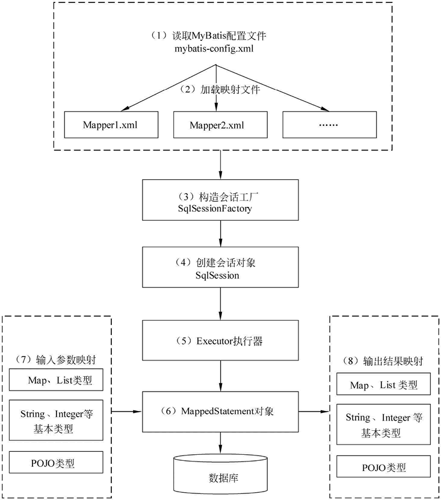
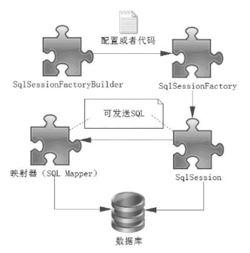
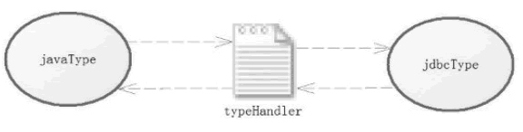

# java_mybatis学习要点

## MyBatis是什么？和hibernate的区别

MyBatis 是一个小巧、方便、高效、简单、直接、半自动化的持久层框架，Hibernate 是一个强大、方便、高效、复杂、间接、全自动化的持久层框架。


## 工作原理




## 核心组件

SqlSessionFactoryBuilder、SqlSessionFactory、SqlSession和SQL Mapper

1）SqlSessionFactoryBuilder（构造器）：它会根据配置或者代码来**生成 SqlSessionFactory**，采用的是分步构建的 Builder 模式。

2）SqlSessionFactory（工厂接口）：依靠它来**生成 SqlSession**，使用的是工厂模式。

3）SqlSession（会话）：一个既可以**发送 SQL 执行**返回结果，也可以**获取 Mapper 的接口**。在现有的技术中，一般我们会让其在业务逻辑代码中“消失”，而使用的是MyBatis提供的 SQL Mapper接口编程技术，它能提高代码的可读性和可维护性。

4）SQL Mapper（映射器）:MyBatis 新设计存在的组件，它由一个 Java 接口和 XML 文件（或注解）构成，需要给出对应的 SQL 和映射规则。它负责**发送 SQL 去执行**，并返回结果。




## SqlSessionFactory及其常见创建方式

SqlSessionFactory 是一个接口，在 MyBatis 中它存在**两个实现类：SqlSessionManager 和 DefaultSqlSessionFactory**。

一般而言，具体是由 DefaultSqlSessionFactory 去实现的，而 SqlSessionManager 使用在多线程的环境中，它的具体实现依靠 DefaultSqlSessionFactory，

http://c.biancheng.net/uploads/allimg/190704/5-1ZF416213S21.png

两者的区别主要就是

**SqlSessionManager 实现了Session接口**。意味着，SqlSessionManager集成了 sqlSessionFactory和session 的功能。通过SqlSessionManager，开发者可以不在理会SqlSessionFacotry的存在，直接面向Session编程。

SqlSessionManager 内部提供了一个sqlSessionProxy,这个sqlSessionProxy提供了所有Session接口的实现，而实现中正是使用了上面提到的本地线程保存的session实例。

这样，在同一个线程实现不同的sql操作，可以复用本地线程session，避免了DefaultSqlSessionFactory实现的每一个sql操作都要创建新的session实例。


**用 XML 构建 SqlSessionFactory**

mybatis-config.xml，放在工程类路径下，其内容如下所示。

```

<?xml version="1.0" encoding="utf-8"?>

<!DOCTYPE configuration PUBLIC "-//mybatis.org//DTD Config 3.0//EN"

"http://mybatis.org/dtd/mybatis-3-config.dtd">

<configuration>

    <typeAliases><!--别名-->

        <typeAliases alias="user" type="com.mybatis.po.User"/>

    </typeAliases>

    <!-- 数据库环境 -->

    <environments default="development">

        <environment id="development">

            <!-- 使用JDBC的事务管理 -->

            <transactionManager type="JDBC" />

            <dataSource type="POOLED">

                <!-- MySQL数据库驱动 -->

                <property name="driver" value="com.mysql.jdbc.Driver" />

                <!-- 连接数据库的URL -->

                <property name="url"

                    value="jdbc:mysql://localhost:3306/mybatis?characterEncoding=utf8" />

                <property name="username" value="root" />

                <property name="password" value="1128" />

            </dataSource>

        </environment>

    </environments>

    <!-- 将mapper文件加入到配置文件中 -->

    <mappers>

        <mapper resource="com/mybatis/mapper/UserMapper.xml" />

    </mappers>

</configuration>

```

说明

<typeAlias> 元素定义了一个别名 user，它代表着 com.mybatis.po.User 这个类。这样定义后，在 MyBatis 上下文中就可以使用别名去代替全限定名了。

<environment> 元素的定义，这里描述的是数据库。它里面的 <transactionManager> 元素是配置事务管理器，这里采用的是 MyBatis 的 JDBC 管理器方式。

<dataSource> 元素配置数据库，其中属性 type="POOLED" 代表采用 **MyBatis 内部提供的连接池**方式，最后定义一些关于 JDBC 的属性信息。

<mapper> 元素代表引入的那些映射器，在谈到映射器时会详细讨论它。


有了基础配置文件，就可以用一段很简短的代码来生成 SqlSessionFactory 了，如下所示。

```

SqlSessionFactory factory = null;

String resource = "mybatis-config.xml";

InputStream is;

try {

    InputStream is = Resources.getResourceAsStream(resource);

    factory = new SqlSessionFactoryBuilder().build(is);

} catch (IOException e) {

    e.printStackTrace();

}

```


**代码创建 SqlSessionFactory（略）**


## SqlSession简介

在 MyBatis 中，SqlSession 是其核心接口。在 MyBatis 中有**两个实现类，DefaultSqlSession 和 SqlSessionManager**。

**DefaultSqlSession 是单线程使用的，而 SqlSessionManager 在多线程环境下使用**。SqlSession 的作用类似于一个 JDBC 中的 Connection 对象，代表着一个连接资源的启用。

```

//定义 SqlSession

SqlSession sqlSession = null;

try {

    // 打开 SqlSession 会话

    sqlSession = SqlSessionFactory.openSession();

    // some code...

    sqlSession.commit();    // 提交事务

} catch (IOException e) {

    sqlSession.rollback();  // 回滚事务

}finally{

    // 在 finally 语句中确保资源被顺利关闭

    if(sqlSession != null){

        sqlSession.close();

    }

}

```


## 实现映射器

2种方式：XML文件形式(常用)和注解形式(基本不使用)

xml举例:

```

<mapper namespace="com.mybatis.mapper.RoleMapper">

    <select id="getRole" parameterType="long" resultType="role">

        SELECT id,role_name as roleName,note FROM role WHERE id =#{id}

    </select>

</mapper>

```


## 执行SQL的两种方式：SqlSession和Mapper接口(略)


## 核心组件的作用域以及生命周期

**SqlSessionFactoryBuilder**

SqlSessionFactoryBuilder 的作用在于创建 SqlSessionFactory，因此 SqlSessionFactoryBuilder 实例的最佳作用域是方法作用域（也就是局部方法变量）。

**SqlSessionFactory**

SqlSessionFactory 可以被认为是一个数据库连接池，所以 SqlSessionFactory 的生命周期存在于整个 MyBatis 的应用之中，

如果创建多个 SqlSessionFactory，那么就存在多个数据库连接池，这样不利于对数据库资源的控制，

因此我们往往希望 SqlSessionFactory 作为一个单例，让它在应用中被共享。所以说 SqlSessionFactory 的最佳作用域是应用作用域。

**SqlSession**

SqlSession 就相当于一个数据库连接（Connection 对象），应该存活在一个业务请求中，处理完整个请求后，应该关闭这条连接

SqlSession 的最佳的作用域是请求或方法作用域。

**Mapper**

Mapper 是一个接口，它由 SqlSession 所创建，所以它的最大生命周期至多和 SqlSession 保持一致，

http://c.biancheng.net/uploads/allimg/190705/5-1ZF5104453328.png


## 配置文件

需要注意的是，MyBatis 配置项的**顺序不能颠倒**。如果颠倒了它们的顺序，那么在 MyBatis 启动阶段就会发生异常，导致程序无法运行。


### properties

MyBatis 提供了 3 种方式让我们使用 properties，它们是：

property 子元素。

properties 文件。

程序代码传递。

这个不再细说了，比较常用的是properties文件


### settings属性配置

较多，常用如下

cacheEnabled：该配置影响所有映射器中配置缓存的全局开关
lazyLoadingEnabled：延迟加载的全局开关。当开启时，所有关联对象都会延迟加载。在特定关联关系中可通过设置 fetchType 属性来覆盖该项的开关状态
aggressiveLazyLoading：当启用时，对任意延迟属性的调用会使带有延迟加载属性的对象完整加载；反之，每种属性将会按需加载
autoMappingBehavior：指定 MyBatis 应如何自动映射列到字段或属性。

NONE 表示取消自动映射。

PARTIAL 表示只会自动映射，没有定义嵌套结果集和映射结果集。

FULL 会自动映射任意复杂的结果集（无论是否嵌套）
mapUnderscoreToCamelCase：是否开启自动驼峰命名规则映射，即从经典数据库列名 A_COLUMN 到经典 Java 属性名 aColumn 的类似映射。

defaultExecutorType：配置默认的执行器。SIMPLE 是普通的执行器；REUSE 会重用预处理语句（prepared statements）；BATCH 执行器将重用语句并执行批量更新


### typeAliases（别名）（不常用）


### TypeHandler类型转换器

在 typeHandler 中，分为 jdbcType 和 javaType，其中 jdbcType 用于定义数据库类型，而 javaType 用于定义 Java 类型，那么 typeHandler 的作用就是承担 jdbcType 和 javaType 之间的相互转换。




### 系统定义的TypeHandler（略）

### 自定义TypeHandler

从系统定义的 typeHandler 可以知道，要实现 typeHandler 就需要去实现接口 typeHandler，或者继承 BaseTypeHandler（实际上，BaseTypeHandler 实现了 typeHandler 接口）。

实例参考：场景一：有个java.util.Date在存入数据库的时候自动转换为timestamp时间戳，从数据库取值的时候把时间戳自动转换为java.util.Date样例：https://www.cnblogs.com/snake23/p/9606576.html


### 自定义TypeHandler处理枚举

MyBatis自定义TypeHandler处理枚举：http://c.biancheng.net/view/4343.html


### BlobTypeHandler读取Blob类型字段（略）


### 配置文件environments和子元素transactionManager、dataSource（略）


## Spring整合

**在Spring中配置MyBatis工厂**

```

<!-- 配置SqlSessionFactoryBean -->

<bean id="sqlSessionFactory" class="org.mybatis.spring.SqlSessionFactoryBean">

    <!-- 引用数据源组件 -->

    <property name="dataSource" ref="dataSource" />

    <!-- 引用MyBatis配置文件中的配置 -->

    <property name="configLocation" value="classpath:mybatis-config.xml" />

</bean>

```


**使用 Spring 管理 MyBatis 的数据操作接口**

最常用、最简洁的一种是基于 MapperScannerConfigurer 的整合。该方式需要在 Spring 的配置文件中加入以下内容：

```

<!-- Mapper代理开发，使用Spring自动扫描MyBatis的接口并装配 （Sprinh将指定包中的所有被@Mapper注解标注的接口自动装配为MyBatis的映射接口） -->

<bean class="org.mybatis.spring.mapper.MapperScannerConfigurer">

    <!-- mybatis-spring组件的扫描器，com.dao只需要接口（接口方法与SQL映射文件中的相同） -->

    <property name="basePackage" value="com.dao" />

    <property name="sqlSessionFactoryBeanName" value="sqlSessionFactory" />

</bean>

```


**MyBatis与Spring的整合实例详解**:http://c.biancheng.net/view/4355.html


## 使用Map接口和Java Bean传递多个参数

```
public List<MyUser> selectAllUser(Map<String,Object> param);  
<!-- 查询陈姓男性用户信息 -->  
<select id="selectAllUser" resultType="com.mybatis.po.MyUser">  
    select * from user  
    where uname like concat('%',#{u_name},'%')  
    and usex = #{u_sex}  
</select>  
  
<select id="selectAllUser" resultType="com.po.MyUser" parameterType="com.pojo.SeletUserParam">  
    select * from user  
    where uname like concat('%',#{u_name},'%')  
    and usex=#{u_sex}  
</select>  
```
## 常用操作标签

### insert
1）主键（自动递增）回填

为 com.mybatis 包中的 SQL 映射文件 UserMapper.xml 中 id 为 addUser 的 <insert> 元素添加 keyProperty 和 useGeneratedKeys 属性，具体代码如下：

```
<!--添加一个用户，成功后将主键值返回填给uid(po的属性)-->  
<insert id="addUser" parameterType="com.po.MyUser" keyProperty="uid" useGeneratedKeys="true">  
    insert into user (uname,usex) values(#{uname},#{usex})  
</insert>  
```
2）自定义主键

如果在实际工程中使用的数据库不支持主键自动递增（例如 Oracle），或者取消了主键自动递增的规则，可以使用 MyBatis 的 <selectKey> 元素来自定义生成主键。具体配置示例代码如下：

```
<!-- 添加一个用户，#{uname}为 com.mybatis.po.MyUser 的属性值 -->  
<insert id="insertUser" parameterType="com.po.MyUser">  
    <!-- 先使用selectKey元素定义主键，然后再定义SQL语句 -->  
    <selectKey keyProperty="uid" resultType="Integer" order="BEFORE">  
    select if(max(uid) is null,1,max(uid)+1) as newUid from user)  
    </selectKey>  
    insert into user (uid,uname,usex) values(#{uid},#{uname},#{usex})  
</insert>  
```

在执行上述示例代码时，<selectKey> 元素首先被执行，该元素通过自定义的语句设置数据表的主键，然后执行插入语句。


<selectKey> 元素的 keyProperty 属性指定了新生主键值返回给 PO 类（com.po.MyUser）的哪个属性。

order 属性可以设置为 BEFORE 或 AFTER。

BEFORE 表示先执行 <selectKey> 元素然后执行插入语句。

AFTER 表示先执行插入语句再执行 <selectKey> 元素。


### update、delete
<update> 和 <delete> 元素比较简单，它们的属性和 <insert> 元素、<select> 元素的属性差不多，执行后也返回一个整数，表示影响了数据库的记录行数。


### sql元素
<sql> 元素的作用在于可以定义 SQL 语句的一部分（代码片段），以方便后面的 SQL 语句引用它，例如反复使用的列名。

在 MyBatis 中只需使用 <sql> 元素编写一次便能在其他元素中引用它。配置示例代码如下：

```
<sql id="comColumns">id,uname,usex</sql>  
<select id="selectUser" resultType="com.po.MyUser">  
    select <include refid="comColumns"> from user  
</select>  
```
在上述代码中使用 <include> 元素的 refid 属性引用了自定义的代码片段。


## resultMap元素的结构及使用

### 使用 Map 存储结果集
任何 select 语句都可以使用 Map 存储结果，示例代码如下：

```
<!-- 查询所有用户信息存到Map中 -->  
<select id="selectAllUserMap" resultType="map">  
    select * from user  
</select>  
```
### pojo使存储结果
配置 <resultMap> 元素

在 SQL 映射文件 UserMapper.xml 中配置 <resultMap> 元素，其属性 type 引用 POJO 类。具体配置如下：

```
<!--使用自定义结果集类型-->  
<resultMap type="com.pojo.MapUser" id="myResult">  
    <!-- property 是 com.pojo.MapUser 类中的属性-->  
    <!-- column是查询结果的列名，可以来自不同的表-->  
    <id property="m_uid" column="uid"/>  
    <result property="m_uname" column="uname"/>  
    <result property="m_usex" column="usex"/>  
</resultMap>  
```
配置<select>元素

在 SQL 映射文件 UserMapper.xml 中配置 <select> 元素，其属性 resultMap 引用了 <resultMap> 元素的 id。具体配置如下：

```
<!-- 使用自定义结果集类型查询所有用户 -->  
<select id="selectResultMap" resultMap="myResult">  
    select * from user  
</select>  
```


## 关联查询（级联查询）

**一对一**

```
<!-- 一对一根据id查询个人信息：级联查询的第一种方法（嵌套查询，执行两个SQL语句）-->  
<resultMap type="com.po.Person" id="cardAndPerson1">  
	<id property="id" column="id"/>  
	<result property="name" column="name"/>  
	<result property="age" column="age"/>  
	<!-- 一对一级联查询-->  
	<association property="card" column="idcard_id" javaType="com.po.Idcard"  
	select="com.dao.IdCardDao.selectCodeByld"/>  
</resultMap>  
```
**一对多**

```
<!-- 一对多 根据uid查询用户及其关联的订单信息：级联查询的第一种方法（嵌套查询） -->  
<resultMap type="com.po.MyUser" id="userAndOrders1">  
    <id property="uid" column="uid" />  
    <result property="uname" column="uname" />  
    <result property="usex" column="usex" />  
    <!-- 一对多级联查询，ofType表示集合中的元素类型，将uid传递给selectOrdersByld -->  
    <collection property="ordersList" ofType="com.po.Orders"  
        column="uid" select="com.dao.OrdersDao.selectOrdersByld" />  
</resultMap>  
```
动态sql
## 动态sql
### 动态sql
```
<!--使用 if 元素根据条件动态查询用户信息-->  
<select id="selectUserByIf" resultType="com.po.MyUser" parameterType="com.po.MyUser">  
    select * from user where 1=1  
    <if test="uname!=null and uname!=''">  
        and uname like concat('%',#{uname},'%')  
    </if >  
    <if test="usex !=null and usex !=''">  
        and usex=#{usex}  
    </if >  
</select>  
```

### choose、when、otherwise标签
```
<!--使用choose、when、otherwise元素根据条件动态查询用户信息-->  
<select id="selectUserByChoose" resultType="com.po.MyUser" parameterType= "com.po.MyUser">  
    select * from user where 1=1  
    <choose>  
        <when test="uname!=null and uname!=''">  
            and uname like concat('%',#{uname},'%')  
        </when>  
        <when test="usex!=null and usex!=''">  
            and usex=#{usex}  
        </when>  
        <otherwise>  
            and uid > 10  
        </otherwise>  
    </choose>  
</select>  
```

### trim
<!--使用trim元素根据条件动态查询用户信息-->

<select id="selectUserByTrim" resultType="com.po.MyUser"parameterType="com.po.MyUser">

    select * from user

    <trim prefix="where" prefixOverrides = "and | or">

        <if test="uname!=null and uname!=''">

            and uname like concat('%',#{uname},'%')

        </if>

        <if test="usex!=null and usex!=''">

            and usex=#{usex}

        </if>

    </trim>

</select>


例子中：

1、prefix：代表拼接一个where前缀

2、suffixOverrides: 代表去除多余的逗号 “，”

3、prefixOverrides:去除sql语句前面的关键字"and"


### where
<where> 元素的作用是会在写入 <where> 元素的地方输出一个 where 语句，另外一个好处是不需要考虑 <where> 元素里面的条件输出是什么样子的，MyBatis 将智能处理。如果所有的条件都不满足，那么 MyBatis 就会查出所有的记录，如果输出后是以 and 开头的，MyBatis 会把第一个 and 忽略。


当然如果是以 or 开头的，MyBatis 也会把它忽略；此外，在 <where> 元素中不需要考虑空格的问题，MyBatis 将智能加上。

```
<!--使用where元素根据条件动态查询用户信息-->  
<select id="selectUserByWhere" resultType="com.po.MyUser" parameterType="com.po.MyUser">  
    select * from user  
    <where>  
        <if test="uname != null and uname ! = ''">  
            and uname like concat('%',#{uname},'%')  
        </if>  
        <if test="usex != null and usex != '' ">  
            and usex=#{usex}  
        </if >  
    </where>  
</select>  
```
### set
用 <set> 元素动态更新列

```
<!--使用set元素动态修改一个用户-->  
<update id="updateUserBySet" parameterType="com.po.MyUser">       
    update user  
    <set>  
        <if test="uname!=null">uname=#{uname}</if>  
        <if test="usex!=null">usex=#{usex}</if>  
    </set>  
    where uid=#{uid}  
</update>  
```
### foreach
<foreach> 元素主要用在构建 in 条件中，它可以在 SQL 语句中迭代一个集合。

<foreach> 元素的属性主要有 item、index、collection、open、separator、close。

```
item 表示集合中每一个元素进行迭代时的别名。  
index 指定一个名字，用于表示在迭代过程中每次迭代到的位置。  
open 表示该语句以什么开始。  
separator 表示在每次进行迭代之间以什么符号作为分隔符。  
close 表示以什么结束。  
```
在使用 <foreach> 元素时，最关键、最容易出错的是 collection 属性，该属性是必选的，但在不同情况下该属性的值是不一样的，主要有以下 3 种情况：

```
如果传入的是单参数且参数类型是一个 List，collection 属性值为 list。  
如果传入的是单参数且参数类型是一个 array 数组，collection 的属性值为 array。  
如果传入的参数是多个，需要把它们封装成一个 Map，当然单参数也可以封装成 Map。Map 的 key 是参数名，collection 属性值是传入的 List 或 array 对象在自己封装的 Map 中的 key。  
```
样例

```
<!--使用foreach元素查询用户信息-->  
<select id="selectUserByForeach" resultType="com.po.MyUser" parameterType=  
"List">  
    select * from user where uid in  
    <foreach item="item" index="index" collection="list"  
    open="(" separator="," close=")">  
        # {item}  
    </foreach>  
</select>  
```
### bind标签
平时写模糊查询，一直用${name}，例如：

```
select * from table where name like '%${name}%'  
```
后来知道了，这样写可能会引发sql注入，于是乎，要用到这样一个标签 bind，经过改正上面的sql可以变成

```
<bind name="bindeName" value="'%'+name+'%'"/>  
SELECT * FROM table where name like #{bindeName}  
```
大致就上面这个意思，不要在意一些细节。就相当于在bind标签中的value值中，把需要的字符拼接好，然后用name中的值去代替拼接好的参数。

这个用法同样用于一些防止更换数据库的sql中。例如：
concat标签，在mysql中，可以拼接多个字符，但是如果有一天，你的数据库突然变成了oracle，concat就会报错了，因为它只能接受两个参数。

这个时候，bind同样适用，如下：

开始的时候：

```
<if test=” userName != null and userName ! = ””>  
　　and username like concat （ '1',＃｛userName｝,'2' ）  
</if>  
```
可以改成：

```
<if test=” userName != null and userName !=””>   
　　<bind name= " userNameLike ” value ＝ ”'1'＋ userName ＋ '2'”/>  
　　and username like #{userNameLike}   
</if>　　  
```


## 参考
MyBatis ：http://c.biancheng.net/view/4314.html

DefaultSqlSessionFactory和SqlSessionManager的区别：https://blog.csdn.net/qq_39396243/article/details/104018189

mybatis bind标签:https://www.cnblogs.com/bpjj/p/11880424.html