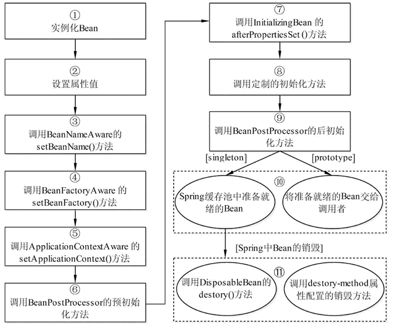

# java_spring01读书要点
java_spring要点整理

## IoC容器
### IoC是什么鬼
IoC 是指在程序开发中，实例的创建不再由调用者管理，而是由 Spring 容器创建。Spring 容器会负责控制程序之间的关系，而不是由程序代码直接控制，因此，**控制权由程序代码转移到了 Spring 容器中，控制权发生了反转**，这就是 Spring 的 IoC 思想。


ioc的思想最核心的地方在于，**资源不由使用资源的双方管理，而由不使用资源的第三方管理**，这可以带来很多好处。

第一，**资源集中管理**，实现资源的**可配置和易管理**。

第二，降低了使用资源双方的依赖程度，也就是我们说的**降低耦合度**。


所谓的**依赖注入**，则是甲方开放接口，在它需要的时候，能够讲乙方传递进来(注入)

所谓的**控制反转**，甲乙**双方不相互依赖**，交易活动的进行不依赖于甲乙任何一方，整个活动的进行由第三方负责管理。


Spring 提供了**两种 IoC 容器**，分别为 BeanFactory 和 ApplicationContext。

### BeanFactory
BeanFactory 就是一个**管理 Bean 的工厂**，它主要负责初始化各种 Bean，并调用它们的生命周期方法。

BeanFactory 接口有多个实现类，最常见的是 org.springframework.beans.factory.xml.XmlBeanFactory，它是根据 XML 配置文件中的定义装配 Bean 的。

加载配置信息的代码具体如下所示：

```
BeanFactory beanFactory = new XmlBeanFactory(new FileSystemResource("D://applicationContext.xml"));
```
### ApplicationContext 
ApplicationContext 是 BeanFactory 的子接口，也被称为应用上下文。它不仅提供了 BeanFactory 的所有功能，还添加了对 i18n（国际化）、资源访问、事件传播等方面的良好支持。

ApplicationContext 接口有两个常用的实现类：

1）ClassPathXmlApplicationContext

2）FileSystemXmlApplicationContext

它与 ClassPathXmlApplicationContext 的区别是：在读取 Spring 的配置文件时，它可以获取类路径之外的资源，如“F：/workspaces/applicationContext.xml”。


### 二者比较
相同点：BeanFactory 和 ApplicationContext 都是通过 XML 配置文件加载 Bean 的。

区别：如果 Bean 的某一个属性没有注入，则使用 BeanFacotry 加载后，在第一次调用 getBean() 方法时会抛出异常，而 ApplicationContext 则在**初始化时自检**，这样有利于检查所依赖的属性是否注入。　　
因此，在实际开发中，**通常都选择使用 ApplicationContext**，而只有在系统资源较少时，才考虑使用 BeanFactory。本教程中使用的就是 ApplicationContext。


## DI（依赖注入）
实现方式：属性注入和构造注入

依赖注入（Dependency Injection，DI）和控制反转含义相同，它们是从**两个角度描述的同一个概念**。


### 属性注入(无参构造函数+setter方法注入)
属性注入**直白易懂**，缺点是对于属性可选的时候，很**多个构造函数会显得类很臃肿**。

### 构造注入(通过有参的构造函数注入)
构造注入是一种**高内聚**的体现，特别是针对有些属性需要在对象在创建时候赋值，且后续不允许修改（不提供setter方法）。


## Bean的配置文件
Spring 容器可以被看作一个大工厂，而 Spring 容器中的 Bean 就相当于该工厂的产品。如果希望这个大工厂能够生产和管理 Bean，这时则需要告诉容器需要哪些 Bean，以及需要以何种方式将这些 Bean 装配到一起。

Spring 配置文件支持两种不同的格式，分别是 XML 文件格式和 Properties 文件格式。


## Bean的常用属性


|     属性名称     |                                                          描述                                                          |
| -------------- | --------------------------------------------------------------------------------------------------------------------- |
| id              | 是一个 Bean 的唯一标识符，Spring 容器对 Bean 的配置和管理都通过该属性完成                                                         |
| name            | Spring 容器同样可以通过此属性对容器中的 Bean 进行配置和管理，name 属性中可以为 Bean 指定多个名称，每个名称之间用逗号或分号隔开             |
| class           | 该属性指定了 Bean 的具体实现类，它必须是一个完整的类名，使用类的全限定名                                                           |
| scope           | 用于设定 Bean 实例的作用域，其属性值有 singleton（单例）、prototype（原型）、request、session 和 global Session。其默认值是 singleton |
| constructor-arg | <bean>元素的子元素，可以使用此元素传入构造参数进行实例化。该元素的 index 属性指定构造参数的序号（从 0 开始），type 属性指定构造参数的类型     |
| property        | <bean>元素的子元素，用于调用 Bean 实例中的 Set 方法完成属性赋值，从而完成依赖注入。该元素的 name 属性指定 Bean 实例中的相应属性名          |
| ref             | <property> 和 <constructor-arg> 等元素的子元索，该元素中的 bean 属性用于指定对 Bean 工厂中某个 Bean 实例的引用                      |
| value           | <property> 和 <constractor-arg> 等元素的子元素，用于直接指定一个常量值                                                         |
| list            | 用于封装 List 或数组类型的依赖注入                                                                                          |
| set             | 用于封装 Set 类型属性的依赖注入                                                                                            |
| map             | 用于封装 Map 类型属性的依赖注入                                                                                            |
| entry           | <map> 元素的子元素，用于设置一个键值对。其 key 属性指定字符串类型的键值，ref 或 value子元素指定其值                                   |

## Bean的实例化三方法
构造器实例化：最常用的默认的实例化方式

静态工厂方式实例化：不常用，略

实例工厂方式实例化：不常用，略


**实例化和注入有什么区别**

实例化：创建对象，

注入：创建对象和对象依赖（或关联）的子对象（属性）

实例必然伴随：权限，作用域（spring统一管理才会面临的问题)，生命周期


## Bean的作用域和生命周期
Spring 容器在初始化一个 Bean 的实例时，同时会指定该实例的作用域。Spring3 为 Bean 定义了五种作用域，具体如下。
1）singleton

单例模式，使用 singleton 定义的 Bean 在 Spring 容器中只有一个实例，这也是 Bean 默认的作用域。

2）prototype

原型模式，每次通过 Spring 容器获取 prototype 定义的 Bean 时，容器都将创建一个新的 Bean 实例。

3）request

在一次 HTTP 请求中，容器会返回该 Bean 的同一个实例。而对不同的 HTTP 请求，会返回不同的实例，该作用域仅在当前 HTTP Request 内有效。

4）session

在一次 HTTP Session 中，容器会返回该 Bean 的同一个实例。而对不同的 HTTP 请求，会返回不同的实例，该作用域仅在当前 HTTP Session 内有效。

5）global Session

在一个全局的 HTTP Session 中，容器会返回该 Bean 的同一个实例。该作用域仅在使用 portlet context 时有效。


对于 prototype 作用域的 Bean，Spring 只负责创建，当容器创建了 Bean 的实例后，Bean 的实例就交给客户端代码管理，Spring 容器将不再跟踪其生命周期。**每次客户端请求 prototype 作用域的 Bean 时，Spring 容器都会创建一个新的实例**，并且不会管那些被配置成 prototype 作用域的 Bean 的生命周期。

可以利用 Bean 在其存活期间的指定时刻完成一些相关操作。这种时刻可能有很多，但一般情况下，会在 Bean 被初始化后和被销毁前执行一些相关操作。

根据经验，对**有状态的 bean 应该使用 prototype 作用域**，而对**无状态的bean则应该使用 singleton 作用域**。





## Bean的依赖注入
### 设值函数
在 Spring 实例化 Bean 的过程中，首先会调用默认的构造方法实例化 Bean 对象，然后通过 Java 的反射机制调用 setXxx() 方法进行属性的注入。因此，设值注入要求一个 Bean 的对应类必须满足以下两点要求。

```
必须提供一个默认的无参构造方法。   
必须为需要注入的属性提供对应的 setter 方法。  
```
使用设值注入时，在 Spring 配置文件中，需要使用 <bean> 元素的子元素 <property> 元素为每个属性注入值。而使用构造注入时，在配置文件中，主要使用 <constructor-arg> 标签定义构造方法的参数，可以使用其 value 属性（或子元素）设置该参数的值。

```
<!-- Definition for textEditor bean -->
<bean id="textEditor" class="com.tutorialspoint.TextEditor">
   <property name="spellChecker" ref="spellChecker" />
   <property name="name" value="Generic Text Editor" />
</bean>

<!-- Definition for javaCollection -->
<bean id="javaCollection" class="com.tutorialspoint.JavaCollection">

  <!-- results in a setAddressList(java.util.List) call -->
  <property name="addressList">
     <list>
        <value>INDIA</value>
        <value>Pakistan</value>
        <value>USA</value>
        <value>USA</value>
     </list>
  </property>

  <!-- results in a setAddressSet(java.util.Set) call -->
  <property name="addressSet">
     <set>
        <value>INDIA</value>
        <value>Pakistan</value>
        <value>USA</value>
        <value>USA</value>
    </set>
  </property>

  <!-- results in a setAddressMap(java.util.Map) call -->
  <property name="addressMap">
     <map>
        <entry key="1" value="INDIA"/>
        <entry key="2" value="Pakistan"/>
        <entry key="3" value="USA"/>
        <entry key="4" value="USA"/>
     </map>
  </property>

  <!-- results in a setAddressProp(java.util.Properties) call -->
  <property name="addressProp">
     <props>
        <prop key="one">INDIA</prop>
        <prop key="two">Pakistan</prop>
        <prop key="three">USA</prop>
        <prop key="four">USA</prop>
     </props>
  </property>

</bean>
```
### 构造函数
举例

```
public class TextEditor {
   private SpellChecker spellChecker;
   public TextEditor(SpellChecker spellChecker) {
      System.out.println("Inside TextEditor constructor." );
      this.spellChecker = spellChecker;
   }
   public void spellCheck() {
      spellChecker.checkSpelling();
   }
}
```
对应xml配置文件

```
   <!-- Definition for textEditor bean -->
   <bean id="textEditor" class="com.tutorialspoint.TextEditor">
      <constructor-arg ref="spellChecker"/>
   </bean>
```


## Bean的装配
### xml装配(依赖注入的设值函数，构造函数)
举例:

```
 <!-- 使用设值注入方式装配Person实例 -->
    <bean id="person1" class="com.mengma.assembly.Person">
        <property name="name" value="zhangsan" />
        <property name="age" value="20" />
    </bean>
    <!-- 使用构造方法装配Person实例 -->
    <bean id="person2" class="com.mengma.assembly.Person">
        <constructor-arg index="0" value="lisi" />
        <constructor-arg index="1" value="21" />
    </bean>
```
###  自动装配
自动装配就是指 Spring 容器可以自动装配（autowire）相互协作的 Bean 之间的关联关系，将一个 Bean 注入其他 Bean 的 Property 中。

要使用自动装配，就需要配置 <bean> 元素的 autowire 属性。autowire 属性有五个值

| 名称 | 说明 |
| --- | --- |
| byName | 根据 Property 的 name 自动装配，如果一个 Bean 的 name 和另一个 Bean 中的 Property 的 name 相同，则自动装配这个 Bean 到 Property 中。 |
| byType | 根据 Property 的数据类型（Type）自动装配，如果一个 Bean 的数据类型兼容另一个 Bean 中 Property 的数据类型，则自动装配。 |
| constructor | 根据构造方法的参数的数据类型，进行 byType 模式的自动装配。 |
| autodetect | 如果发现默认的构造方法，则用 constructor 模式，否则用 byType 模式。 |
| no | 默认情况下，不使用自动装配，Bean 依赖必须通过 ref 元素定义。 |

### 注解(常用)
```
@Component：用于描述Spring中的Bean，它是一个泛化的概念，仅仅表示一个组件。
@Repository：用于将数据访问层（DAO）的类标识为Spring中的Bean。
@Service：用于将业务层中的类标识Spring中的Bean。
@Autowired：用于对Bean的属性变量、属性的setter方法及构造方法进行标注，配合对应的注解处理器完成Bean的自动配置工作。
@Resource：其作用与Autowired作用一样。@Resource中有两个重要属性：name和type。Spring将name属性解析为Bean实例名称，type属性解析为Bean实例类型。
@Qualifier：与@Autowired注解配合使用，会将默认的按Bean类型装配修改为按Bean的实例名称装配，Bean的实例名称由@Qualifier注解的参数指定。
```

## Bean其他属性
**后置处理器**

Bean 后置处理器允许在调用初始化方法前后对 Bean 进行额外的处理


**Bean 定义继承**

子 bean 的定义继承父定义的配置数据。子定义可以根据需要重写一些值，或者添加其他值。

**Spring Bean 定义的继承与 Java 类的继承无关**，但是继承的概念是一样的。你可以定义一个父 bean 的定义作为模板和其他子 bean 就可以从父 bean 中继承所需的配置。

当你使用基于 XML 的配置元数据时，通过使用父属性，指定父 bean 作为该属性的值来表明子 bean 的定义。


**Bean 定义模板**
你可以创建一个 Bean 定义模板，不需要花太多功夫它就可以被其他子 bean 定义使用。在定义一个 Bean 定义模板时，你不应该指定类的属性，而应该指定带 true 值的抽象属性。
```
<bean id="beanTeamplate" abstract="true">
  <property name="message1" value="Hello World!"/>
  <property name="message2" value="Hello Second World!"/>
  <property name="message3" value="Namaste India!"/>
</bean>

<bean id="helloIndia" class="com.tutorialspoint.HelloIndia" parent="beanTeamplate">
  <property name="message1" value="Hello India!"/>
  <property name="message3" value="Namaste India!"/>
</bean>
```


##  AOP（面向切面编程）
AOP 的全称是“Aspect Oriented Programming”，即面向切面编程，它将**业务逻辑的各个部分进行隔离**，使开发人员在编写业务逻辑时可以专心于核心业务，从而提高了开发效率。

面向切面编程（AOP）和面向对象编程（OOP）类似，也是**一种编程模式**。Spring AOP 是基于 AOP 编程模式的一个框架，它的使用有效**减少了系统间的重复代码，达到了模块间的松耦合**目的。

AOP 采取**横向抽取机制**，取代了传统纵向继承体系的重复性代码，其应用主要体现在事务处理、日志管理、权限控制、异常处理等方面。

目前最流行的 AOP 框架有两个，分别为 Spring AOP 和 AspectJ。

## 动态代理(略)
## 通知类型(略)
## JDBCTemplate
Spring 框架针对数据库开发中的应用提供了 JDBCTemplate 类，该类是 Spring 对 JDBC 支持的核心，它提供了所有对数据库操作功能的支持。

在定义 jdbcTemplate 时，需要将 dataSource 注入 jdbcTemplate 中。而在其他的类中要使用 jdbcTemplate，也需要将 jdbcTemplate 注入使用类中（通常注入 dao 类中）。


## 事务相关
Spring 的事务管理是**基于 AOP 实现的**，而 AOP 是以方法为单位的。Spring 的**事务属性分别为传播行为、隔离级别、只读和超时属性**，这些属性提供了事务应用的方法和描述策略。

### PlatformTransactionManager

PlatformTransactionManager 接口是 Spring 提供的平台事务管理器，用于管理事务。该接口中提供了三个事务操作方法，具体如下。

```
TransactionStatus getTransaction（TransactionDefinition definition）：用于获取事务状态信息。
void commit（TransactionStatus status）：用于提交事务。
void rollback（TransactionStatus status）：用于回滚事务。
```

### TransactionDefinition

TransactionDefinition 接口是事务定义（描述）的对象，它提供了事务相关信息获取的方法，其中包括五个操作，具体如下。

```
String getName()：获取事务对象名称。
int getIsolationLevel()：获取事务的隔离级别。
int getPropagationBehavior()：获取事务的传播行为。
int getTimeout()：获取事务的超时时间。
boolean isReadOnly()：获取事务是否只读。
```
### 事务的隔离级别
| 不同传播机制 | 事务名称 | 描述 | 事务管理器要求 | 是否支持事务 | 是否开启新事务 | 回滚规则 |
| ---------- | ------ | ---- | ----------- | ---------- | ----------- | ------ |
| REQUIRED      | 要求    | 存在加入，不存在创建新      | 无                          | ✅         | 不一定                          |  存在一个事务：1.外部有事务加入，异常回滚；2.外部没事务创建新事务，异常回滚                                                            |
| SUPPORTS      | 支持    | 存在加入，不存在非事务      | 无                          | ✅         | ❎                             | 最多只存在一个事务： 1.外部有事务加入，异常回滚；2.外部没事务，内部非事务，异常不回滚                                                    |
| MANDATORY     | 强制    | 存在加入，不存在抛异常      | 无                          | ✅         | ❎                             | 最多只存在一个事务： 1.外部存在事务加入，异常回滚；2.外部不存在事务，异常无法回滚                                                       |
| REQUIRES_NEW  | 要求新   | 存在挂起创建新，不存在创建新 | 无                          | ✅         | ✅                             | 可能存在1-2个事务：1.外部存在事务挂起，创建新，异常回滚自己的事务 2.外部不存在事务，创建新， 异常只回滚新事务                                |
| NOT_SUPPORTED | 不支持   | 存在挂起，不存在非事务      | 无                          |  ❎         | ❎                             | 最多只存在一个事务：1\. 外部有事务挂起，外部异常回滚；内部非事务，异常不回滚2.外部无事务，内部非事务，异常不回滚                              |
|  NEVER        | 坚决不   | 存在抛异常               | 无                          | ❎         |  ❎                            |  最多只存在一个事务：1.外部有事务，外部异常回滚；内部非事务不回滚 2.外部非事务，内部非事务，异常不回滚                                      |
| NESTED        | 嵌套    | 存在嵌套，不存在创建新      | DataSourceTransactionManager | ✅         |  ❎（同一个物理事务，保存点实现嵌套） | 存在一个事务：1\. 外部有事务，嵌套事务创建保存点，外部异常回滚全部事务；内部嵌套事务异常回滚到保存点；2.外部不存在事务，内部创建新事务，内部异常回滚 |


### TransactionStatus
TransactionStatus 接口是事务的状态，它描述了某一时间点上事务的状态信息。

| 名称 | 说明 |
| --- | --- |
| void flush() | 刷新事务 |
| boolean hasSavepoint() | 获取是否存在保存点 |
| boolean isCompleted() | 获取事务是否完成 |
| boolean isNewTransaction() | 获取是否是新事务 |
| boolean isRollbackOnly() | 获取是否回滚 |
| void setRollbackOnly() | 设置事务回滚 |

## 事务管理
### 编程式事务管理
直接调用PlatformTransactionManager的commit，rollback等函数实现的事务管理.

优点是灵活性较好，缺点是可读性，可维护性较差。实际**开发中基本不会使用**到。


### 声明式事务管理
基于 AOP 技术实现的，按照配置方式可分为基于xml的和Annotation的

基于xml的相对更为灵活，可独立配置是否readonly，以及特定异常是否回滚等，但使用较为繁琐，大多时候并不需要如此细粒度控制。

**基于Annotation使用起来更方便,添加@Transactional即可**。

详情可参考：Spring 声明式事务管理：https://blog.csdn.net/q343509740/article/details/80765327


声明式事务实现上又可分为xml方式和Annotation方式

xml方式:

```
   <!-- 事务管理器，依赖于数据源 -->
    <bean id="txManager"
        class="org.springframework.jdbc.datasource.DataSourceTransactionManager">
        <property name="dataSource" ref="dataSource" />
    </bean>
    <!-- 编写通知：对事务进行增强（通知），需要编写切入点和具体执行事务的细节 -->
    <tx:advice id="txAdvice" transaction-manager="txManager">
        <tx:attributes>
            <!-- 给切入点方法添加事务详情，name表示方法名称，*表示任意方法名称，propagation用于设置传播行为，read-only表示隔离级别，是否只读 -->
            <tx:method name="find*" propagation="SUPPORTS"
                rollback-for="Exception" />
            <tx:method name="*" propagation="REQUIRED" isolation="DEFAULT"
                read-only="false" />
        </tx:attributes>
    </tx:advice>
    <!-- aop编写，让Spring自动对目标生成代理，需要使用AspectJ的表达式 -->
    <aop:config>
        <!-- 切入点 -->
        <aop:pointcut expression="execution(* com.mengma.service.*.*(..))"
            id="txPointCut" />
        <!-- 切面：将切入点与通知整合 -->
        <aop:advisor pointcut-ref="txPointCut" advice-ref="txAdvice" />
    </aop:config>
```

Annotation方式

```
@Transactional(propagation = Propagation.REQUIRED, isolation = Isolation.DEFAULT, readOnly = false)
public class AccountServiceImpl {
    private AccountDao accountDao;
    public void setAccountDao(AccountDao accountDao) {
        this.accountDao = accountDao;
    }
    public void transfer(String outUser, String inUser, int money) {
        this.accountDao.out(outUser, money);
        // 模拟断电
        int i = 1 / 0;
        this.accountDao.in(inUser, money);
    }
}

```
当然，即使是Annotation方式，也需要在xml中注册事务相关组件的

```
<!-- 事务管理器，依赖于数据源 -->
<bean id="txManager"
    class="org.springframework.jdbc.datasource.DataSourceTransactionManager">
    <property name="dataSource" ref="dataSource" />
</bean>
<!-- 注册事务管理驱动 -->
<tx:annotation-driven transaction-manager="txManager"/>
```
## 参考
Spring IoC容器：BeanFactory和ApplicationContext:http://c.biancheng.net/view/4248.html

Spring 教程：https://www.w3cschool.cn/wkspring/

Spring IoC有什么好处：实例，https://blog.csdn.net/xuefeiliuyuxiu/article/details/79181540

Spring注入值得2种方式：属性注入和构造注入：https://www.cnblogs.com/LiuChunfu/p/5574546.html

spring事务详解（一）初探事务【table】：https://www.cnblogs.com/dennyzhangdd/p/9549535.html

【概念题】java依赖注入（DI）与自动装配（Autowired）之间的关系(依赖注入的本质就是装配，装配是依赖注入的具体行为)：https://blog.csdn.net/qq15577969/article/details/104312023

强大的【环绕通知】:https://blog.csdn.net/weixin_33758863/article/details/94070334

13--Spring 构造函数注入和Setter方法注入及集合注入（一）:https://blog.csdn.net/lyc_liyanchao/article/details/82428726  