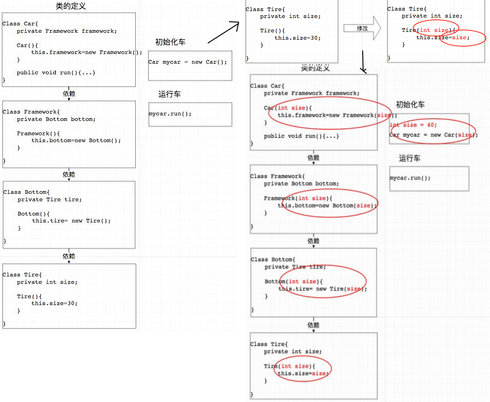

# java_spring02ioc有什么优点
有很多关于ioc优点说明，比如有如下不同的说法：

01,IoC最原初的目的就是充分利用OO的多态性，使得**通过配置文件而不是在代码里硬编码（hardcode）的方式来实例化对象和装配对象图**，这样就有了为不同的客户场景服务的**灵活性**（不同的客户通过配置文件使用不同的子类）。**IoC本质上和插件化代码的思路很接近**举例来说，软件公司只需要维护一套类库，然后通过使用配置文件装配对象图的方式为不同的客户定制不同版本的软件。这些软件可以在功能上、界面上大相径庭，但是区别只在于配置文件

02,ioc的思想最核心的地方在于，资源不由使用资源的双方管理，而**由不使用资源的第三方管理**，这可以带来很多好处。第一，**资源集中管理**，实现资源的可配置和易管理。第二，**降低了使用资源双方的依赖程度**，也就是我们说的耦合度。

听起来都蛮有道理的，但都**有些抽象**，不明觉厉。那么具体落到代码里，IOC为我们提供了什么便捷呢?

找到一个不错的案例。特此分享下。

上图可以看出，非IOC机制下，修改了底层子类的构造函数，所有使用此子类的对象，都要进行修改。(传统开发中常见的**构造方法入参太多**的问题，基本都属于这类场景)

如果使用了IOC呢？

当**底层对象构造函数变更时，上层需要修改的地方少多了**，这就实现了所谓的**低耦合**。

并且spring的ioc默认是单例模式（意味着需要使用无状态函数），也节约了资源。

