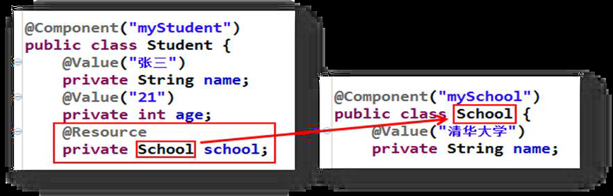
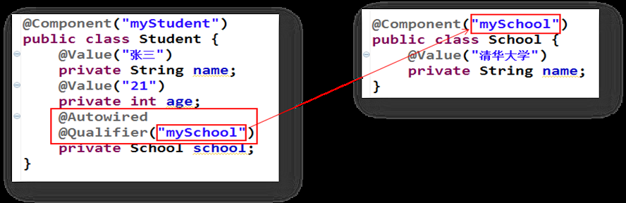

# java_spring04Autowired与Resource差异解析
spring中比较容易混淆的是Resource和Autowired，特此做下区分。


Resource：**j2ee的注解**，**默认以byName**的方式去匹配与属性名相同的bean的id，如果没有找到就会以byType的方式查找，如果byType查找到多个的话，使用@Qualifier注解（spring注解）指定某个具体名称的bean。




Autowired：**spring注解**，**默认是以byType**的方式去匹配类型相同的bean，如果只匹配到一个，那么就直接注入该bean，无论要注入的 bean 的 name 是什么；如果匹配到多个，就会调用 DefaultListableBeanFactory 的 determineAutowireCandidate 方法来决定具体注入哪个bean。

determineAutowireCandidate 方法的逻辑是：

```
先找 Bean 上有@Primary 注解的，有则直接返回 bean 的 name。  
再找 Bean 上有 @Order，@PriorityOrder 注解的，有则返回 bean 的 name。  
最后再以名称匹配（ByName）的方式去查找相匹配的 bean。  
```
可以简单的理解为**先以 ByType 的方式去匹配，如果匹配到了多个再以 ByName 的方式去匹配**，找到了对应的 bean 就去注入，没找到就抛出异常。

```
还有一点要注意：如果使用了 @Qualifier 注解，那么当自动装配匹配到多个 bean 的时候就不会进入 determineAutowireCandidate 方法（亲测），而是直接查找与 @Qualifer 指定的 bean name 相同的 bean 去注入，找到了就直接注入，没有找到则抛出异常。  
```



@Autowired与@Resource异同：

```
1、@Autowired与@Resource都可以用来装配bean。都可以写在字段上，或写在setter方法上。  
2、@Autowired默认按类型装配（属于spring规范），默认情况下必须要求依赖对象必须存在，如果要允许null 值，可以设置它的required属性为false，如：@Autowired(required=false) ，如果我们想使用名称装配可以结合@Qualifier注解进行使用  
3、@Resource（属于J2EE复返），默认按照名称进行装配，名称可以通过name属性进行指定。如果没有指定name属性，当注解写在字段上时，默认取字段名进行按照名称查找，如果注解写在setter方法上默认取属性名进行装配。当找不到与名称匹配的bean时才按照类型进行装配。但是需要注意的是，如果name属性一旦指定，就只会按照名称进行装配。  
```
它们的作用相同都是用注解方式注入对象，但执行顺序不同。**@Autowired先byType，@Resource先byName**。


**问题：Spring的@Autowired加到接口上但获取的是实现类？**

```
/* 类 @Controller注解，会在spring容器中实例化对象 */
@Controller
public class UserContoller{
	@Autowired		// 先按类型找，然后按id为属性名去找
	private UserService userService;
	//为什么他会拿到userServiceImpl？
	// @Autowired会帮你按UserService的类型去容器中找唯一bean对象
	// 1、容器没有该类型的对象：报错
	// 2、容器中有该类型的唯一bean对象，就将该唯一bean对象赋值给该属性
	///3、容器中有多个【两个及以上】该类型的唯一bean对象，
	//     它会再根据该属性名去容器中找，
	//     看看容器中的哪个bean对象的id值和该属性名一致，
	//     如果有，就将容器中该对象赋值给该属性，如果没有报错。
}	
/* 接口  */
public interface UserService{}

/* 类  @Service注解，会在spring容器中实例化对象 */
@Service
public class UserServiceImpl implements UserService{}

```
@Autowired先按类型找，然后再按id为属性名去找

他会帮你按UserService的类型去容器中找唯一bean对象


容器没有该类型的对象：报错

容器中有该类型的唯一bean对象，就将该唯一bean对象赋值给该属性

容器中有多个【两个及以上】该类型的唯一bean对象，

它会再根据该属性名去容器中找，

看看容器中的哪个bean对象的id值和该属性名一致，

如果有，就将容器中该对象赋值给该属性，如果没有报错。

然后通过多态的向上转型就赋值成功。等价于之前手动赋值

```
UserService userService = new UserServiceImpl();
```

**问题：同一类型拥有多个实现类的时候，如何注入呢？**

答：这种场景下，只能通过 byName 注入的方式。可以使用 @Resource 或 @Qualifier 注解。


**问题：如果没有指定Spring创建的bean的名称，会怎么注入呢？**

(1)默认名为类名,但首字母小写,如:UserService类,创建的bean的name为userService

(2)如果类名前两个或以上字母都为大写,那么bean的名字就是类名,如:TUserService类,默认创建的bean的name为TUserService


@Required 注释应用于 bean 属性的 setter 方法，它表明**受影响的 bean 属性在配置时必须放在 XML 配置文件中**，否则容器就会抛出一个 BeanInitializationException 异常


参考

Spring依赖注入与自动装配:https://blog.csdn.net/weixin_44273302/article/details/113716352

Spring的@Autowired和@Qualifier注解的3个知识点：https://blog.csdn.net/gs838251686/article/details/82973228

spring学习笔记之注解注入方式详解（自动装配）详解:https://blog.csdn.net/iamlinuxasd/article/details/95735226

