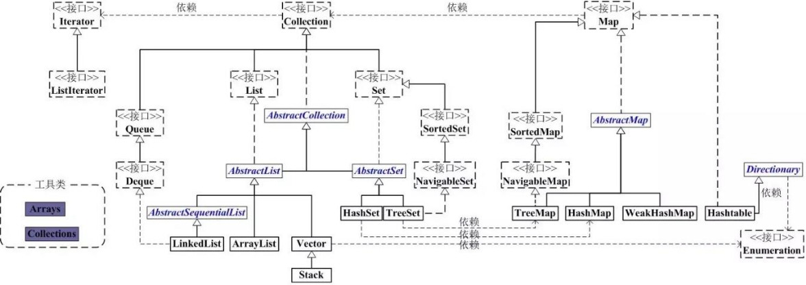
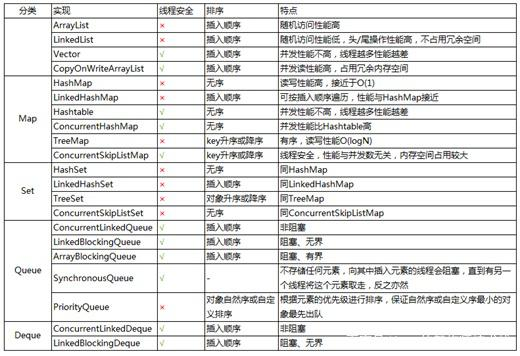
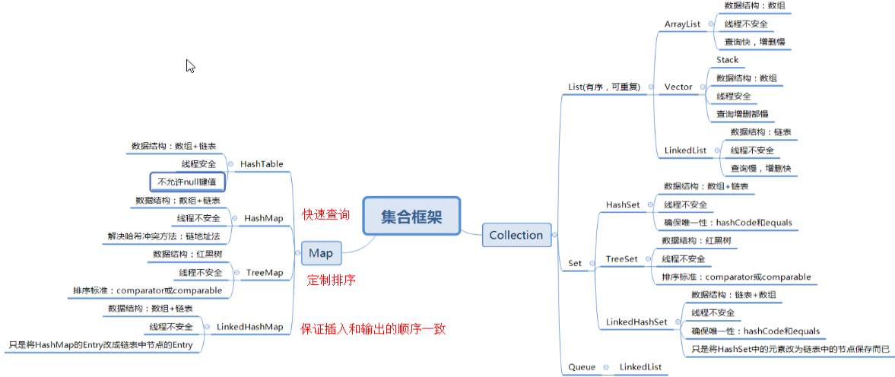
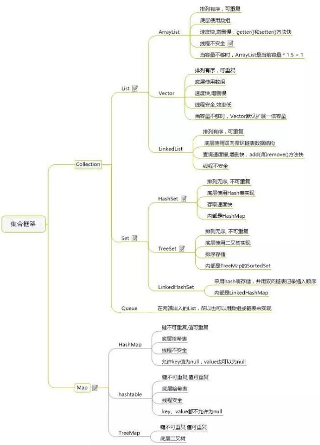

# java_基础02集合

## 整体关系图

## Java集合接口的作用

|    接口名称     |                                                                         作    用                                                                         |
| -------------- | ------------------------------------------------------------------------------------------------------------------------------------------------------- |
| Iterator 接口   | 集合的输出接口，主要用于遍历输出（即迭代访问）Collection 集合中的元素，Iterator 对象被称之为迭代器。迭代器接口是集合接口的父接口，实现类实现 Collection 时就必须实现 Iterator 接口。 |
| Collection 接口 | 是 List、Set 和 Queue 的父接口，是存放一组单值的最大接口。所谓的单值是指集合中的每个元素都是一个对象。一般很少直接使用此接口直接操作。                                          |
| Queue 接口      | Queue 是 Java 提供的队列实现，有点类似于 List。                                                                                                               |
| Dueue 接口      | 是 Queue 的一个子接口，为双向队列。                                                                                                                           |
| List 接口       | 是最常用的接口。是有序集合，允许有相同的元素。使用 List 能够精确地控制每个元素插入的位置，用户能够使用索引（元素在 List 中的位置，类似于数组下标）来访问 List 中的元素，与数组类似。     |
| Set 接口        | 不能包含重复的元素。                                                                                                                                        |
| Map 接口        | 是存放一对值的最大接口，即接口中的每个元素都是一对，以 key➡value 的形式保存。                                                                                        |

对于 Set、List、Queue 和 Map 这 4 种集合，Java 最常用的实现类分别是 HashSet、TreeSet、ArrayList、ArrayDueue、LinkedList 和 HashMap、TreeMap 等。表 2 介绍了集合中这些常用的实现类。

## Java集合实现类的作用

|   类名称    |                                                                               作用                                                                               |
| ---------- | --------------------------------------------------------------------------------------------------------------------------------------------------------------- |
| HashSet    | 为优化査询速度而设计的 Set。它是基于 HashMap 实现的，HashSet 底层使用 HashMap 来保存所有元素，实现比较简单                                                                      |
| TreeSet    | 实现了 Set 接口，是一个有序的 Set，这样就能从 Set 里面提取一个有序序列                                                                                                      |
| ArrayList  | 一个用数组实现的 List，能进行快速的随机访问，效率高而且实现了可变大小的数组                                                                                                   |
| ArrayDueue | 是一个基于数组实现的双端队列，按“先进先出”的方式操作集合元素                                                                                                                |
| LinkedList | 对顺序访问进行了优化，但随机访问的速度相对较慢。此外它还有 addFirst()、addLast()、getFirst()、getLast()、removeFirst() 和 removeLast() 等方法，能把它当成栈（Stack）或队列（Queue）来用 |
| HashMap    | 按哈希算法来存取键对象                                                                                                                                              |
| TreeMap    | 可以对键对象进行排序                                                                                                                                                |

## （一）说说List,Set,Map三者的区别？

List(对付顺序的好帮手)： List接口存储一组不唯一（可以有多个元素引用相同的对象），有序的对象

Set(注重独一无二的性质): 不允许重复的集合。不会有多个元素引用相同的对象。

Map(用Key来搜索的专家): 使用键值对存储。Map会维护与Key有关联的值。两个Key可以引用相同的对象，但Key不能重复，典型的Key是String类型，但也可以是任何对象。

## （二）Arraylist 与 LinkedList 区别?

1. 是否保证线程安全： ArrayList 和 LinkedList 都是不同步的，也就是不保证线程安全；

2. 底层数据结构： Arraylist 底层使用的是 Object 数组；LinkedList 底层使用的是 双向链表 数据结构（JDK1.6之前为循环链表，JDK1.7取消了循环。注意双向链表和双向循环链表的区别，下面有介绍到！）

3. 插入和删除是否受元素位置的影响： ① ArrayList 采用数组存储，所以插入和删除元素的时间复杂度受元素位置的影响。 比如：执行add(E e)方法的时候， ArrayList 会默认在将指定的元素追加到此列表的末尾，这种情况时间复杂度就是O(1)。但是如果要在指定位置 i 插入和删除元素的话（add(int index, E element)）时间复杂度就为 O(n-i)。因为在进行上述操作的时候集合中第 i 和第 i 个元素之后的(n-i)个元素都要执行向后位/向前移一位的操作。 ② LinkedList 采用链表存储，所以插入，删除元素时间复杂度不受元素位置的影响，都是近似 O（1）而数组为近似 O（n）。

4. 是否支持快速随机访问： LinkedList 不支持高效的随机元素访问，而 ArrayList 支持。快速随机访问就是通过元素的序号快速获取元素对象(对应于get(int index)方法)。

5. 内存空间占用： ArrayList的空 间浪费主要体现在在list列表的结尾会预留一定的容量空间，而LinkedList的空间花费则体现在它的每一个元素都需要消耗比ArrayList更多的空间（因为要存放直接后继和直接前驱以及数据）。

1.ArrayList是实现了基于动态数组的数据结构，LinkedList基于链表的数据结构。

　　2.对于随机访问get和set，ArrayList觉得优于LinkedList，因为LinkedList要移动指针。

　　3.对于新增和删除操作add和remove，LinedList比较占优势，因为ArrayList要移动数据。

尽量避免同时遍历和删除集合。因为这会改变集合的大小；

## （三）ArrayList 与 Vector 区别呢?为什么要用Arraylist取代Vector呢？

Vector类的所有方法都是同步的。可以由两个线程安全地访问一个Vector对象、但是一个线程访问Vector的话代码要在同步操作上耗费大量的时间。

Arraylist不是同步的，所以在不需要保证线程安全时建议使用Arraylist。

## （四）说一说 ArrayList 的扩容机制吧

https://github.com/Snailclimb/JavaGuide/blob/master/docs/java/collection/ArrayList-Grow.md

## （五）HashSet与TreeSet与LinkedHashSet对比

HashSet不能保证元素的排列顺序，顺序有可能发生变化，不是同步的，集合元素可以是null,但只能放入一个null

TreeSet是SortedSet接口的唯一实现类，TreeSet可以确保集合元素处于排序状态。TreeSet支持两种排序方式，自然排序 和定制排序，其中自然排序为默认的排序方式。向 TreeSet中加入的应该是同一个类的对象。

TreeSet判断两个对象不相等的方式是两个对象通过equals方法返回false，或者通过CompareTo方法比较没有返回0

自然排序

自然排序使用要排序元素的CompareTo（Object obj）方法来比较元素之间大小关系，然后将元素按照升序排列。

定制排序

自然排序是根据集合元素的大小，以升序排列，如果要定制排序，应该使用Comparator接口，实现 int compare(To1,To2)方法

LinkedHashSet集合同样是根据元素的hashCode值来决定元素的存储位置，但是它同时使用链表维护元素的次序。这样使得元素看起 来像是以插入顺 序保存的，也就是说，当遍历该集合时候，LinkedHashSet将会以元素的添加顺序访问集合的元素。

LinkedHashSet在迭代访问Set中的全部元素时，性能比HashSet好，但是插入时性能稍微逊色于HashSet。

## （六）LinkedHashMap和HashMap，TreeMap对比

Hashtable与 HashMap类似,它继承自Dictionary类，不同的是:它不允许记录的键或者值为空;它支持线程的同步，即任一时刻只有一个线程能写Hashtable,因此也导致了 Hashtable在写入时会比较慢。

Hashmap 是一个最常用的Map,它根据键的HashCode 值存储数据,根据键可以直接获取它的值，具有很快的访问速度，遍历时，取得数据的顺序是完全随机的。

LinkedHashMap保存了记录的插入顺序，在用Iterator遍历LinkedHashMap时，先得到的记录肯定是先插入的.也可以在构造时用带参数，按照应用次数排序。在遍历的时候会比HashMap慢，不过有种情况例外，当HashMap容量很大，实际数据较少时，遍历起来可能会比LinkedHashMap慢，因为LinkedHashMap的遍历速度只和实际数据有关，和容量无关，而HashMap的遍历速度和他的容量有关。

TreeMap实现SortMap接口，能够把它保存的记录根据键排序,默认是按键值的升序排序，也可以指定排序的比较器，当用Iterator 遍历TreeMap时，得到的记录是排过序的。

我们用的最多的是HashMap,HashMap里面存入的键值对在取出的时候是随机的,在Map 中插入、删除和定位元素，HashMap 是最好的选择。

TreeMap取出来的是排序后的键值对。但如果您要按自然顺序或自定义顺序遍历键，那么TreeMap会更好。

LinkedHashMap 是HashMap的一个子类，如果需要输出的顺序和输入的相同,那么用LinkedHashMap可以实现,它还可以按读取顺序来排列，像连接池中可以应用。

## （七）HashMap 和 Hashtable 的区别

线程是否安全： HashMap 是非线程安全的，HashTable 是线程安全的；HashTable 内部的方法基本都经过synchronized 修饰。（如果你要保证线程安全的话就使用 ConcurrentHashMap 吧！）；

效率： 因为线程安全的问题，HashMap 要比 HashTable 效率高一点。另外，HashTable 基本被淘汰，不要在代码中使用它；

对Null key 和Null value的支持： HashMap 中，null 可以作为键，这样的键只有一个，可以有一个或多个键所对应的值为 null。。但是在 HashTable 中 put 进的键值只要有一个 null，直接抛出 NullPointerException。

初始容量大小和每次扩充容量大小的不同 ： ①创建时如果不指定容量初始值，Hashtable 默认的初始大小为11，之后每次扩充，容量变为原来的2n+1。HashMap 默认的初始化大小为16。之后每次扩充，容量变为原来的2倍。②创建时如果给定了容量初始值，那么 Hashtable 会直接使用你给定的大小，而 HashMap 会将其扩充为2的幂次方大小（HashMap 中的tableSizeFor()方法保证，下面给出了源代码）。也就是说 HashMap 总是使用2的幂作为哈希表的大小,后面会介绍到为什么是2的幂次方。

底层数据结构： JDK1.8 以后的 HashMap 在解决哈希冲突时有了较大的变化，当链表长度大于阈值（默认为8）时，将链表转化为红黑树，以减少搜索时间。Hashtable 没有这样的机制。

## （八）HashMap 和 HashSet区别

如果你看过 HashSet 源码的话就应该知道：HashSet 底层就是基于 HashMap 实现的。（HashSet 的源码非常非常少，因为除了 clone()、writeObject()、readObject()是 HashSet 自己不得不实现之外，其他方法都是直接调用 HashMap 中的方法。

## （九）HashSet如何检查重复

当你把对象加入HashSet时，HashSet会先计算对象的hashcode值来判断对象加入的位置，同时也会与其他加入的对象的hashcode值作比较，如果没有相符的hashcode，HashSet会假设对象没有重复出现。但是如果发现有相同hashcode值的对象，这时会调用equals（）方法来检查hashcode相等的对象是否真的相同。如果两者相同，HashSet就不会让加入操作成功。（摘自我的Java启蒙书《Head fist java》第二版）

hashCode（）与equals（）的相关规定：

如果两个对象相等，则hashcode一定也是相同的

两个对象相等,对两个equals方法返回true

两个对象有相同的hashcode值，它们也不一定是相等的

综上，equals方法被覆盖过，则hashCode方法也必须被覆盖

hashCode()的默认行为是对堆上的对象产生独特值。如果没有重写hashCode()，则该class的两个对象无论如何都不会相等（即使这两个对象指向相同的数据）。

## （十）HashMap的底层实现

## （十一）HashMap 的长度为什么是2的幂次方

为了能让 HashMap 存取高效，尽量较少碰撞，也就是要尽量把数据分配均匀。我们上面也讲到了过了，Hash 值的范围值-2147483648到2147483647，前后加起来大概40亿的映射空间，只要哈希函数映射得比较均匀松散，一般应用是很难出现碰撞的。但问题是一个40亿长度的数组，内存是放不下的。所以这个散列值是不能直接拿来用的。用之前还要先做对数组的长度取模运算，得到的余数才能用来要存放的位置也就是对应的数组下标。这个数组下标的计算方法是“ (n - 1) & hash”。（n代表数组长度）。这也就解释了 HashMap 的长度为什么是2的幂次方。

这个算法应该如何设计呢？

我们首先可能会想到采用%取余的操作来实现。但是，重点来了：“取余(%)操作中如果除数是2的幂次则等价于与其除数减一的与(&)操作（也就是说 hash%length==hash&(length-1)的前提是 length 是2的 n 次方；）。” 并且 采用二进制位操作 &，相对于%能够提高运算效率，这就解释了 HashMap 的长度为什么是2的幂次方。

## （十二）HashMap 多线程操作导致死循环问题

主要原因在于 并发下的Rehash 会造成元素之间会形成一个循环链表。不过，jdk 1.8 后解决了这个问题，但是还是不建议在多线程下使用 HashMap,因为多线程下使用 HashMap 还是会存在其他问题比如数据丢失。并发环境下推荐使用 ConcurrentHashMap 。

Rehash：一般来说，Hash表这个容器当有数据要插入时，都会检查容量有没有超过设定的thredhold，如果超过，需要增大Hash表的尺寸，但是这样一来，整个Hash表里的无素都需要被重算一遍。这叫rehash，这个成本相当的大。

## （十三）ConcurrentHashMap 和 Hashtable 的区别

ConcurrentHashMap 和 Hashtable 的区别主要体现在实现线程安全的方式上不同。

底层数据结构： JDK1.7的 ConcurrentHashMap 底层采用 分段的数组+链表 实现，JDK1.8 采用的数据结构跟HashMap1.8的结构一样，数组+链表/红黑二叉树。Hashtable 和 JDK1.8 之前的 HashMap 的底层数据结构类似都是采用 数组+链表 的形式，数组是 HashMap 的主体，链表则是主要为了解决哈希冲突而存在的；

实现线程安全的方式（重要）： ① 在JDK1.7的时候，ConcurrentHashMap（分段锁） 对整个桶数组进行了分割分段(Segment)，每一把锁只锁容器其中一部分数据，多线程访问容器里不同数据段的数据，就不会存在锁竞争，提高并发访问率。 到了 JDK1.8 的时候已经摒弃了Segment的概念，而是直接用 Node 数组+链表+红黑树的数据结构来实现，并发控制使用 synchronized 和 CAS 来操作。（JDK1.6以后 对 synchronized锁做了很多优化） 整个看起来就像是优化过且线程安全的 HashMap，虽然在JDK1.8中还能看到 Segment 的数据结构，但是已经简化了属性，只是为了兼容旧版本；② Hashtable(同一把锁) 😗*使用 synchronized 来保证线程安全，get/put所有相关操作都是synchronized的，这相当于给整个哈希表加了一把大锁,**效率非常低下。当一个线程访问同步方法时，其他线程也访问同步方法，可能会进入阻塞或轮询状态，如使用 put 添加元素，另一个线程不能使用 put 添加元素，也不能使用 get，竞争会越来越激烈效率越低。

## （十五）comparable 和 Comparator的区别
comparable接口实际上是出自java.lang包 它有一个 compareTo(Object obj)方法用来排序

comparator接口实际上是出自 java.util 包它有一个compare(Object obj1, Object obj2)方法用来排序

Map类似，是一种数组和链表结构，一个 Segment 包含一个 HashEntry 数组，每个 HashEntry 是一个链表结构的元素，每个 Segment 守护着一个HashEntry数组里的元素，当对 HashEntry 数组的数据进行修改时，必须首先获得对应的 Segment的锁。

## hashset重复不会覆盖(保留最初那个，和hashmap并不冲突)

对于HashSet，这个value只是个空的Object类的对象，没有任何实际作用，HashSet中的元素实际上是存储在key上的。针对重复的key，HashMap只有对于value的处理，并不会替换key，因此在HashSet中加入相同元素不会覆盖。

向HashSet中加入相同元素不会进行覆盖。因为HashSet底层使用HashMap实现，元素存在HashMap的key中。在HashMap中，多次put相同的key，只会覆盖value，而不存在key的情况。

## 参考
java集合详解完整版（超详细）：https://blog.csdn.net/weixin_42533238/article/details/106651056#t3

Java集合详解：http://c.biancheng.net/view/6824.html

【Java集合】探究HashSet的底层实现 加入相同元素是否会覆盖？：https://blog.csdn.net/Steven_L_/article/details/106122324

