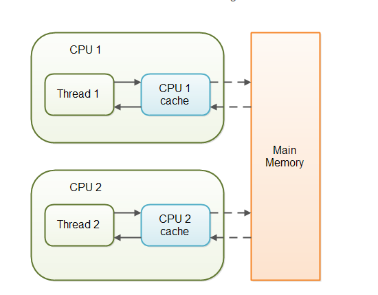

# java_并发编程02Volatile
前置知识：需要先了解 Java内存模型(JMM) 相关知识.

用法:volatile只可以用来修饰变量,不可以修饰方法以及类


## 作用(可见性，举例)
count++; 这条语句由3条指令组成：

（1）将 count 的值从内存加载到 cpu 的某个寄存器r

（2）将 寄存器r 的值 +1，结果存放在 寄存器s

（3）将 寄存器s 中的值写回内存


所以，如果有多个线程同时在执行 count++;，在某个线程执行完第（3）步之前，**其它线程是看不到它的执行结果**的。


在没有 volatile 的时候，执行完 count++;，执行结果其实是**写到CPU缓存中，没有马上写回到内存中**，后续在某些情况下（比如CPU缓存不够用）再将CPU缓存中的值flush到内存。正因为没有马上写到内存，所以**不能保证其它线程可以及时见到执行的结果**。
在有 volatile 的时候，执行完 count++;，执行结果写到CPU缓存中，**并且同时写回到内存**，因为已经写回内存了，所以可以保证**其它线程马上看到执行的结果**。
但是，**volatile 并没有保证原子性**，在某个线程执行（1）（2）（3）的时候，volatile 并没有锁定 count 的值，也就是并不能阻塞其他线程也执行（1）（2）（3）。可能有两个线程同时执行（1），所以（2）计算出来一样的结果，然后（3）存回的也是同一个值。


## 原理
Java语言提供了一种**稍弱的同步机制**，即volatile变量，用来确保**将变量的更新操作通知到其他线程**。当把变量声明为volatile类型后，编译器与运行时都会注意到这个变量是共享的，因此**不会将该变量上的操作与其他内存操作一起重排序**。volatile变量不会被缓存在寄存器或者对其他处理器不可见的地方，因此在读取volatile类型的变量时总会返回最新写入的值。

在访问volatile变量时**不会执行加锁操作，因此也就不会使执行线程阻塞**，因此volatile变量是一种比sychronized关键字**更轻量级的同步机制**。




当对非 volatile 变量进行读写的时候，每个线程先从内存拷贝变量到CPU缓存中。如果计算机有多个CPU，每个线程可能在不同的CPU上被处理，这意味着每个线程可以拷贝到不同的 CPU cache 中。

而声明变量是 volatile 的，JVM 保证了每次读变量都从内存中读，跳过 CPU cache 这一步。

当一个变量定义为 volatile 之后，将具备两种特性：

1.**保证此变量对所有的线程的可见性**，这里的“可见性”，如本文开头所述，当一个线程修改了这个变量的值，volatile 保证了新值能立即同步到主内存，以及每次使用前立即从主内存刷新。但普通变量做不到这点，普通变量的值在线程间传递均需要通过主内存（详见：Java内存模型）来完成。

2.**禁止指令重排序优化**。有volatile修饰的变量，赋值后多执行了一个“load addl $0x0, (%esp)”操作，这个操作相当于一个**内存屏障**（指令重排序时不能把后面的指令重排序到内存屏障之前的位置），只有一个CPU访问内存时，并不需要内存屏障；（什么是指令重排序：是指CPU采用了允许将多条指令不按程序规定的顺序分开发送给各相应电路单元处理）。


## 性能
volatile 的**读性能消耗与普通变量几乎相同，但是写操作稍慢**，因为它需要在本地代码中插入许多内存屏障指令来保证处理器不发生乱序执行。

## volatile适用的场景
synchronized关键字是防止多个线程同时执行一段代码，那么就会很影响程序执行效率，而volatile关键字在某些情况下性能要优于synchronized，但是要注意volatile关键字是无法替代synchronized关键字的，因为volatile关键字无法保证操作的原子性。通常来说，使用volatile必须具备以下2个条件：

1）对变量的写操作不依赖于当前值

2）该变量没有包含在具有其他变量的不变式中

实际上，这些条件表明，可以被写入 volatile 变量的这些有效值独立于任何程序的状态，包括变量的当前状态。

事实上，我的理解就是上面的2个条件需要保证操作是原子性操作，才能保证使用volatile关键字的程序在并发时能够正确执行。


下面列举几个Java中使用volatile的几个场景。

### 状态标志
作为一个布尔状态标志，用于指示发生了一个重要的一次性事件，例如完成初始化或任务结束.

状态标志并不依赖于程序内任何其他状态，且通常只有一种状态转换

```
volatile boolean shutdownRequested;
...
public void shutdown() { shutdownRequested = true; }

public void doWork() { 
    while (!shutdownRequested) { 
        // todo...
    }
}
```
### 一次性安全发布（one-time safe publication）
在缺乏同步的情况下，可能会遇到某个对象引用的更新值（由另一个线程写入）和该对象状态的旧值同时存在。（这就是造成著名的双重检查锁定（double-checked-locking）问题的根源）。

```
public class TestInstance{
	private volatile static TestInstance instance;
	
	public static TestInstance getInstance(){        //1
		if(instance == null){                        //2
			synchronized(TestInstance.class){        //3
				if(instance == null){                //4
					instance = new TestInstance();   //5
				}
			}
		}
		return instance;                             //6
	}
}
```
需要volatile关键字的原因是，在并发情况下，如果没有volatile关键字，在第5行会出现问题。instance = new TestInstance();可以分解为3行伪代码

```
a. memory = allocate() //分配内存
b. ctorInstanc(memory) //初始化对象
c. instance = memory //设置instance指向刚分配的地址
```
面的代码在编译运行时，可能会出现重排序**从a-b-c排序为a-c-b**。在多线程的情况下会出现以下问题。当线程A在执行第5行代码时，B线程进来执行到第2行代码。假设此时A执行的过程中发生了指令重排序，即先执行了a和c，没有执行b。那么由于A线程执行了c导致instance指向了一段地址，所以B线程判断instance不为null，会直接**跳到第6行并返回一个未初始化的对象**。


### 独立观察（independent observation）
将 volatile变量用于多个独立观察结果的发布,是"状态标志"的拓展，该值随时会发生变化，同时会被反复使用，前者一般就是用一次 ;只是简单的赋值操作，不会做复合操作.

```
class CustomLinkedList{
    public volatile Node lastNode;
    .....
    public void add() {
        Node node = new Node();
        .....
        lastNode = node;//将新节点作为最后一个节点
    }
}
```
### 开销较低的读－写锁策略

当读远多于写，结合使用内部锁和 volatile 变量来减少同步的开销
利用volatile保证读取操作的可见性；利用synchronized保证复合操作的原子性
```
public class Counter {
    private volatile int value;
    //利用volatile保证读取操作的可见性, 读取时无需加锁
    public int getValue() { return value; }
    // 使用 synchronized 加锁
    public synchronized int increment() { 
        return value++;
    }
}
```

## volatile不适合复合操作(i++)
比如i++此类操作。

解决方法：AtomicInteger,synchronized,lock


## volatile的原理和实现机制
前面讲述了源于volatile关键字的一些使用，下面我们来探讨一下volatile到底如何保证可见性和禁止指令重排序的。

下面这段话摘自《深入理解Java虚拟机》：

“观察加入volatile关键字和没有加入volatile关键字时所生成的汇编代码发现，**加入volatile关键字时，会多出一个lock前缀指令** ”

lock前缀指令实际上相当于一个**内存屏障**（也成内存栅栏），内存屏障会提供3个功能：

1）它确保**指令重排序时不会把其后面的指令排到内存屏障之前**的位置，也不会把前面的指令排到内存屏障的后面；即在执行到内存屏障这句指令时，在它前面的操作已经全部完成；

2）它会**强制将对缓存的修改操作立即写入主存**；

3）如果是写操作，它会导致其他CPU中对应的**缓存行无效**。

## 为什么volatile在并发下也是线程不安全的
java的运算并非原子性的操作，导致volatile在并发下并非是线程安全的。

最简单的例子就是多线程为一个变量连续赋值 每次做到 i++的问题。在进行加一的操作过程中，volatile关键字保证了变量i的值当前是正确的，但是在执行+1操作的指令的过程中，其他线程已经把i的值加大了，此时操作栈顶的值就变成了过期的数据。


## 参考
Java中Volatile关键字详解及代码示例:https://www.jb51.net/article/128240.htm

java中关于volatile的理解疑问？:https://www.zhihu.com/question/49656589

Java volatile关键字最全总结：原理剖析与实例讲解(简单易懂):https://blog.csdn.net/u012723673/article/details/80682208

Java面试官最爱问的volatile关键字:https://www.techug.com/post/java-volatile-keyword.html

java并发(4)深入理解volatile:https://www.jianshu.com/p/9e467de97216
Java并发编程：volatile关键字解析:https://www.cnblogs.com/dolphin0520/p/3920373.html

为什么volatile在并发下也是线程不安全的：https://blog.csdn.net/laifu007/article/details/89850299


