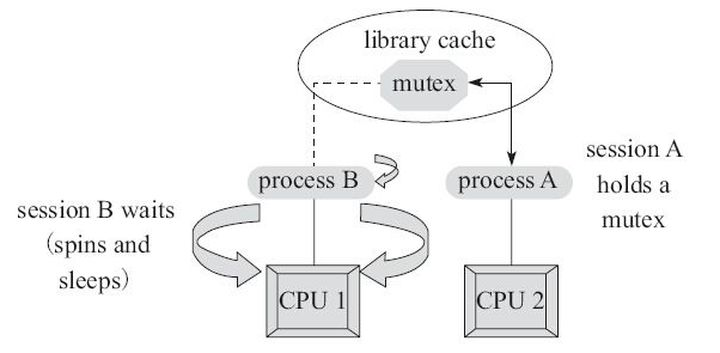
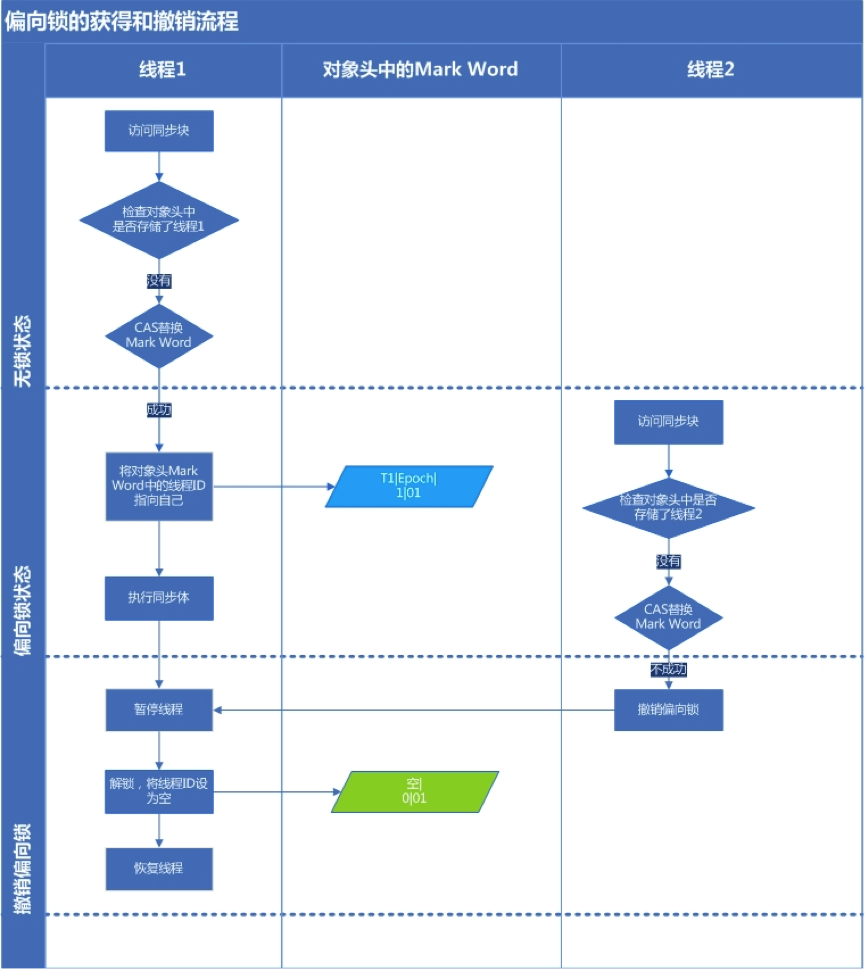
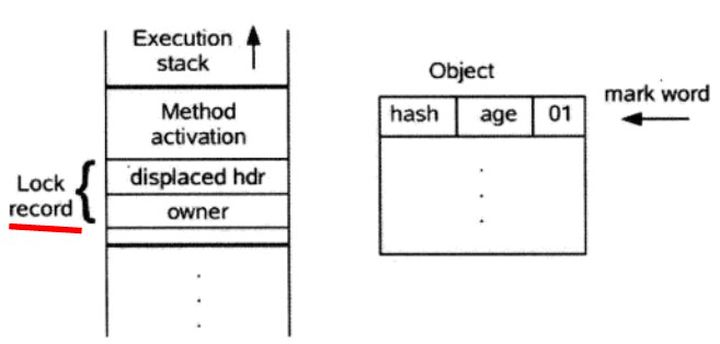
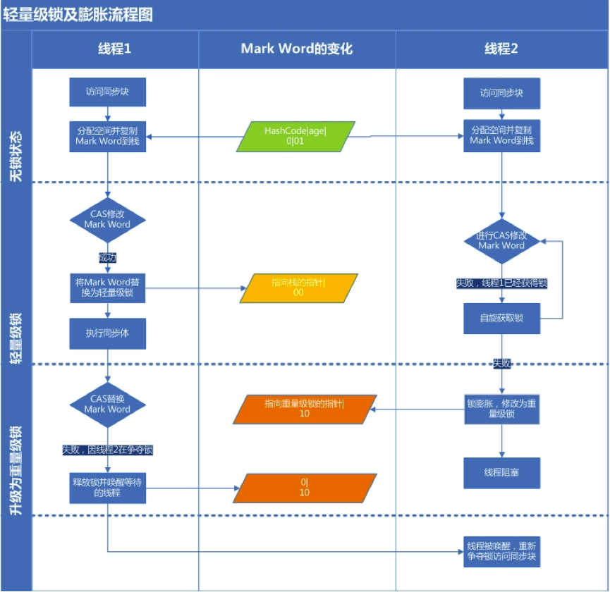
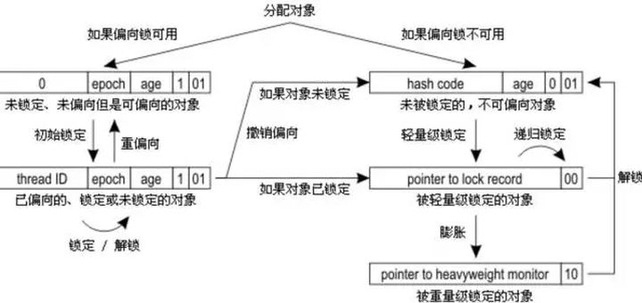
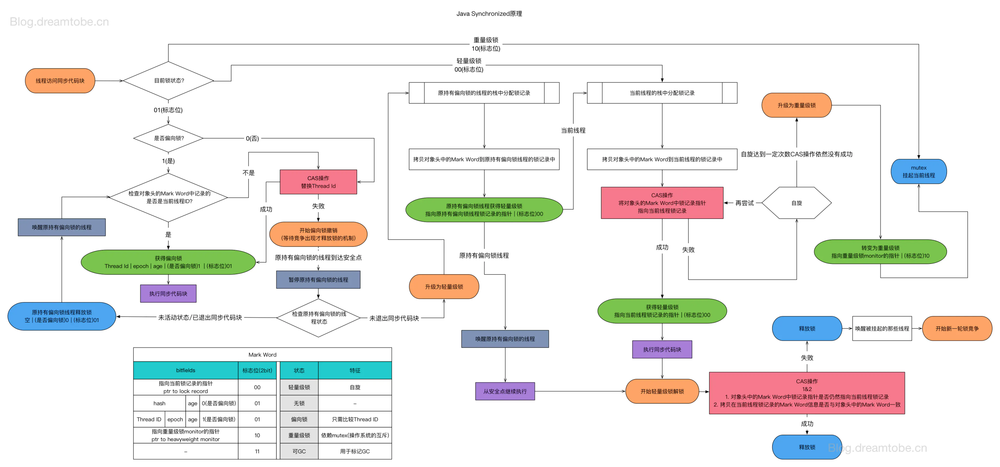

# java_并发编程04Synchronized
synchronized是用于修饰用的加锁关键词，synchronized属于**隐式锁**，即锁的持有与释放都是隐式的，我们无需干预。可以用于方法和代码块中，可以简单理解为锁住对象对应的指针地址，只要区分好指针对象是否同一个地址，就可以判断两个线程的锁是否互斥。

synchronized是可重入的，意思就是当前线程获得锁之后，其他线程就无法获得锁进入，但是当前线程自己还可以再次获得锁多次进入。


在进一步阐述之前，我们需要明确几点：

A．无论synchronized关键字加在方法上还是对象上，它取得的锁都是对象，而不是把一段代码或函数当作锁――而且同步方法很可能还会被其他线程的对象访问。

B．每个对象只有一个锁（lock）与之相关联。

C．实现同步是要很大的系统开销作为代价的，甚至可能造成死锁，所以尽量避免无谓的同步控制。


## 修饰对象
synchronized是一种同步锁。它修饰的对象有以下几种：


|   修饰对象    |                    被锁住对象                    | 全局唯一 |                                 简单例子                                  |
| ------------ | ---------------------------------------------- | ------ | ----------------------------------------------------------------------- |
| 类的类型      | 类的类型                                         | √       | `synchronized(Example.class) {...}`, 全局锁，其他线程无法进入                  |
| 类的实例      | 类的实例                                         | ×       | `synchronized(this){...}` 或者  `final A a = new A()  synchronized(a){...}` |
| 普通成员函数   | 类的实例                                         | ×       | `public synchronized void f() {...}`锁住类的实例                            |
| 静态成员函数   | 类的类型                                         | √       | `public static synchronized void f() {...}`锁住类的类型                      |
| (静态)成员变量 | 成员对象所指向实例，final修饰，否则重赋值后非同一对象 | ×       | `final (static) A a = new A()  synchronized(a){...}`                       |

简单理解：可以简单理解成锁住对象是对象指针值，实际原理要比这个复杂的多。

**修饰(this)代码块**

被修饰的代码块称为同步语句块，其作用的范围是大括号{}括起来的代码，作用的对象是调用这个代码块的对象；（而不一定是本对象了）

（synchronized方法是对当前对象加锁，synchronized代码块是对某个对象加锁）

格式是这样的：**synchronized(类名)**{......}

我们先来认识第一种用法来体会修饰代码块的好处：

synchronized(this)同步代码块：a调用相关代码后，b对其它synchronized方法和synchronized(this)同步代码块调用会阻塞。但是没有被synchronized修饰的代码就得以执行，**不像之前修饰方法那么死板**了。


**修饰(非this)代码块**（也就是说将任意对象作为对象监视器）：

格式：**synchronized(非this对象x)**{......}

1、当多个线程持有的对象监听器为同一个对象时，依旧是同步的，同一时间只有一个可以访问，

2、但是对象不同，执行就是异步的。

这样有什么好处呢？

（因为如果一个类有很多synchronized方法或synchronized（this）代码块，还是会影响效率，这时用synchronized(非this)同步代码块就不会和其它锁this同步方法争抢this锁）


## 底层原理
在 Java 早期版本中，synchronized属于重量级锁，效率低下，因为监视器锁（monitor）是依赖于**底层的操作系统来实现(用户态内核态切换)**

在 Java 6 之后从**JVM 层面对synchronized 较大优化**，锁的实现引入了如**自旋锁、适应性自旋锁、锁消除、锁粗化、偏向锁、轻量级锁**等技术来减少锁操作的开销


JVM基于进入和退出**Monitor**对象来实现方法同步和代码块同步，但两者的实现细节不一样。

**synchronized 同步语句块**：使用**monitorenter 和 monitorexit 指令**。

其中 monitorenter 指令指向同步代码块的开始位置，monitorexit 指令则指明同步代码块的结束位置。

当执行 monitorenter 指令时，线程试图获取锁也就是获取 monitor(monitor对象存在于每个Java对象的对象头中，synchronized 锁便是通过这种方式获取锁的，也是为什么Java中任意对象可以作为锁的原因) 的持有权.当计数器为0则可以成功获取，获取后将锁计数器设为1也就是加1。相应的在执行 monitorexit 指令后，将锁计数器设为0，表明锁被释放。如果获取对象锁失败，那当前线程就要阻塞等待，直到锁被另外一个线程释放为止。

**synchronized 修饰方法**：使用**ACC_SYNCHRONIZED标识**。

JVM就是根据该标示符来实现方法的同步的：当方法调用时，调用指令将会检查方法的 ACC_SYNCHRONIZED 访问标志是否被设置，如果设置了，执行线程将先获取monitor，获取成功之后才能执行方法体，方法执行完后再释放monitor。在方法执行期间，其他任何线程都无法再获得同一个monitor对象。 其实本质上没有区别，只是方法的同步是一种隐式的方式来实现，无需通过字节码来完成。


## Monitor和Mutex Lock
监视器锁（Monitor）本质是依赖于底层的操作系统的Mutex Lock（互斥锁）来实现的。每个对象都对应于一个可称为" 互斥锁" 的标记，这个标记用来保证在任一时刻，只能有一个线程访问该对象。

互斥锁：用于保护临界区，确保**同一时间只有一个线程访问数据**。对共享资源的访问，先对互斥量进行加锁，如果互斥量已经上锁，调用线程会阻塞，直到互斥量被解锁。在完成了对共享资源的访问后，要对互斥量进行解锁。


mutex的工作方式：




1) 申请mutex

2) 如果成功，则持有该mutex

3) 如果失败，则进行spin自旋. spin的过程就是在线等待mutex, 不断发起mutex gets, 直到获得mutex或者达到spin_count限制为止

4) 依据工作模式的不同选择yiled还是sleep

5) 若达到sleep限制或者被主动唤醒或者完成yield, 则重复1)~4)步，直到获得为止

由于Java的线程是映射到操作系统的原生线程之上的，如果要阻塞或唤醒一条线程，都需要操作系统来帮忙完成，这就需要**从用户态转换到核心态中**，因此状态转换需要耗费很多的处理器时间。所以**synchronized是Java语言中的一个重量级操作**。在JDK1.6中，虚拟机进行了一些优化，譬如**在通知操作系统阻塞线程之前加入一段自旋等待过程，避免频繁地切入到核心态中**：


synchronized与java.util.concurrent包中的ReentrantLock相比，由于JDK1.6中加入了针对锁的优化措施（见后面），使得synchronized与ReentrantLock的性能基本持平。**ReentrantLock只是提供了synchronized更丰富的功能，而不一定有更优的性能，所以在synchronized能实现需求的情况下，优先考虑使用synchronized来进行同步**。


## 性能问题
synchronized确保了线程安全，但有时性能不佳。

synchronized关键字会让没有得到锁资源的线程进入BLOCKED状态，而后在争夺到锁资源后恢复为RUNNABLE状态，这个过程中涉及到操作系统**用户模式和内核模式的转换**，代价比较高。

尽管JAVA 1.6为synchronized做了优化，增加了从偏向锁到轻量级锁再到重量级锁的过过度，但是在**最终转变为重量级锁之后，性能仍然比较低**。所以面对这种情况，我们就可以使用java中的“原子操作类”。


## 优化措施
### 偏向锁
HotSpot的作者经过研究发现，**大多数情况下，锁不仅不存在多线程竞争，而且总是由同一线程多次获得**。偏向锁是为了在只有一个线程执行同步块时提高性能。

当一个线程访问同步块并获取锁时，会在**对象头和栈帧中的锁记录里存储锁偏向的线程ID**，以后该线程在进入和退出同步块时不需要进行CAS操作来加锁和解锁，只需简单地**测试一下对象头的Mark Word里是否存储着指向当前线程的偏向锁**。引入偏向锁是为了在无多线程竞争的情况下尽量减少不必要的轻量级锁执行路径，因为轻量级锁的获取及释放依赖多次CAS原子指令，而偏向锁只需要在置换ThreadID的时候依赖一次CAS原子指令（由于一旦出现多线程竞争的情况就必须撤销偏向锁，所以偏向锁的撤销操作的性能损耗必须小于节省下来的CAS原子指令的性能消耗）。


**偏向锁获取过程**：

（1）访问Mark Word中偏向锁的标识是否设置成1，锁标志位是否为01——确认为可偏向状态。

（2）如果为可偏向状态，则测试线程ID是否指向当前线程，如果是，进入步骤（5），否则进入步骤（3）。

（3）如果线程ID并未指向当前线程，则通过CAS操作竞争锁。如果竞争成功，则将Mark Word中线程ID设置为当前线程ID，然后执行（5）；如果竞争失败，执行（4）。

（4）如果CAS获取偏向锁失败，则表示有竞争（CAS获取偏向锁失败说明至少有过其他线程曾经获得过偏向锁，因为线程不会主动去释放偏向锁）。当到达全局安全点（safepoint）时，会首先暂停拥有偏向锁的线程，然后检查持有偏向锁的线程是否活着（因为可能持有偏向锁的线程已经执行完毕，但是该线程并不会主动去释放偏向锁），如果线程不处于活动状态，则将对象头设置成无锁状态（标志位为“01”），然后重新偏向新的线程；如果线程仍然活着，撤销偏向锁后升级到轻量级锁状态（标志位为“00”），此时轻量级锁由原持有偏向锁的线程持有，继续执行其同步代码，而正在竞争的线程会进入自旋等待获得该轻量级锁。

（5）执行同步代码。


**偏向锁的释放过程**：
如上步骤（4）。偏向锁使用了一种等到竞争出现才释放偏向锁的机制：偏向锁只有遇到其他线程尝试竞争偏向锁时，持有偏向锁的线程才会释放锁，线程不会主动去释放偏向锁。偏向锁的撤销，需要等待全局安全点（在这个时间点上没有字节码正在执行），它会首先暂停拥有偏向锁的线程，判断锁对象是否处于被锁定状态，撤销偏向锁后恢复到未锁定（标志位为“01”）或轻量级锁（标志位为“00”）的状态。


**关闭偏向锁**：

偏向锁在Java 6和Java 7里是默认启用的。由于偏向锁是为了在只有一个线程执行同步块时提高性能，如果你确定应用程序里所有的锁通常情况下处于竞争状态，可以通过JVM参数关闭偏向锁：-XX:-UseBiasedLocking=false，那么程序默认会进入轻量级锁状态。





### 轻量级锁

轻量级锁是为了在线程近乎交替执行同步块时提高性能。

轻量级锁的加锁过程：

（1）在代码进入同步块的时候，如果同步对象锁状态为无锁状态（锁标志位为“01”状态，是否为偏向锁为“0”），虚拟机首先将在当前线程的栈帧中建立一个名为锁记录（Lock Record）的空间，用于存储锁对象目前的Mark Word的拷贝，官方称之为 Displaced Mark Word。这时候线程堆栈与对象头的状态如下图所示。




（2）拷贝对象头中的Mark Word复制到锁记录中。

（3）拷贝成功后，虚拟机将使用CAS操作尝试将对象的Mark Word更新为指向Lock Record的指针，并将Lock record里的owner指针指向object mark word。如果更新成功，则执行步骤（3），否则执行步骤（4）。

（4）如果这个更新动作成功了，那么这个线程就拥有了该对象的锁，并且对象Mark Word的锁标志位设置为“00”，即表示此对象处于轻量级锁定状态，这时候线程堆栈与对象头的状态如下图所示。


（5）如果这个更新操作失败了，虚拟机首先会检查对象的Mark Word是否指向当前线程的栈帧，如果是就说明当前线程已经拥有了这个对象的锁，那就可以直接进入同步块继续执行。否则说明多个线程竞争锁，若当前只有一个等待线程，则可通过自旋稍微等待一下，可能另一个线程很快就会释放锁。 但是当自旋超过一定的次数，或者一个线程在持有锁，一个在自旋，又有第三个来访时，轻量级锁膨胀为重量级锁，重量级锁使除了拥有锁的线程以外的线程都阻塞，防止CPU空转，锁标志的状态值变为“10”，Mark Word中存储的就是指向重量级锁（互斥量）的指针，后面等待锁的线程也要进入阻塞状态。

轻量级锁的解锁过程：


（1）通过CAS操作尝试把线程中复制的Displaced Mark Word对象替换当前的Mark Word。

（2）如果替换成功，整个同步过程就完成了。

（3）如果替换失败，说明有其他线程尝试过获取该锁（此时锁已膨胀），那就要在释放锁的同时，唤醒被挂起的线程。





### 重量级锁

如上轻量级锁的加锁过程步骤（5），轻量级锁所适应的场景是线程近乎交替执行同步块的情况，如果存在同一时间访问同一锁的情况，就会导致轻量级锁膨胀为重量级锁。Mark Word的锁标记位更新为10，Mark Word指向互斥量（重量级锁）


Synchronized的重量级锁是通过对象内部的一个叫做监视器锁（monitor）来实现的，监视器锁本质又是依赖于底层的操作系统的Mutex Lock（互斥锁）来实现的。而操作系统实现线程之间的切换需要从用户态转换到核心态，这个成本非常高，状态之间的转换需要相对比较长的时间，这就是为什么Synchronized效率低的原因。


（具体见前面的mutex lock）


偏向锁、轻量级锁、重量级锁之间转换






偏向所锁，轻量级锁都是乐观锁，重量级锁是悲观锁。

一个对象刚开始实例化的时候，没有任何线程来访问它的时候。它是可偏向的，意味着，它现在认为只可能有一个线程来访问它，所以当第一个线程来访问它的时候，它会偏向这个线程，此时，对象持有偏向锁。偏向第一个线程，这个线程在修改对象头成为偏向锁的时候使用CAS操作，并将对象头中的ThreadID改成自己的ID，之后再次访问这个对象时，只需要对比ID，不需要再使用CAS在进行操作。

一旦有第二个线程访问这个对象，因为偏向锁不会主动释放，所以第二个线程可以看到对象时偏向状态，这时表明在这个对象上已经存在竞争了。检查原来持有该对象锁的线程是否依然存活，如果挂了，则可以将对象变为无锁状态，然后重新偏向新的线程。如果原来的线程依然存活，则马上执行那个线程的操作栈，检查该对象的使用情况，如果仍然需要持有偏向锁，则偏向锁升级为轻量级锁，（偏向锁就是这个时候升级为轻量级锁的），此时轻量级锁由原持有偏向锁的线程持有，继续执行其同步代码，而正在竞争的线程会进入自旋等待获得该轻量级锁；如果不存在使用了，则可以将对象回复成无锁状态，然后重新偏向。

轻量级锁认为竞争存在，但是竞争的程度很轻，一般两个线程对于同一个锁的操作都会错开，或者说稍微等待一下（自旋），另一个线程就会释放锁。 但是当自旋超过一定的次数，或者一个线程在持有锁，一个在自旋，又有第三个来访时，轻量级锁膨胀为重量级锁，重量级锁使除了拥有锁的线程以外的线程都阻塞，防止CPU空转。


### 其他锁优化(锁消除,锁粗化,自旋锁与自适应自旋锁)

**锁消除**

锁消除即删除不必要的加锁操作。虚拟机即时编辑器在运行时，对一些“代码上要求同步，但是被检测到不可能存在共享数据竞争”的锁进行消除。

根据代码逃逸技术，如果判断到一段代码中，堆上的数据不会逃逸出当前线程，那么可以认为这段代码是线程安全的，不必要加锁。

看下面这段程序：

```
public class SynchronizedTest {  
  
    public static void main(String[] args) {  
        SynchronizedTest test = new SynchronizedTest();  
  
        for (int i = 0; i < 100000000; i++) {  
            test.append("abc", "def");  
        }  
    }  
  
    public void append(String str1, String str2) {  
        StringBuffer sb = new StringBuffer();  
        sb.append(str1).append(str2);  
    }  
}  
```
虽然StringBuffer的append是一个同步方法，但是这段程序中的StringBuffer属于一个局部变量，并且不会从该方法中逃逸出去（即StringBuffer sb的引用没有传递到该方法外，不可能被其他线程拿到该引用），所以其实这过程是线程安全的，可以将锁消除。


**锁粗化**

如果一系列的连续操作都对同一个对象反复加锁和解锁，甚至加锁操作是出现在循环体中的，那即使没有出现线程竞争，频繁地进行互斥同步操作也会导致不必要的性能损耗。

如果虚拟机检测到有一串零碎的操作都是对同一对象的加锁，将会把加锁同步的范围扩展（粗化）到整个操作序列的外部。

举个例子：

```
public class StringBufferTest {  
    StringBuffer stringBuffer = new StringBuffer();  
  
    public void append(){  
        stringBuffer.append("a");  
        stringBuffer.append("b");  
        stringBuffer.append("c");  
    }  
}  
```
这里每次调用stringBuffer.append方法都需要加锁和解锁，如果虚拟机检测到有一系列连串的对同一个对象加锁和解锁操作，就会将其合并成一次范围更大的加锁和解锁操作，即在第一次append方法时进行加锁，最后一次append方法结束后进行解锁。


**自旋锁与自适应自旋锁**

**引入自旋锁的原因**：互斥同步对性能最大的影响是阻塞的实现，因为挂起线程和恢复线程的操作都需要转入内核态中完成，这些操作给系统的并发性能带来很大的压力。同时虚拟机的开发团队也注意到在许多应用上面，共享数据的锁定状态只会持续很短一段时间，为了这一段很短的时间频繁地阻塞和唤醒线程是非常不值得的。

**自旋锁**：让该线程执行一段无意义的忙循环（自旋）等待一段时间，不会被立即挂起（自旋不放弃处理器额执行时间），看持有锁的线程是否会很快释放锁。自旋锁在JDK 1.4.2中引入，默认关闭，但是可以使用-XX:+UseSpinning开开启；在JDK1.6中默认开启。

**自旋锁的缺点**：自旋等待不能替代阻塞，虽然它可以避免线程切换带来的开销，但是它占用了处理器的时间。如果持有锁的线程很快就释放了锁，那么自旋的效率就非常好；反之，自旋的线程就会白白消耗掉处理器的资源，它不会做任何有意义的工作，这样反而会带来性能上的浪费。所以说，自旋等待的时间（自旋的次数）必须要有一个限度，例如让其循环10次，如果自旋超过了定义的时间仍然没有获取到锁，则应该被挂起（进入阻塞状态）。通过参数-XX:PreBlockSpin可以调整自旋次数，默认的自旋次数为10。

**自适应的自旋锁**：JDK1.6引入自适应的自旋锁，自适应就意味着自旋的次数不再是固定的，它是由前一次在同一个锁上的自旋时间及锁的拥有者的状态来决定：如果在同一个锁的对象上，自旋等待刚刚成功获得过锁，并且持有锁的线程正在运行中，那么虚拟机就会认为这次自旋也很有可能再次成功，进而它将允许自旋等待持续相对更长的时间。如果对于某个锁，自旋很少成功获得过，那在以后要获取这个锁时将可能省略掉自旋过程，以避免浪费处理器资源。简单来说，就是线程如果自旋成功了，则下次自旋的次数会更多，如果自旋失败了，则自旋的次数就会减少。

**自旋锁使用场景**：从轻量级锁获取的流程中我们知道，当线程在获取轻量级锁的过程中执行CAS操作失败时，是要通过自旋来获取重量级锁的。（见前面“轻量级锁”）


## 其他问题
### synchronized不能被继承
子类B继承了父类A,但是**没有重写test方法**，ThreadB仍然是同步的。

子类C继承了父类A，**也重写了test方法，但是未明确写上synchronized**，所以这个方法**并不是同步方法**。只有显式的写上synchronized关键字，才是同步方法。

所以synchronized不能继承这句话有歧义，我们只要记住子类如果想要重写父类的同步方法，synchronized关键字一定要显示写出，否则无效。


### 中断与synchronized
事实上线程的中断操作对于正在等待获取的锁对象的synchronized方法或者代码块并不起作用，也就是对于synchronized来说，如果一个线程在等待锁，那么结果只有两种，要么它获得这把锁继续执行，要么它就保存等待，即使调用中断线程的方法，也不会生效。


### 等待唤醒机制与synchronized
所谓等待唤醒机制本篇主要指的是notify/notifyAll和wait方法，在使用这3个方法时，必须处于synchronized代码块或者synchronized方法中，否则就会抛出IllegalMonitorStateException异常，这是因为调用这几个方法前必须拿到当前对象的监视器monitor对象，也就是说notify/notifyAll和wait方法依赖于monitor对象，在前面的分析中，我们知道monitor 存在于对象头的Mark Word 中(存储monitor引用指针)，而synchronized关键字可以获取 monitor ，这也就是为什么notify/notifyAll和wait方法必须在synchronized代码块或者synchronized方法调用的原因。


## 参考
JAVA锁之一（synchronized快速记忆法）：http://www.easysb.cn/2019/05/341.html

synchronized使用和原理全解;https://blog.csdn.net/hebtu666/article/details/103057476#t2

synchronized和volatile区别：https://blog.csdn.net/xiaoming100001/article/details/79781680

Java synchronized 能防止指令重排序吗？：https://www.zhihu.com/question/337265532/answer/794398131

并发编程面试题之synchronized实现原理：https://blog.csdn.net/weixin_38251871/article/details/104667415

synchronized为什么不能继承？：https://blog.csdn.net/qq_33774822/article/details/104775075

java中synchronized用法：https://bbs.csdn.net/topics/390448793

聊聊并发（二）Java SE1.6中的Synchronized：https://ifeve.com/java-synchronized/

Java synchronized原理总结：https://zhuanlan.zhihu.com/p/29866981

java中synchronized的底层实现：https://www.jianshu.com/p/c97227e592e1

Java并发编程：Synchronized及其实现原理：https://www.cnblogs.com/paddix/p/5367116.html

深入理解Java并发之synchronized实现原理：https://blog.csdn.net/javazejian/article/details/72828483

