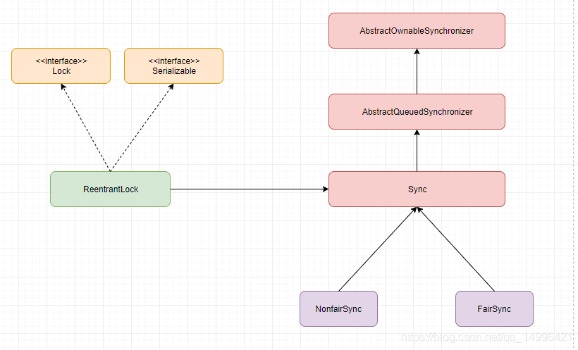

# java_并发编程05从锁到ReentrantLock
## Lock
源码如下，可知是一个接口：
```
public   interface   Lock {
      void   lock();
      void   lockInterruptibly()   throws   InterruptedException;
      boolean   tryLock();
      boolean   tryLock(  long   time, TimeUnit unit)   throws   InterruptedException;
      void   unlock();
      Condition newCondition();
}
```
其中lock()、tryLock()、tryLock(long time, TimeUnit unit)和lockInterruptibly()都是用来获取锁的，unLock()方法是用来释放锁的。newCondition()在后面的线程通信中使用。

1. lock()

如果锁已被其他线程获取，则进行等待。但是在发生异常时，不会自动释放锁，需要手动释放锁，防止死锁发生。常在try{}catch{}中上锁，finally块中释放锁。

2. tryLock()

此方法是有返回值的，它表示用来尝试获取锁，如果获取成功，则返回true，如果获取失败（即锁已被其他线程获取），则返回false，也就说这个方法无论如何都会立即返回。在拿不到锁时不会一直在那等待。

3. tryLock(long time, TimeUnit unit)

和tryLock()方法是类似的，区别在于这个方法在拿不到锁时会等待一定的时间，在时间期限之内如果还拿不到锁，就返回false。如果如果一开始拿到锁或者在等待期间内拿到了锁，则返回true。

4. lockInterruptibly()

lockInterruptibly()方法比较特殊，当通过这个方法去获取锁时，如果线程正在等待获取锁，则这个线程能够响应中断，即中断线程的等待状态。也就使说，当两个线程同时通过lock.lockInterruptibly()想获取某个锁时，假若此时线程A获取到了锁，而线程B只有在等待，那么对线程B调用threadB.interrupt()方法能够中断线程B的等待过程。

### Lock简单实现
Lock类的简单实现：
```
public class Counter{
public class Lock{
	private boolean isLocked = false;

	public synchronized void lock()
		throws InterruptedException{
		while(isLocked){
			wait();
		}
		isLocked = true;
	}

	public synchronized void unlock(){
		isLocked = false;
		notify();
	}
}
```
注意其中的while(isLocked)循环，它又被叫做“自旋锁”。**自旋锁**以及wait()和notify()方法在线程通信这篇文章中有更加详细的介绍。当isLocked为true时，调用lock()的线程在wait()调用上阻塞等待。为防止该线程没有收到notify()调用也从wait()中返回（也称作虚假唤醒），这个线程会重新去检查isLocked条件以决定当前是否可以安全地继续执行还是需要重新保持等待，而不是认为线程被唤醒了就可以安全地继续执行了。如果isLocked为false，当前线程会退出while(isLocked)循环，并将isLocked设回true，让其它正在调用lock()方法的线程能够在Lock实例上加锁。

当线程完成了临界区（位于lock()和unlock()之间）中的代码，就会调用unlock()。执行unlock()会重新将isLocked设置为false，并且通知（唤醒）其中一个（若有的话）在lock()方法中调用了wait()函数而处于等待状态的线程。


### ReentrantLock

1.“可重入锁”。ReentrantLock是唯一实现了Lock接口的类，并且提供了更多的方法。

2.在同一个时间点只能被一个线程锁持有；而可重入的意思是，ReentrantLock锁，可以被单个线程多次获取

3.ReentrantLock分为“公平锁”和“非公平锁”。它们的区别体现在获取锁的机制上是否公平。“锁”是为了保护竞争资源，防止多个线程同时操作线程而出错，ReentrantLock在同一个时间点只能被一个线程获取(当某线程获取到“锁”时，其它线程就必须等待)；ReentraantLock是通过一个FIFO的等待队列来管理获取该锁所有线程的。在“公平锁”的机制下，线程依次排队获取锁；而“非公平锁”在锁是可获取状态时，不管自己是不是在队列的开头都会获取锁。


### ReadWriteLock

ReadWriteLock也是一个接口，在它里面只定义了两个方法：

```
{
　　public   interface   ReadWriteLock {  
      Lock readLock();  
      Lock writeLock();  
}  
```
一个用来获取读锁，一个用来获取写锁。也就是说将文件的读写操作分开，分成2个锁来分配给线程，从而使得多个线程可以同时进行读操作。下面的ReentrantReadWriteLock实现了ReadWriteLock接口。


### ReentrantReadWriteLock

提供了很多丰富的方法，不过最主要的有两个方法：readLock()和writeLock()用来获取读锁和写锁。

ReadWriteLock是一个接口。

ReentrantReadWriteLock是它的实现类，ReentrantReadWriteLock包括内部类ReadLock和WriteLock，这两个内部类实现了Lock接口。


## Lock相关概念
### 1.可重入锁
如果锁具备可重入性，则称作为可重入锁。像synchronized和ReentrantLock都是可重入锁，可重入性在我看来实际上表明了**锁的分配机制：基于线程的分配，而不是基于方法调用的分配**。

举个简单的例子，当一个线程执行到某个synchronized方法时，比如说method1，而在method1中会调用另外一个synchronized方法method2，此时线程不必重新去申请锁，而是可以直接执行方法method2。


### 2.可中断锁
可中断锁：顾名思义，就是可以相应中断的锁。

在Java中，synchronized就不是可中断锁，而Lock是可中断锁。

如果某一线程A正在执行锁中的代码，另一线程B正在等待获取该锁，可能由于等待时间过长，线程B不想等待了，想先处理其他事情，我们可以让它中断自己或者在别的线程中中断它，这种就是可中断锁。


### 3.公平锁

公平锁即尽量以请求锁的顺序来获取锁。比如同是有多个线程在等待一个锁，当这个锁被释放时，等待时间最久的线程（最先请求的线程）会获得该所，这种就是公平锁。

非公平锁即无法保证锁的获取是按照请求锁的顺序进行的。这样就可能导致某个或者一些线程永远获取不到锁。

在Java中，synchronized就是非公平锁，它无法保证等待的线程获取锁的顺序。

而对于ReentrantLock和ReentrantReadWriteLock，它默认情况下是非公平锁，但是可以设置为公平锁。


### 4.读写锁

读写锁将对一个资源（比如文件）的访问分成了2个锁，一个读锁和一个写锁。

正因为有了读写锁，才使得多个线程之间的读操作不会发生冲突。

ReadWriteLock就是读写锁，它是一个接口，ReentrantReadWriteLock实现了这个接口。

可以通过readLock()获取读锁，通过writeLock()获取写锁。

上面已经演示过了读写锁的使用方法，在此不再赘述。


## 从Lock到ReentrantLock
ReentrantLock 重入锁**实现了 Lock和 java.io.Serializable接口**，并提供了与synchronized相同的互斥性和内存可见性，ReentrantLock 提供了可重入的加锁语义，能够对共享资源能够重复加锁，即当前线程获取该锁再次获取不会被阻塞，并且与synchronized相比，它还为处理锁的不可用性提供了更高的灵活性，与此同时，ReentrantLock 还支持公平锁和非公平锁两种方式。


### ReentrantLock类层次结构




### ReentrantLock 案例：
```
Lock lock = new ReentrantLock();

lock.lock();
try{
   //更新对象状态
   //捕获异常，并在必须时恢复不变性条件

}catch (Exception e){
   e.printStackTrace();
} finally {
   lock.unlock();
}
```
上述代码中是使用Lock接口的标准使用方式，这种形式比使用内置锁（synchronized ）复杂一些，必须要在 finally 块中释放锁，否则，如果在被保护的代码中抛出了异常，那么这个锁永远都无法释放。


### ReentrantLock 源码分析
ReentrantLock 也实现了Lock接口（细节参考前文的Lock部分，此处不在赘述）的内容,同时 ReentrantLock 提供了 公平锁和 非公平锁两种模式，如果没有特别的去指定使用何种方式，那么 ReentrantLock 会默认为 非公平锁，首先我们来看一下 ReentrantLock 的构造函数：

```
/**
 * 无参的构造函数
 */
public ReentrantLock() {
    sync = new NonfairSync();
}

/**
 * 有参构造函数
 * 参数为布尔类型
 */
public ReentrantLock(boolean fair) {
    sync = fair ? new FairSync() : new NonfairSync();
}
```
从上述源码中我们可以看到：

ReentrantLock **优先使用的是无参构造函数**，也就是**非公平锁**，但是当我们调用有参构造函数时，可以指定使用哪种锁来进行操作（公平锁还是非公平锁），参数为布尔类型，如果指定为 false 的话代表 非公平锁 ，如果指定为 true 的话代表的是 公平锁

Sync 类 是 ReentrantLock 自定义的同步组件，它是 ReentrantLock 里面的一个内部类，它继承自AQS，Sync 有两个子类：公平锁 FairSync 和 非公平锁 NonfairSync

ReentrantLock 的获取与释放锁操作都是委托给该同步组件来实现的。


### 公平锁和非公平锁的具体实现
锁的主要实现是通过实现AQS的tryAcquire方法和自身的lock方法。

```
static final class NonfairSync extends Sync {
    private static final long serialVersionUID = 7316153563782823691L;

    //加锁，分为两步。先尝试获取锁，获取到将持有锁的线程设置为当前线程
  	//通过AbstractOwnableSynchronizer的setExclusiveOwnerThread实现
    final void lock() {
      	//这里如果获取成功直接将持有线程设置成自己就行，无其它操作
        if (compareAndSetState(0, 1))
            setExclusiveOwnerThread(Thread.currentThread());
        else
          	//加入阻塞队列
            acquire(1);
    }

  	//尝试获取锁，公平锁和非公平锁不同实现就是这里的差异性实现
    protected final boolean tryAcquire(int acquires) {
        return nonfairTryAcquire(acquires);
    }
}
```

**公平锁和非公平锁差异**


​ 
这里我们能看到，若是阻塞队列不为空且第一个等待线程不为当前线程。则返回true，根据这里判断公平锁和非公平锁的区别是若是存在阻塞队列则不进行锁的获取，不存在才获取。


**方法hasQueuedPredecessors**

```
public final boolean hasQueuedPredecessors() {
    Node t = tail; 
    Node h = head;
    Node s;
    return h != t &&
        ((s = h.next) == null || s.thread != Thread.currentThread());
}

```
通过代码，我们能够理解，公平锁是指当前阻塞的线程为空才获取线程，非公平所不管是不是空都会去获取。可重入是指持有的锁持有的线程为当前线程，独占锁既是通过当前持有锁的线程来进行判断。


## 参考
java.util.concurrent.locks包下常用的类详解：https://blog.csdn.net/qq_44053632/article/details/104343768#t4

Java基础-并发编程-AQS:https://www.jianshu.com/p/7fa09ba6f361

Java并发编程：Lock：https://www.cnblogs.com/dolphin0520/p/3923167.html

Java中的锁：https://ifeve.com/locks/

深入浅出ReentrantLock(可重入锁)：https://blog.csdn.net/qq_14996421/article/details/102967314

AQS的具体实现一：ReentrantLock：https://blog.csdn.net/qq_35015148/article/details/111145605

