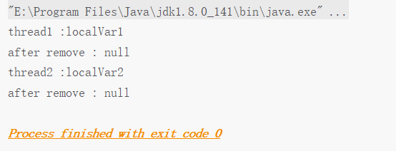
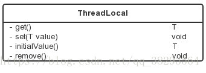
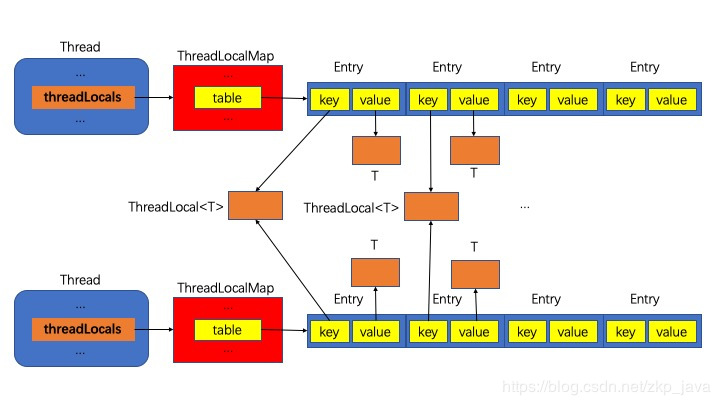
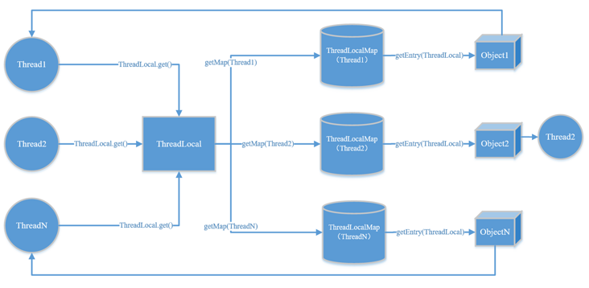
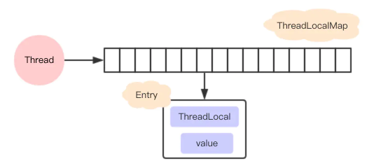
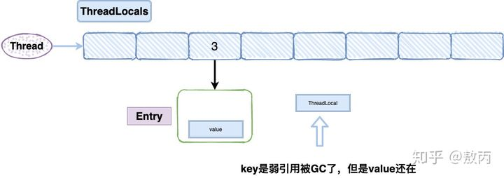
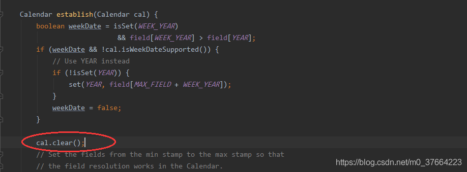

# java_并发编程09ThreadLocal
ThreadLocal提高一个线程的局部变量，访问某个线程拥有自己局部变量。当使用ThreadLocal维护变量时，ThreadLocal为每个使用该变量的线程提供独立的变量副本，在实际多线程操作的时候，操作的是自己本地内存中的变量，从而规避了线程安全问题。

## ThreadLocal简单使用
下面的例子中，开启两个线程，在每个线程内部设置了本地变量的值，然后调用print方法打印当前本地变量的值。如果在打印之后调用本地变量的remove方法会删除本地内存中的变量，代码如下所示

```
 1 package test;
 2 
 3 public class ThreadLocalTest {
 4 
 5     static ThreadLocal<String> localVar = new ThreadLocal<>();
 6 
 7     static void print(String str) {
 8         //打印当前线程中本地内存中本地变量的值
 9         System.out.println(str + " :" + localVar.get());
10         //清除本地内存中的本地变量
11         localVar.remove();
12     }
13 
14     public static void main(String[] args) {
15         Thread t1  = new Thread(new Runnable() {
16             @Override
17             public void run() {
18                 //设置线程1中本地变量的值
19                 localVar.set("localVar1");
20                 //调用打印方法
21                 print("thread1");
22                 //打印本地变量
23                 System.out.println("after remove : " + localVar.get());
24             }
25         });
26 
27         Thread t2  = new Thread(new Runnable() {
28             @Override
29             public void run() {
30                 //设置线程1中本地变量的值
31                 localVar.set("localVar2");
32                 //调用打印方法
33                 print("thread2");
34                 //打印本地变量
35                 System.out.println("after remove : " + localVar.get());
36             }
37         });
38 
39         t1.start();
40         t2.start();
41     }
42 }
```
 下面是运行后的结果：




## ThreadLocal常用方法


get()方法：获取与当前线程关联的ThreadLocal值。

set(T value)方法：设置与当前线程关联的ThreadLocal值。

initialValue()方法：设置与当前线程关联的ThreadLocal初始值。

当调用get()方法的时候，若是与当前线程关联的ThreadLocal值已经被设置过，则不会调用initialValue()方法；否则，会调用initialValue()方法来进行初始值的设置。通常initialValue()方法只会被调用一次，除非调用了remove()方法之后又调用get()方法，此时，与当前线程关联的ThreadLocal值处于没有设置过的状态（其状态体现在源码中，就是线程的ThreadLocalMap对象是否为null），initialValue()方法仍会被调用。

initialValue()方法是protected类型的，很显然是建议在子类重载该函数的，所以通常该方法都会以匿名内部类的形式被重载，以指定初始值，例如：

```
public class ThreadLocalTest {
	public static ThreadLocal<Integer> threadLocal = new ThreadLocal<Integer>() {
		@Override
		protected Integer initialValue() {
			return Integer.valueOf(1);
		}
	};
}
```
remove()方法：将与当前线程关联的ThreadLocal值删除。

## ThreadLocal实现原理
ThreadLocal实现原理



ThreadLocal实现原理
每个线程对象里会持有一个java.lang.ThreadLocal.**ThreadLocalMap类型的threadLocals成员变量(特别注意threadLocals看做threadLocalMap可能更合适，习惯用类小写标识对应实例)**，而ThreadLocalMap里有一个java.lang.ThreadLocal.ThreadLocalMap.Entry[]类型的table成员，这是一个**数组，数组元素是Entry类型，Entry中相当于有一个key和value，key指向所有线程共享的java.lang.ThreadLocal对象，value指向各线程私有的变量，这样保证了线程局部变量的隔离性**，每个线程只是读取和修改自己所持有的那个value对象，相互之间没有影响。


ThreadLocal最简单的实现方式就是ThreadLocal类内部有一个线程安全的Map，然后用线程的ID作为Map的key，实例对象作为Map的value，这样就能达到各个线程的值隔离的效果。

JDK最早期的ThreadLocal就是这样设计的，但是，之后ThreadLocal的设计换了一种方式，我们先看get()方法的源码，然后进一步介绍ThreadLocal的实现方式：

```
public T get() {
    Thread t = Thread.currentThread();
    ThreadLocalMap map = getMap(t);
    if (map != null) {
        ThreadLocalMap.Entry e = map.getEntry(this);#这里是this,而非t
        if (e != null) {
            @SuppressWarnings("unchecked")
            T result = (T)e.value;
            return result;
        }
    }
    return setInitialValue();
}
```
get()方法主要做了以下事情：

1、调用Thread.currentThread()获取当前线程对象t；

2、根据当前线程对象，调用getMap(Thread)获取线程对应的ThreadLocalMap对象：

```
ThreadLocalMap getMap(Thread t) {
    return t.threadLocals;
}
```
threadLocals是Thread类的成员变量，初始化为null：

```
/* ThreadLocal values pertaining to this thread. This map is maintained
     * by the ThreadLocal class. */
ThreadLocal.ThreadLocalMap threadLocals = null;
```
所以每个 Thread 都会拥有一个 ThreadLocalMap 变量，来存放属于该 Thread 的所有 ThreadLocal 变量。这样来看的话，ThreadLocal就相当于一个调度器，每次调用 get 方法的时候，都会先找到当前线程的 ThreadLocalMap，然后再在这个 ThreadLocalMap 中找到对应的线程本地变量。




3、如果获取的map不为空，则在map中以ThreadLocal的引用作为key来在map中获取对应的value e，否则转到步骤5；

补充:**获取到<key,value>键值对，注意这里获取键值对传进去的是  this，而不是当前线程t**。

4、若e不为null，则返回e中存储的value值，否则转到步骤5；

5、调用setInitialValue()方法，对线程的ThreadLocalMap对象进行初始化操作，ThreadLocalMap对象的key为ThreadLocal对象，value为initialValue()方法的返回值。


从上面的分析中，可以看到，ThreadLocal的实现离不开ThreadLocalMap类，ThreadLocalMap类是ThreadLocal的静态内部类。每个Thread维护一个ThreadLocalMap映射表，这个映射表的key是ThreadLocal实例本身，value是真正需要存储的Object。这样的设计主要有以下几点优势：

01，这样设计之后每个Map的Entry数量变小了：之前是Thread的数量，现在是ThreadLocal的数量，能提高性能；

02，当Thread销毁之后对应的ThreadLocalMap也就随之销毁了，能减少内存使用量。


## ThreadLoalMap
本文分析的是1.7的源码。

从名字上看，可以猜到它也是一个类似HashMap的数据结构，但是在ThreadLocal中，并没实现Map接口。

在ThreadLoalMap中，也是初始化一个大小16的Entry数组，Entry对象用来保存每一个key-value键值对，只不过**这里的key永远都是ThreadLocal对象**，是不是很神奇，**通过ThreadLocal对象的set方法，结果把ThreadLocal对象自己当做key**，放进了ThreadLoalMap中。



这里需要注意的是，ThreadLoalMap的Entry是继承WeakReference，和HashMap很大的区别是，Entry中没有next字段，所以就不存在链表的情况了。


### hash冲突

没有链表结构，那发生hash冲突了怎么办？

先看看ThreadLoalMap中插入一个key-value的实现
```
private void set(ThreadLocal<?> key, Object value) {
    Entry[] tab = table;
    int len = tab.length;
    int i = key.threadLocalHashCode & (len-1);

    for (Entry e = tab[i];
         e != null;
         e = tab[i = nextIndex(i, len)]) {
        ThreadLocal<?> k = e.get();

        if (k == key) {
            e.value = value;
            return;
        }

        if (k == null) {
            replaceStaleEntry(key, value, i);
            return;
        }
    }

    tab[i] = new Entry(key, value);
    int sz = ++size;
    if (!cleanSomeSlots(i, sz) && sz >= threshold)
        rehash();
}

```
每个ThreadLocal对象都有一个hash值threadLocalHashCode，每初始化一个ThreadLocal对象，hash值就增加一个固定的大小0x61c88647。

在插入过程中，根据ThreadLocal对象的hash值，定位到table中的位置i，过程如下：

1、如果当前位置是空的，那么正好，就初始化一个Entry对象放在位置i上；

2、不巧，位置i已经有Entry对象了，如果这个Entry对象的key正好是即将设置的key，那么重新设置Entry中的value；

3、很不巧，位置i的Entry对象，和即将设置的key没关系，那么只能找下一个空位置；


这样的话，在get的时候，也会根据ThreadLocal对象的hash值，定位到table中的位置，然后判断该位置Entry对象中的key是否和get的key一致，如果不一致，就判断下一个位置

可以发现，set和get如果冲突严重的话，效率很低，因为ThreadLoalMap是Thread的一个属性，所以即使在自己的代码中控制了设置的元素个数，但还是不能控制其它代码的行为。

### 内存泄露

ThreadLocal在保存的时候会把自己当做Key存在ThreadLocalMap中，正常情况应该是key和value都应该被外界强引用才对，但是现在key被设计成WeakReference弱引用了





这就导致了一个问题，ThreadLocal在没有外部强引用时，发生GC时会被回收，如果创建ThreadLocal的线程一直持续运行，那么这个Entry对象中的value就有可能一直得不到回收，发生内存泄露。

就比如线程池里面的线程，线程都是复用的，那么之前的线程实例处理完之后，出于复用的目的线程依然存活，所以，ThreadLocal设定的value值被持有，导致内存泄露。

按照道理一个线程使用完，ThreadLocalMap是应该要被清空的，但是现在线程被复用了。

那怎么解决？

在代码的最后使用remove就好了，我们只要记得在使用的最后用remove把值清空就好了。

```
ThreadLocal<String> localName = new ThreadLocal();
try {
    localName.set("张三");
    ……
} finally {
    localName.remove();
}
```
remove的源码很简单，找到对应的值全部置空，这样在垃圾回收器回收的时候，会自动把他们回收掉。


### 为什么ThreadLocalMap的key要设计成弱引用
设计成弱引用的目的是为了更好地对ThreadLocal进行回收，当我们在代码中将ThreadLocal的强引用置为null后，这时候Entry中的ThreadLocal理应被回收了，但是如果Entry的key被设置成强引用则该ThreadLocal就不能被回收，这就是将其设置成弱引用的目的。


### 为啥需要使用 Map 呢？
因为一个线程可能有多个 ThreadLocal 对象，可能是包含 SimpleDateFormat，也可能是包含一个数据库连接 Connection，所以不同的变量需要通过对应的 ThreadLocal 对象来快速查找 —— 那么 Map 当然是最好的方式。


### 如何避免内存泄露
既然已经发现有内存泄露的隐患，自然有应对的策略，在调用ThreadLocal的get()、set()可能会清除ThreadLocalMap中key为null的Entry对象，这样对应的value就没有GC Roots可达了，下次GC的时候就可以被回收，当然如果调用remove方法，肯定会删除对应的Entry对象。

如果使用ThreadLocal的set方法之后，没有显示的调用remove方法，就有可能发生内存泄露，所以养成良好的编程习惯十分重要，使用完ThreadLocal之后，记得调用remove方法。

```
ThreadLocal<String> localName = new ThreadLocal();
try {
    localName.set("占小狼");
    // 其它业务逻辑
} finally {
    localName.remove();
}

```
## 何时使用ThreadLocal
### 数据库连接
最常见的ThreadLocal使用场景为 用来解决 数据库连接、Session管理等。

如：

```
private static ThreadLocal<Connection> connectionHolder = new ThreadLocal<Connection>() {
    public Connection initialValue() {
        return DriverManager.getConnection(DB_URL);
    }
};
 
public static Connection getConnection() {
    return connectionHolder.get();
}
```
### 传参
用来提供线程内部的共享变量，在多线程环境下，可以保证各个线程之间的变量互相隔离、相互独立。在线程中，可以通过get()/set()方法来访问变量。ThreadLocal实例通常来说都是private static类型的，它们希望将状态与线程进行关联。这种变量在线程的生命周期内起作用，可以减少同一个线程内多个函数或者组件之间一些公共变量的传递的复杂度。


### SimpleDateFormat 的并发安全问题
很多人为了提高性能，会把 private static final SimpleDateFormat simpleDateFormat=new SimpleDateFormat(“yyyy-MM-dd HH:mm:ss”); 作为全局变量来写代码；这样写代码会有并发问题，因为 在调用format 或者parse等方法的时候，该类的对象会用到全局变量，一旦涉及到全局变量问题，那么同一个类的对象去面对并发多线程问题，会互相影响彼此的操作数据，导致可能出现异常情况。

在SimpleDateFormat转换日期是通过Calendar对象来操作的，SimpleDateFormat继承DateFormat类，DateFormat类中维护一个Calendar对象，代码如下：



可知SimpleDateFormat维护的用于format和parse方法计算日期-时间的calendar被清空了，如果此时线程A将calendar清空且没有设置新值，线程B也进入parse方法用到了SimpleDateFormat对象中的calendar对象，此时就会产生线程安全问题！


**解决SimpleDateFormat 的并发问题**

一：当前比较受欢迎的方法，利用空间换时间，放在threadLocal中，保证了线程的安全，借助threadlocal对象每个线程只创建一个实例

```
public class ConcurrentDateFormat {
    private static final ThreadLocal<SimpleDateFormat>  _threadLocal=new ThreadLocal<SimpleDateFormat>(){

    @Override
    protected SimpleDateFormat initialValue() {
        return new SimpleDateFormat(yyyy_mmdd_hhmm);
    }
};
    /**
     * 格式化时间
     */
    public static String formatDateTime(Date date){
        return _threadLocal.get().format(date);
    }
}
```

二：加锁，简单粗暴

```
public class tests {
    private static final SimpleDateFormat format = new SimpleDateFormat("yyyy-MM-dd hh:mm:ss");
    public synchronized static String DateToStringFormat(Date date) {
        return format.format(date);
    }
}
```
二：jdk8之后的time包，jdk8之后引入了，java.time.XXX相关的包，是线程安全的类。Date 和 LocalDateTime相互转化相关，


```
public class tests {
    //    private static final SimpleDateFormat format = new SimpleDateFormat("yyyy-MM-dd hh:mm:ss");
    private static final DateTimeFormatter _format = DateTimeFormatter.ofPattern("yyyy-MM-dd hh:mm:ss");

    public synchronized static String DateToStringFormat(Date date) {
        LocalDateTime time = LocalDateTime.ofInstant(date.toInstant(), ZoneId.systemDefault());
        return _format.format(time);
    }
}
```

## ThreadLocal不支持继承性
同一个ThreadLocal变量在父线程中被设置值后，在子线程中是获取不到的。（threadLocals中为当前调用线程对应的本地变量，所以二者自然是不能共享的）

```
package test;

public class ThreadLocalTest2 {

    //(1)创建ThreadLocal变量
    public static ThreadLocal<String> threadLocal = new ThreadLocal<>();

    public static void main(String[] args) {
        //在main线程中添加main线程的本地变量
        threadLocal.set("mainVal");
        //新创建一个子线程
        Thread thread = new Thread(new Runnable() {
            @Override
            public void run() {
                System.out.println("子线程中的本地变量值:"+threadLocal.get());
            }
        });
        thread.start();
        //输出main线程中的本地变量值
        System.out.println("mainx线程中的本地变量值:"+threadLocal.get());
    }
}
```

## InheritableThreadLocal类
在上面说到的ThreadLocal类是不能提供子线程访问父线程的本地变量的，而InheritableThreadLocal类则可以做到这个功能，下面是该类的源码
```
 1 public class InheritableThreadLocal<T> extends ThreadLocal<T> {
 2     
 3     protected T childValue(T parentValue) {
 4         return parentValue;
 5     }
 6 
 7     ThreadLocalMap getMap(Thread t) {
 8        return t.inheritableThreadLocals;
 9     }
10 
11     void createMap(Thread t, T firstValue) {
12         t.inheritableThreadLocals = new ThreadLocalMap(this, firstValue);
13     }
14 }
```
从上面代码可以看出，InheritableThreadLocal类继承了ThreadLocal类，并重写了childValue、getMap、createMap三个方法。其中createMap方法在被调用（当前线程调用set方法时得到的map为null的时候需要调用该方法）的时候，创建的是inheritableThreadLocal而不是threadLocals。同理，getMap方法在当前调用者线程调用get方法的时候返回的也不是threadLocals而是inheritableThreadLocal。

总之，InheritableThreadLocals类**通过重写getMap和createMap两个方法将本地变量保存到了具体线程的inheritableThreadLocals变量中**，当线程通过InheritableThreadLocals实例的set或者get方法设置变量的时候，就会创建当前线程的inheritableThreadLocals变量。而**父线程创建子线程的时候，ThreadLocalMap中的构造函数会将父线程的inheritableThreadLocals中的变量复制一份到子线程的inheritableThreadLocals变量中**。

## 参考
Java中的ThreadLocal详解：https://www.cnblogs.com/fsmly/p/11020641.html

java SimpleDateFormat并发问题：https://blog.csdn.net/m0_37664223/article/details/96571737

Java并发编程之ThreadLocal详解:https://blog.csdn.net/qq_38293564/article/details/80459827

Java ThreadLocal用法实例详解;https://www.jb51.net/article/170439.htm

Java面试必问，ThreadLocal终极篇:https://www.jianshu.com/p/377bb840802f

Java中的ThreadLocal详解:https://www.cnblogs.com/fsmly/p/11020641.html

Java中ThreadLocal的实际用途是啥？:https://www.zhihu.com/question/341005993

Java 多线程（7）： ThreadLocal 的应用及原理:https://segmentfault.com/a/1190000010251063

Java并发编程：深入剖析ThreadLocal:https://www.cnblogs.com/dolphin0520/p/3920407.html

ThreadLocalMap的enrty的key为什么要设置成弱引用:https://blog.csdn.net/qq646040754/article/details/82493409

ThreadLocal底层原理学习:https://www.cnblogs.com/bangiao/p/13204983.html

