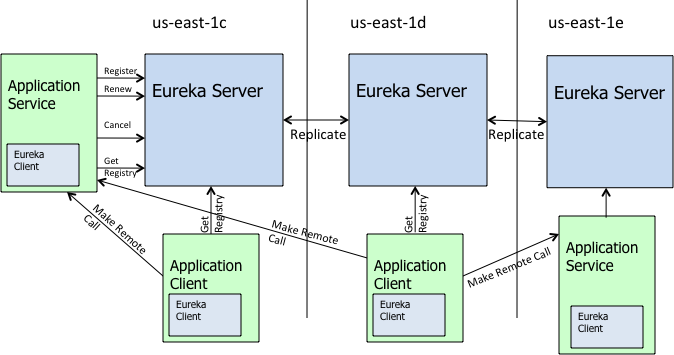

# java_微服务01学习笔记
教程地址:跟我学Spring Cloud（Finchley版）

Spring Cloud系列教程：www.itmuch.com/spring-cloud/spring-cloud-index/#一、跟我学Spring-Cloud系列


## 01-开篇

## 02-构建分布式应用

Spring Boot/Spring Cloud时代后，应用开发基本遵循三板斧：

加依赖

加注解

写配置


创建Pom.xml

创建实体类

创建DAO：

创建Controller：

编写启动类：

ApplicationRunner init(UserRepository repository) 初始化了三条数据，

编写配置文件application.yml


## 03-监控：强大的Spring Boot Actuator

加依赖：actuator

加配置：

```
management:
  endpoint:
    health:
      # 是否展示健康检查详情
      show-details: always
```
## 04-服务注册与服务发现-原理剖析

服务发现组件应具备以下功能。

服务注册表：服务注册表是服务发现组件的核心（其实就是类似于上面的registry表），它用来记录各个微服务的信息，例如微服务的名称、IP、端口等。服务注册表提供查询API和管理API，查询API用于查询可用的微服务实例，管理API用于服务的注册和注销；

服务注册与服务发现：服务注册是指微服务在启动时，将自己的信息注册到服务发现组件上的过程。服务发现是指查询可用微服务列表及其网络地址的机制；

服务检查：服务发现组件使用一定机制定时检测已注册的服务，如发现某实例长时间无法访问，就会从服务注册表中移除该实例。


## 05-服务注册与服务发现-Eureka入门

Eureka是Netflix开源的服务发现组件，本身是一个基于REST的服务，包含Server和Client两部分，Spring Cloud将它集成在子项目Spring Cloud Netflix中。

**编写Eureka Server**：加依赖，加注解，写配置

依赖：spring-cloud-starter-netflix-eureka-server

注解:

```
@SpringBootApplication
@EnableEurekaServer
public class EurekaApplication {
  public static void main(String[] args) {
    SpringApplication.run(EurekaApplication.class, args);
  }
}
```
配置：

```
server:
  port: 8761
eureka:
  client:
    # 是否要注册到其他Eureka Server实例
    register-with-eureka: false
    # 是否要从其他Eureka Server实例获取数据
    fetch-registry: false
    service-url: 
      defaultZone: http://localhost:8761/eureka/
```
**将应用注册到Eureka Server上**：加依赖，加注解，写配置

依赖：spring-cloud-starter-netflix-eureka-client

注解：此处无变化。早期的版本（Dalston及更早版本）还需在启动类上添加注解@EnableDiscoveryClient 或@EnableEurekaClient ，从Edgware开始，该注解可省略。

配置:

```
spring:
  application:
    # 指定注册到eureka server上的服务名称，对于电影微服务，本系列将名称设为microservice-consumer-movie
    name: microservice-provider-user
eureka:
  client:
    service-url:
      # 指定eureka server通信地址，注意/eureka/小尾巴不能少
      defaultZone: http://localhost:8761/eureka/
  instance:
    # 是否注册IP到eureka server，如不指定或设为false，那就会注册主机名到eureka server
    prefer-ip-address: true
```
## 06-服务注册与服务发现-Eureka深入

**Region & Availability Zone**


Region表示AWS中的地理位置，例如us-east-1、us-east-2、eu-west-1等；

每个Region都有多个Availability Zone，彼此内网打通；

各个Region之间完全隔离，彼此内网不打通；

AWS通过这种方式实现了最大的容错和稳定性。

Spring Cloud中，默认使用的Region是us-east-1 。非AWS环境下，可将将Region理解为内网没有打通的机房，将Availability Zone理解成相同机房的不同机架（内网打通）。




**Eureka包含两个组件：Eureka Server 和 Eureka Client**，它们的作用如下：

Eureka Server提供服务发现的能力，各个微服务启动时，会向Eureka Server注册自己的信息（例如IP、端口、微服务名称等），Eureka Server会存储这些信息；
Eureka Client是一个Java客户端，用于简化与Eureka Server的交互；

微服务启动后，会周期性（默认30秒）地**向Eureka Server发送心跳**以续约自己的“租期”；

如果Eureka Server在一定时间内没有接收到某个微服务实例的心跳，Eureka Server将会**注销该实例（默认90秒）**；

默认情况下，Eureka Server同时也是Eureka Client。**多个Eureka Server实例，互相之间通过增量复制的方式，来实现服务注册表中数据的同步**。Eureka Server默认保证在90秒内，Eureka Server集群内的所有实例中的数据达到一致（从这个架构来看，Eureka Server所有实例所处的角色都是对等的，没有类似Zookeeper、Consul、Etcd等软件的选举过程，也不存在主从，所有的节点都是主节点。Eureka官方将Eureka Server集群中的所有实例称为“对等体（peer）”）

**Eureka Client会缓存服务注册表中的信息**。这种方式有一定的优势——首先，微服务无需每次请求都查询Eureka Server，从而**降低了Eureka Server的压力**；其次，即使**Eureka Server所有节点都宕掉**，服务消费者依然可以使用缓存中的信息找到服务提供者并完成调用。

综上，**Eureka通过心跳检查、客户端缓存等机制**，提高了系统的灵活性、可伸缩性和可用性。


**编写高可用Eureka Server**

下面来编写一个双节点Eureka Server集群。编写这个集群非常简单，只需修改单实例Eureka Server的配置即可：

修改vim /etc/hosts：

```
# 添加如下内容
127.0.0.1 peer1 peer2
```
配置:

```
spring:
  application:
    name: microservice-discovery-eureka-ha
---
spring:
  profiles: peer1                                 # 指定profile=peer1
server:
  port: 8761
eureka:
  instance:
    hostname: peer1                               # 指定当profile=peer1时，主机名是peer1
  client:
    serviceUrl:
      defaultZone: http://peer2:8762/eureka/      # 将自己注册到peer2这个Eureka上面去
---
spring:
  profiles: peer2
server:
  port: 8762
eureka:
  instance:
    hostname: peer2
  client:
    serviceUrl:
      defaultZone: http://peer1:8761/eureka/
```
如果两个Eureka Server实例在同一台机器上启动，那么配置hosts的这一步不能少。原因：**Eureka Server对端口是不敏感的**，这意味着，如果直接用IP的形式（例如地址写成http://127.0.0.1:8761/eureka/）相互注册，Eureka Server误认为两个Eureka Server实例是一个实例——这会造成Eureka Server首页显示不正常等一系列问题！！


编写Eureka Server集群的简写方式：

```
spring:
  application:
    name: microservice-discovery-eureka-ha
eureka:
  client:
    serviceUrl:
      defaultZone: http://peer2:8762/eureka/,http://peer1:8761/eureka/
---
spring:
  profiles: peer1
server:
  port: 8761
eureka:
  instance:
    hostname: peer1
---
spring:
  profiles: peer2
server:
  port: 8762
eureka:
  instance:
    hostname: peer2
```

**RESTful API**

举例:rest-api-test.xml

```
<instance>
  <instanceId>itmuch:rest-api-test:9000</instanceId>
  <hostName>itmuch</hostName>
  <app>REST-API-TEST</app>
  <ipAddr>127.0.0.1</ipAddr>
  <vipAddress>rest-api-test</vipAddress>
  <secureVipAddress>rest-api-test</secureVipAddress>
  <status>UP</status>
  <port enabled="true">9000</port>
  <securePort enabled="false">443</securePort>
  <homePageUrl>http://127.0.0.1:9000/</homePageUrl>
  <statusPageUrl>http://127.0.0.1:9000/info</statusPageUrl>
  <healthCheckUrl>http://127.0.0.1:9000/health</healthCheckUrl>
  <dataCenterInfo class="com.netflix.appinfo.InstanceInfo$DefaultDataCenterInfo">
    <name>MyOwn</name>
  </dataCenterInfo>
</instance>
```
**RESTful API的意义**

你可能会问：我们不是已经有Eureka Client了吗？谁闲着没事再去用RESTful API啊？

要知道，微服务的优势之一就是允许使用异构的技术、异构的语言甚至异构的平台解决你想解决的问题。

举个例子，如果你有一个系统，一部分是Spring Cloud构建的，一部分是用世界上最好的语言PHP写的！但是呢，你希望Java应用与PHP应用之间的通信也能享受服务发现所带来的好处，此时就可编写一个基于PHP的Eureka Client，将PHP应用也注册到Eureka Server！

事实上，前文说的Eureka Client不过是一个用Jersey 1.x封装了RESTful API的Jar包而已。


## 07-Ribbon入门

依赖:加依赖：由于spring-cloud-starter-netflix-eureka-client 已经包含spring-cloud-starter-netfilx-ribbon ，故而无需额外添加依赖。
注解：

```
@Bean
@LoadBalanced
public RestTemplate restTemplate() {
  return new RestTemplate();
}
```
调用:

```
@GetMapping("/users/{id}")
public User findById(@PathVariable Long id) {
  // 这里用到了RestTemplate的占位符能力
  User user = this.restTemplate.getForObject(
    "http://microservice-provider-user/users/{id}",
    User.class,
    id
  );
  // ...电影微服务的业务...
  return user;
}
```
将请求的目标服务改成了http://microservice-provider-user/users/{id} ，也就是http://{目标服务名称}/{目标服务端点} 的形式，Ribbon会自动在实际调用时，将目标服务名替换为该服务的IP和端口。

原来: this.restTemplate.getForObject("http://localhost:8000/users/{id}", User.class, id);

这里的目标服务名称，在Ribbon里叫虚拟主机名 ，主机名是不能包含_ 等特殊字符的——这意味着，一般不建议配置spring.application.name = xxx_xxx

## 08-Ribbon深入

内置负载均衡规则

Ribbon配置自定义【细粒度配置】：

方式1、代码配置方式，

方式2、属性配置方式【推荐】

代码示例

```
user:
  ribbon:
    NFLoadBalancerRuleClassName: com.netflix.loadbalancer.RandomRule
```

## 09-Feign

取代restTemplate

加依赖：

加注解：启动类上添加@EnableFeignClients ；

编写Feign Client

```
@FeignClient(name = "microservice-provider-user")
public interface UserFeignClient {
  @GetMapping("/users/{id}")
  User findById(@PathVariable("id") Long id);
}
```
改control

```
public class MovieController {
  @Autowired
  private UserFeignClient userFeignClient;
}
```
## 10-Feign深入

## 11-Feign常见问题总结

## 12-微服务容错三板斧

应用容错三板斧

超时机制:一旦超时，就释放资源。由于释放资源速度较快，应用就不会那么容易被拖死。

舱壁模式:软件世界里的仓壁模式可以这样理解：M类使用线程池1，N类使用线程池2，彼此的线程池不同，并且为每个类分配的线程池较小，

断路器:实时监测应用，如果发现在一定时间内失败次数/失败率达到一定阈值，就“跳闸”，断路器打开——此时，请求直接返回，而不去调用原本调用的逻辑。


## 13-通用方式使用Hystrix

加依赖：

```
<dependency>
  <groupId>org.springframework.cloud</groupId>
  <artifactId>spring-cloud-starter-netflix-hystrix</artifactId>
</dependency>
```
加注解：在启动类上添加@EnableCircuitBreaker 注解。

使用：

```
@HystrixCommand(fallbackMethod = "findByIdFallback")
@GetMapping("/users/{id}")
public User findById(@PathVariable Long id) {
  // 这里用到了RestTemplate的占位符能力
  User user = this.restTemplate.getForObject(
    "http://microservice-provider-user/users/{id}",
    User.class,
    id
  );
  // ...电影微服务的业务...
  return user;
}

public User findByIdFallback(Long id) {
  return new User(id, "默认用户", "默认用户", 0, new BigDecimal(1));
}
```
由代码可知，只需使用@HystrixCommand 注解，就可保护该API。这里的”保护“，其实带有三层含义——”超时机制“、”仓壁模式“、”断路器“！


## 14-Feign使用Hystrix

Feign默认已经整合了Hystrix，默认Feign是不启用Hystrix的，

```
feign:
  hystrix:
    enabled: true

```

## 15-Hystrix监控详解

监控端点与数据

可视化监控数据

监控数据聚合-Turbine


## 16-Zuul

Zuul是Netflix开源的微服务网关，它可以和Eureka、Ribbon、Hystrix等组件配合使用。Zuul的核心是一系列的过滤器，这些过滤器帮助我们完成以下功能：

```
身份认证与安全：识别每个资源的验证要求，并拒绝那些与要求不符的请求；
审查与监控：在边缘位置追踪有意义的数据和统计结果，从而为我们带来精确的生产视图；
动态路由：动态地将请求路由到不同的后端集群；
压力测试：逐渐增加指向集群的流量，以了解性能；
负载分配：为每一种负载类型分配对应容量，并弃用超出限定值的请求；
静态响应处理：在边缘位置直接建立部分响应，从而避免其转发到内部集群；
多区域弹性：跨越AWS Region进行请求路由，旨在实现ELB（Elastic Load Balancing）使用的多样化；以及让系统的边缘更贴近系统的使用者。
```
加依赖

加注解：@EnableZuulProxy

写配置：我们编写了一个Zuul，并将其注册到了Eureka上。


## 17-Zuul路由配置详解

## 18-Zuul深入

## 19-配置中心-Spring Cloud Config

## 20-Spring Cloud Config-Git仓库配置详解

## 21-Spring Cloud Config-配置属性加解密

## 22-Spring Cloud Config-配置动态刷新

## 23-Spring Cloud Config高可用

## 24-Spring Cloud Sleuth入门

## 25-Spring Cloud Sleuth与Zipkin配合使用

## 26-使用Elasticsearch作为Zipkin Server的后端存储
