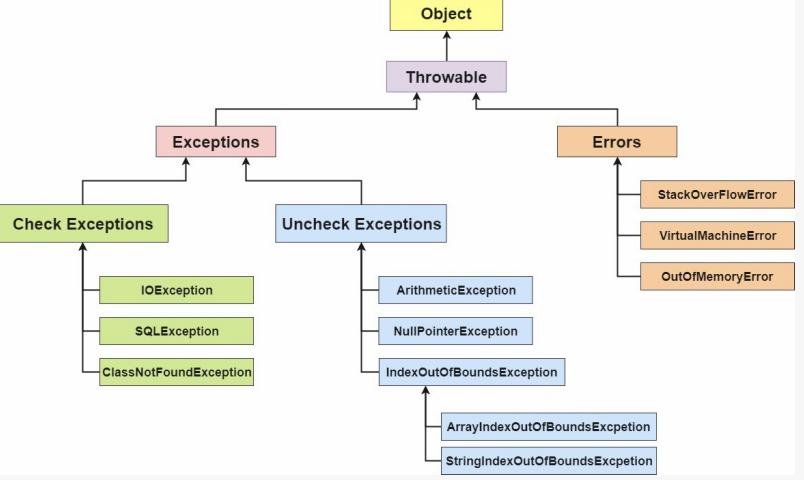
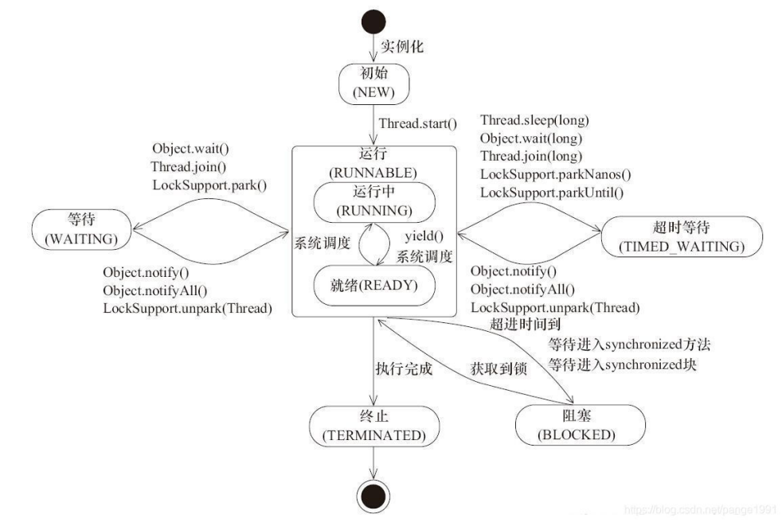
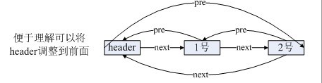
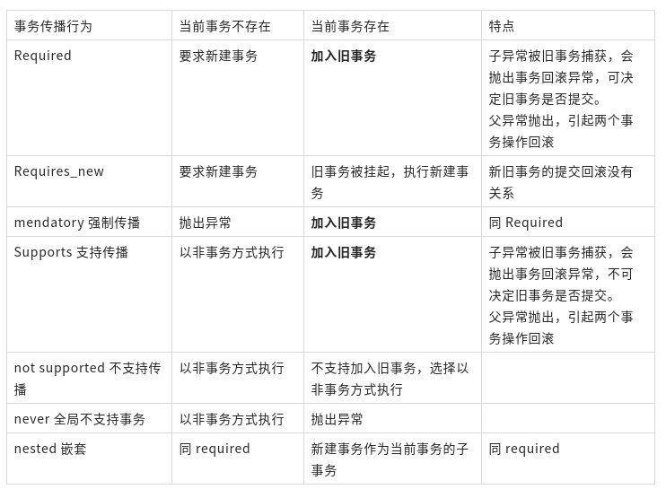
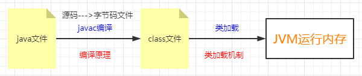
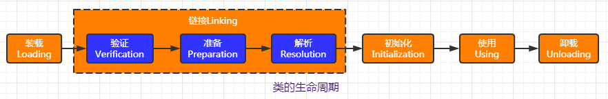

# java_读书01guide学习笔记
V1.1-JavaGuide面试突击版

原文：[Java基础知识.md](https://gitee.com/SnailClimb/JavaGuide/blob/master/docs/java/basis/Java基础知识.md)

## Java基础
### 1.1.4. Java 和 C++的区别?

均是面向对象，继承封装多态，直接访问内存，单多继承，gc，字符串结束


### 1.2.7. Java 泛型了解么？什么是类型擦除？介绍一下常用的通配符？

泛型提供了编译时类型安全检测机制

Java 的泛型是伪泛型，这是因为 Java 在编译期间，所有的泛型信息都会被擦掉，这也就是通常所说类型擦除 。 更多关于类型擦除的问题，可以查看这篇文章：《Java 泛型类型擦除以及类型擦除带来的问题》 。

常用的通配符为： T，E，K，V，？


### 1.2.8. ==和 equals 的区别

情况 1：类没有覆盖 equals()方法。则通过equals()比较该类的两个对象时，等价于通过“==”比较这两个对象

情况 2：类覆盖了 equals()方法。一般，我们都覆盖 equals()方法来两个对象的内容相等；


### 1.2.9. hashCode()与 equals()

3)为什么重写 equals 时必须重写 hashCode 方法？

如果两个对象相等，则 hashcode 一定也是相同的。两个对象相等,对两个对象分别调用 equals 方法都返回 true。但是，两个对象有相同的 hashcode 值，它们也不一定是相等的 。因此，equals 方法被覆盖过，则 hashCode 方法也必须被覆盖。

hashCode()的默认行为是对堆上的对象产生独特值。如果没有重写 hashCode()，则该 class 的两个对象无论如何都不会相等（即使这两个对象指向相同的数据）

4)为什么两个对象有相同的 hashcode 值，它们也不一定是相等的？

同样的 hashcode 有多个对象，它会使用 equals() 来判断是否真的相同。也就是说 hashcode 只是用来缩小查找成本。

更多关于 hashcode() 和 equals() 的内容可以查看：Java hashCode() 和 equals()的若干问题解答


### 1.3.3. 8 种基本类型的包装类和常量池

Java 基本类型的包装类的大部分都实现了常量池技术，即 Byte,Short,Integer,Long,Character,Boolean；前面 4 种包装类默认创建了数值[-128，127] 的相应类型的缓存数据，Character 创建了数值在[0,127]范围的缓存数据，Boolean 直接返回 True Or False。如果超出对应范围仍然会去创建新的对象。

两种浮点数类型的包装类 Float,Double 并没有实现常量池技术。

应用场景：

```
Integer i1=40；Java 在编译的时候会直接将代码封装成 Integer i1=Integer.valueOf(40);，从而使用常量池中的对象。  
Integer i1 = new Integer(40);这种情况下会创建新的对象。  
```


### 1.4.3. 重载和重写的区别


| 区别点         | 重载方法 | 重写方法                                                                                                                 |
| :------------- | :---------- | :------------------------------------------------------------------------------------- |
| 发生范围     | 同一个类 | 子类                                                                                                                         |
| 参数列表     | 必须修改 | 一定不能修改                                                                                                         |
| 返回类型     | 可修改     | 子类方法返回值类型应比父类方法返回值类型更小或相等                             |
| 异常             | 可修改     | 子类方法声明抛出的异常类应比父类方法声明抛出的异常类更小或相等； |
| 访问修饰符 | 可修改     | 一定不能做更严格的限制（可以降低限制）                                                     |
| 发生阶段     | 编译期     | 运行期                                                                                                                     |

方法的重写要遵循“两同两小一大”

```
“两同”即方法名相同、形参列表相同；
“两小”指的是子类方法返回值类型应比父类方法返回值类型更小或相等，子类方法声明抛出的异常类应比父类方法声明抛出的异常类更小或相等；
“一大”指的是子类方法的访问权限应比父类方法的访问权限更大或相等。
```
关于 重写的返回值类型 这里需要额外多说明一下，上面的表述不太清晰准确：如果方法的返回类型是void和基本数据类型，则返回值重写时不可修改。但是如果方法的返回值是引用类型，重写时是可以返回该引用类型的子类的。


### 2.1.1. 面向对象和面向过程的区别

面向过程 ：面向过程性能比面向对象高。

面向对象 ：面向对象易维护、易复用、易扩展。

参见 issue : 面向过程 ：面向过程性能比面向对象高？？

这个并不是根本原因，面向过程也需要分配内存，计算内存偏移量，Java 性能差的主要原因并不是因为它是面向对象语言，而是 Java 是半编译语言，最终的执行代码并不是可以直接被 CPU 执行的二进制机械码。

而面向过程语言大多都是直接编译成机械码在电脑上执行，并且其它一些面向过程的脚本语言性能也并不一定比 Java 好。


### 2.1.2. 构造器 Constructor 是否可被 override?

Constructor 不能被 override（重写）,但是可以 overload（重载）,所以你可以看到一个类中有多个构造函数的情况。


### 2.1.4. 成员变量与局部变量的区别有哪些？

所属，修饰符，存放位置，生存周期，初值


### 2.1.7. 构造方法有哪些特性？

名字，返回值，自动执行


### 2.4.1. String StringBuffer 和 StringBuilder 的区别是什么? String 为什么是不可变的?

可变性，线程安全，性能


### 2.4.5. Java 序列化中如果有些字段不想进行序列化，怎么办？

对于不想进行序列化的变量，使用 transient 关键字修饰。


### 3.1.2.反射机制优缺点

优点：灵活，缺点：性能，安全性


### 3.1.3.反射的应用场景

反射是框架设计的灵魂。

例如模块化的开发，通过反射去调用对应的字节码；动态代理设计模式也采用了反射机制，还有我们日常使用的 Spring／Hibernate 等框架也大量使用到了反射机制。

举例：

我们在使用 JDBC 连接数据库时使用 Class.forName()通过反射加载数据库的驱动程序；

Spring 框架的 IOC（动态加载管理 Bean）创建对象以及 AOP（动态代理）功能都和反射有联系；

动态配置实例的属性；


### 3.2.1. Java 异常类层次结构图



Exception 和 Error 二者都是 Java 异常处理的重要子类，各自都包含大量子类。

Exception :程序本身可以处理的异常，可以通过 catch 来进行捕获。Exception 又可以分为 受检查异常(必须处理) 和 不受检查异常(可以不处理)。

Error ：Error 属于程序无法处理的错误 ，我们没办法通过 catch 来进行捕获 。例如，Java 虚拟机运行错误（Virtual MachineError）、虚拟机内存不够错误(OutOfMemoryError)、类定义错误（NoClassDefFoundError）等 。这些异常发生时，Java 虚拟机（JVM）一般会选择线程终止。

受检查异常


Java 代码在编译过程中，如果受检查异常没有被 catch/throw 处理的话，就没办法通过编译 。

除了RuntimeException及其子类以外，其他的Exception类及其子类都属于受检查异常 。常见的受检查异常有： IO 相关的异常、ClassNotFoundException 、SQLException...。


不受检查异常

Java 代码在编译过程中 ，我们即使不处理不受检查异常也可以正常通过编译。

RuntimeException 及其子类都统称为非受检查异常，例如：NullPointExecrption、NumberFormatException（字符串转换为数字）、ArrayIndexOutOfBoundsException（数组越界）、ClassCastException（类型转换错误）、ArithmeticException（算术错误）等。


在以下 3 种特殊情况下，finally 块不会被执行：

```
在 try 或 finally 块中用了 System.exit(int)退出程序。但是，如果 System.exit(int) 在异常语句之后，finally 还是会被执行  
程序所在的线程死亡。  
关闭 CPU。  
```
注意： 当 try 语句和 finally 语句中都有 return 语句时，在方法返回之前，finally 语句的内容将被执行，并且 finally 语句的返回值将会覆盖原始的返回值。如下：

```
public class Test {  
    public static int f(int value) {  
        try {  
            return value * value;  
        } finally {  
            if (value == 2) {  
                return 0;  
            }  
        }  
    }  
}  
```
如果调用 f(2)，返回值将是 0，因为 finally 语句的返回值覆盖了 try 语句块的返回值。


### 3.2.4. 使用 try-with-resources 来代替try-catch-finally

适用范围（资源的定义）： 任何实现 java.lang.AutoCloseable或者 java.io.Closeable 的对象

关闭资源和 final 的执行顺序： 在 try-with-resources 语句中，任何 catch 或 finally 块在声明的资源关闭后运行


### 3.3.2. 线程有哪些基本状态?

Java 线程在运行的生命周期中的指定时刻只可能处于下面 6 种不同状态的其中一个状态




**阻塞与等待的区别**

阻塞：当一个线程试图获取对象锁（非java.util.concurrent库中的锁，即synchronized），而该锁被其他线程持有，则该线程进入阻塞状态。它的特点是**使用简单**，由**JVM调度器来决定唤醒自己**，而不需要由另一个线程来显式唤醒自己，**不响应中断**。
等待：当一个线程等待另一个线程通知调度器一个条件时，该线程进入等待状态。它的特点是需要**等待另一个线程显式地唤醒自己**，**实现灵活**，语义更丰富，**可响应中断**。例如调用：Object.wait()、Thread.join()以及等待Lock或Condition。

需要强调的是虽然synchronized和JUC里的Lock都实现锁的功能，但线程进入的状态是不一样的。**synchronized会让线程进入阻塞态，而JUC里的Lock是用LockSupport.park()/unpark()来实现阻塞/唤醒的，会让线程进入等待态。**但话又说回来，虽然等锁时进入的状态不一样，但**被唤醒后又都进入runnable态**，从行为效果来看又是一样的。


### 3.4.1.2. BIO,NIO,AIO 有什么区别?


### 2.2.2. Arraylist 与 LinkedList 区别?

是否保证线程安全：

插入和删除是否受元素位置的影响：

 ① ArrayList 采用数组存储，所以插入和删除元素的时间复杂度受元素位置的影响。

 ② LinkedList 采用链表存储，所以对于add(E e)方法的插入，删除元素时间复杂度不受元素位置的影响，近似 O(1)，如果是要在指定位置i插入和删除元素的话（(add(int index, E element)） 时间复杂度近似为o(n))因为需要先移动到指定位置再插入。

是否支持快速随机访问：

内存空间占用：


### 2.2.4. 说一说 ArrayList 的扩容机制吧

详见笔主的这篇文章:通过源码一步一步分析 ArrayList 扩容机制


### 2.2.5. HashMap 和 Hashtable 的区别

线程是否安全：

效率：

对 Null key 和 Null value 的支持：

初始容量大小和每次扩充容量大小的不同 ：

底层数据结构：


### 2.2.6. HashMap 和 HashSet区别

如果你看过 HashSet 源码的话就应该知道：HashSet 底层就是基于 HashMap 实现的。


### 2.2.7. HashSet如何检查重复

(先hashcode，如果油在equal


### 2.2.8. HashMap的底层实现

2.2.8.1. JDK1.8 之前

2.2.8.2. JDK1.8 之后

### 2.2.9. HashMap 的长度为什么是2的幂次方

数组下标的计算方法是“ (n - 1) & hash”。（n代表数组长度）。这也就解释了 HashMap 的长度为什么是2的幂次方。

采用二进制位操作 &，相对于%能够提高运算效率，这就解释了 HashMap 的长度为什么是2的幂次方。

### 2.2.10. HashMap 多线程操作导致死循环问题

主要原因在于 并发下的Rehash 会造成元素之间会形成一个循环链表。不过，jdk 1.8 后解决了这个问题，但是还是不建议在多线程下使用 HashMap,因为多线程下使用 HashMap 还是会存在其他问题比如数据丢失。并发环境下推荐使用 ConcurrentHashMap 。

详情请查看：https://coolshell.cn/articles/9606.html


### 2.2.12. ConcurrentHashMap线程安全的具体实现方式/底层具体实现


### 2.2.13. 比较 HashSet、LinkedHashSet 和 TreeSet 三者的异同

HashSet 是 Set 接口的主要实现类 ，HashSet 的底层是 HashMap，线程不安全的，可以存储 null 值；

LinkedHashSet 是 HashSet 的子类，能够按照添加的顺序遍历；

TreeSet 底层使用红黑树，能够按照添加元素的顺序进行遍历，排序的方式有自然排序和定制排序。


## Java基础知识疑难点
链接同上：docs/java/basis/Java基础知识疑难点.md


1.2. 整型包装类值的比较

所有整型包装类对象值的比较必须使用equals方法。

先看下面这个例子：

```
Integer x = 3;  
Integer y = 3;  
System.out.println(x == y);// true  
Integer a = new Integer(3);  
Integer b = new Integer(3);  
System.out.println(a == b);//false  
System.out.println(a.equals(b));//true  
```
当使用**自动装箱**方式创建一个Integer对象时，当**数值在-128 ~127时**，会将创建的 Integer 对象缓存起来，当下次再出现该数值时，直接**从缓存中取出对应的Integer对象**。所以上述代码中，x和y引用的是相同的Integer对象。


### 1.3. BigDecimal

精度丢失:浮点数之间的等值判断，基本数据类型不能用==来比较，包装数据类型不能用 equals 来判断

使用使用 BigDecimal 来定义浮点数的值，再进行浮点数的运算操作。


### 1.3.4. BigDecimal 的使用注意事项

注意：我们在使用BigDecimal时，为了防止精度丢失，推荐使用它的 BigDecimal(String) 构造方法来创建对象。


2. 集合

### 2.1.3. 使用时的注意事项总结

传递的数组必须是对象数组，而不是基本类型。

Arrays.asList()是泛型方法，传入的对象必须是对象数组。

```
int[] myArray = {1, 2, 3};  
List myList = Arrays.asList(myArray);  
System.out.println(myList.size());//1  
System.out.println(myList.get(0));//数组地址值  
System.out.println(myList.get(1));//报错：ArrayIndexOutOfBoundsException  
int[] array = (int[]) myList.get(0);  
System.out.println(array[0]);//1  
```
当传入一个原生数据类型数组时，Arrays.asList() 的真正得到的参数就不是数组中的元素，而是数组对象本身！此时List 的唯一元素就是这个数组，这也就解释了上面的代码。

我们使用包装类型数组就可以解决这个问题。

```
Integer[] myArray = {1, 2, 3};  
```
Arrays.asList() 方法返回的并不是 java.util.ArrayList ，而是 java.util.Arrays 的一个内部类,这个内部类并没有实现集合的修改方法或者说并没有重写这些方法。

```
List myList = Arrays.asList(1, 2, 3);  
System.out.println(myList.getClass());//class java.util.Arrays$ArrayList  
```
### 2.1.4. 如何正确的将数组转换为ArrayList?

2. 最简便的方法(推荐)

```
List list = new ArrayList<>(Arrays.asList("a", "b", "c"))  
```
3. 使用 Java8 的Stream(推荐)

```
Integer [] myArray = { 1, 2, 3 };  
List myList = Arrays.stream(myArray).collect(Collectors.toList());  
//基本类型也可以实现转换（依赖boxed的装箱操作）  
int [] myArray2 = { 1, 2, 3 };  
List myList = Arrays.stream(myArray2).boxed().collect(Collectors.toList());  
```
5. 使用 Apache Commons Collections

```
List<String> list = new ArrayList<String>();  
CollectionUtils.addAll(list, str);  
```
6. 使用 Java9 的 List.of()方法

```
Integer[] array = {1, 2, 3};  
List<Integer> list = List.of(array);  
System.out.println(list); /* [1, 2, 3] */  
/* 不支持基本数据类型 */  
```
### 2.2. Collection.toArray()方法使用的坑&如何反转数组

该方法是一个泛型方法：<T> T[] toArray(T[] a); 如果toArray方法中没有传递任何参数的话返回的是Object类型数组。

```
String [] s= new String[]{  
    "dog", "lazy", "a", "over", "jumps", "fox", "brown", "quick", "A"  
};  
List<String> list = Arrays.asList(s);  
Collections.reverse(list);  
s=list.toArray(new String[0]);//没有指定类型的话会报错  
```
由于JVM优化，new String[0]作为Collection.toArray()方法的参数现在使用更好，new String[0]就是起一个模板的作用，指定了返回数组的类型，0是为了节省空间，因为它只是为了说明返回的类型。详见：https://shipilev.net/blog/2016/arrays-wisdom-ancients/


### 2.3. 不要在 foreach 循环里进行元素的 remove/add 操作


## pdf补充

### 为什么 Java 中只有值传递
Java中其实还是值传递的，只不过对于对象参数，值的内容是对象的引用。


### 线程安全
Java进阶（二）当我们说线程安全时，到底在说什么（原子性（锁lock，synchronized）可见性（volatile）顺序性（synchronized，happens-before原则隐式地保证顺序性））：www.jasongj.com/java/thread_safe/


### Jdk1.7,jdk1.8,jdk1.9的区别
Jdk1.7 与 jdk1.8的区别，最新的特征有哪些：https://www.cnblogs.com/aspirant/p/8617201.html

```
1.2 Switch语句支持String类型。  
1.3 Try-with-resource语句：  
1.4 Catch多个异常：  
1.7 并发工具增强： fork-join框架最大的增强，充分利用多核特性，将大问题分解成各个子问题，由多个cpu可以同时解决多个子问题，最后合并结果，继承RecursiveTask，实现compute方法，然后调用fork计算，最后用join合并结果。  
2.2 Lambda 表达式：(例如： (x, y) -> { return x + y; } ;λ表达式有三部分组成：参数列表，箭头（->），以及一个表达式或语句块。)  
2.3 方法与构造函数引用：  
2.5 Annotation 注解：支持多重注解：  
2.9 Stream的使用：  
2.10 Optional：  
2.12 并行（parallel）数组：
```

jdk各个版本的新特性（jdk1.7，1.8，1.9）：https://www.cnblogs.com/tangjian07/p/10693157.html


### 接口和抽象类
接口和抽象类(相同无法单独实例，必须实现abt或int。不同:关键字，单多，接口只能定义，接口强调功能，抽象类所属)

接口和抽象类

**抽象类：**在Java中被**abstract关键字**修饰的类称为抽象类，被abstract关键字修饰的方法称为抽象方法，抽象方法只有方法的声明，没有方法体。抽象类的特点：

a、抽象类不能被实例化只能被继承；

b、包含抽象方法的一定是抽象类，但是抽象类不一定含有抽象方法；

c、抽象类中的抽象方法的修饰符只能为public或者protected，默认为public；

d、一个子类继承一个抽象类，则子类必须实现父类抽象方法，否则子类也必须定义为抽象类；

e、抽象类可以包含属性、方法、构造方法，但是构造方法不能用于实例化，主要用途是被子类调用。


**接口**：Java中接口使用**interface关键字**修饰，特点为:

a、接口可以包含变量、方法；变量被隐士指定为public static final，方法被隐士指定为public abstract（JDK1.8之前）；

b、接口支持多继承，即一个接口可以extends多个接口，间接的解决了Java中类的单继承问题；

c、一个类可以实现多个接口；

d、JDK1.8中对接口增加了新的特性：（1）、默认方法（default method）：JDK 1.8允许给接口添加非抽象的方法实现，但必须使用default关键字修饰；定义了default的方法可以不被实现子类所实现，但只能被实现子类的对象调用；如果子类实现了多个接口，并且这些接口包含一样的默认方法，则子类必须重写默认方法；（2）、静态方法（static method）：JDK 1.8中允许使用static关键字修饰一个方法，并提供实现，称为接口静态方法。接口静态方法只能通过接口调用（接口名.静态方法名）。

相同点

（1）都不能被实例化 （2）接口的实现类或抽象类的子类都只有实现了接口或抽象类中的方法后才能实例化。

不同点

（1）接口只有定义，不能有方法的实现，java 1.8中可以定义default方法体，而抽象类可以有定义与实现，方法可在抽象类中实现。

（2）实现接口的关键字为implements，继承抽象类的关键字为extends。一个类可以实现多个接口，但一个类只能继承一个抽象类。所以，使用接口可以间接地实现多重继承。

（3）接口强调特定功能的实现，而抽象类强调所属关系。

（4）接口成员变量默认为public static final，必须赋初值，不能被修改；其所有的成员方法都是public、abstract的。抽象类中成员变量默认default，可在子类中被重新定义，也可被重新赋值；抽象方法被abstract修饰，不能被private、static、synchronized和native等修饰，必须以分号结尾，不带花括号。


在接口和抽象类的选择上，必须遵守这样一个原则：

**行为模型应该总是通过接口**而不是抽象类定义，所以通常是优先选用接口，尽量少用抽象类。

选择抽象类的时候通常是如下情况：**需要定义子类的行为，又要为子类提供通用的功能**。


### hashmap1.7，1.8
jdk7 数组+单链表 jdk8 数组+(单链表+红黑树)

jdk7 链表头插 jdk8 链表尾插

    头插: resize后transfer数据时不需要遍历链表到尾部再插入

    头插: 最近put的可能等下就被get，头插遍历到链表头就匹配到了

    头插: resize后链表可能倒序; 并发resize可能产生循环链

jdk7 先扩容再put jdk8 先put再扩容  (why?有什么区别吗?)

jdk7 计算hash运算多 jdk8 计算hash运算少(http://www.jasongj.com/java/concurrenthashmap/#寻址方式-1)

jdk7 受rehash影响 jdk8 调整后是(原位置)or(原位置+旧容量)


### HashTable 和 HashMap 区别

0x01: 继承的父类不同

Hashtable继承自Dictionary类，而HashMap继承自AbstractMap类。但二者都实现了Map接口。

0x02: 线程安全性不同

0x04: key和value是否允许null值

0x06: hash值不同

哈希值的使用不同，HashTable直接使用对象的hashCode。而HashMap重新计算hash值。

0x07:内部实现使用的数组初始化和扩容方式不同

HashTable在不指定容量的情况下的默认容量为11，而HashMap为16，Hashtable不要求底层数组的容量一定要为2的整数次幂，而HashMap则要求一定为2的整数次幂。

Hashtable扩容时，将容量变为原来的2倍加1，而HashMap扩容时，将容量变为原来的2倍。

Hashtable和HashMap它们两个内部实现方式的数组的初始大小和扩容的方式。HashTable中hash数组默认大小是11，增加的方式是 old*2+1。


### ArrayList和LinkedList
ArrayList和LinkedList（常用方法、底层结构及扩容机制）:https://blog.csdn.net/hqy1719239337/article/details/83041062

ArrayList初始长度为0（这里以jdk1.8为例）

当第一次调用add后，长度变为10

ArrayList初始大小为10，每次1.5倍进行扩容；它的底层是用数组实现的，所以查询速度相对LinkedList要快。


LinkedList底层的数据结构是基于双向循环链表的，且头结点中不存放数据,

由于它的底层是用双向链表实现的，所以它对元素的增加、删除效率要比ArrayList好；

它是一个双向链表，没有初始化大小，也没有扩容的机制，就是一直在前面或者后面新增就好。




### Spring事务传播
Spring事务传播行为详解：https://segmentfault.com/a/1190000013341344

由“1.2 场景二”和“3.2 场景二”对比，我们可知：

**NESTED和REQUIRED**修饰的内部方法都属于外围方法事务，如果外围方法抛出异常，这两种方法的事务都会被回滚。但是REQUIRED是加入外围方法事务，所以和外围事务同属于一个事务，一旦REQUIRED事务抛出异常被回滚，外围方法事务也将被回滚。而NESTED是外围方法的子事务，有单独的保存点，所以NESTED方法抛出异常被回滚，不会影响到外围方法的事务。

由“2.2 场景二”和“3.2 场景二”对比，我们可知：

**NESTED和REQUIRES_NEW**都可以做到内部方法事务回滚而不影响外围方法事务。但是因为NESTED是嵌套事务，所以外围方法回滚之后，作为外围方法事务的子事务也会被回滚。而REQUIRES_NEW是通过开启新的事务实现的，内部事务和外围事务是两个事务，外围事务回滚不会影响内部事务。


Spring 事务：https://www.yuque.com/jertyv/spring/wmdcle




### throwable,sleep(wait),final(static)


### ThreadLocal为什么会内存泄漏
ThreadLocalMap使用ThreadLocal的弱引用作为key，如果一个ThreadLocal没有外部强引用来引用它，那么系统 GC 的时候，这个ThreadLocal势必会被回收，这样一来，ThreadLocalMap中就会出现key为null的Entry，就没有办法访问这些key为null的Entry的value，如果当前线程再迟迟不结束的话，这些key为null的Entry的value就会一直存在一条强引用链：Thread Ref -> Thread -> ThreaLocalMap -> Entry -> value永远无法回收，造成内存泄漏。

其实，ThreadLocalMap的设计中已经考虑到这种情况，也加上了一些防护措施：在ThreadLocal的get(),set(),remove()的时候都会清除线程ThreadLocalMap里所有key为null的value。

但是这些被动的预防措施并不能保证不会内存泄漏：

使用static的ThreadLocal，延长了ThreadLocal的生命周期，可能导致的内存泄漏（参考ThreadLocal 内存泄露的实例分析）。

分配使用了ThreadLocal又不再调用get(),set(),remove()方法，那么就会导致内存泄漏。


Java线程池的实现原理和使用：https://www.jianshu.com/p/81f4edca2ee9


### 强引用、软引用、弱引用和虚引用
java中的4种引用：强引用、软引用、弱引用和虚引用：https://blog.csdn.net/weixin_36795183/article/details/103652517

通过表格来说明一下，如下：（在生命周期范围内）


| 引用类型 | 被垃圾回收时间 |      用途       |     生存时间     |
| ------ | ----------- | -------------- | -------------- |
| 强引用   | 从来不会      | 对象的一般状态    | JVM停止运行时终止 |
| 软引用   | 当内存不足时   | 对象缓存         | 内存不足时终止    |
| 弱引用   | 正常垃圾回收时 | 对象缓存         | 垃圾回收后终止    |
| 虚引用   | 正常垃圾回收时 | 跟踪对象的垃圾回收 | 垃圾回收后终止    |
###  Lambda、函数式接口、Stream 
10分钟让你彻底了解 Java 8 的 Lambda、函数式接口、Stream 用法和原理：https://my.oschina.net/u/4519772/blog/4305992

### java创建对象过程(注意和类加载不同)


**类加载**

虚拟机遇到一条new指令时，首先检查这个指令的参数是否能在常量池中定位到一个**类到符号引用**，并检查这个符号引用代表到**类是否已经被加载、解析和初始化**。如果没有，那必须先执行相应的类加载过程。

**分配内存**

接下来虚拟机将为新生对象**分配内存**。对象所需内存的大小在类加载完成后便可完全确定，为对象分配空间的任务等同于把一块确定大小的内存从Java堆中划分出来。

**内存初始化**

内存分配完成后，虚拟机需要将分配到到内存空间都**初始化为零值（不包括对象头**）。这一步骤操作保证了对象都实例字段在Java代码中可以不赋值就直接使用，程序能访问到这些字段到数据类型所对应的零值。

**对象头设置**

接下来，虚拟机要对**对象进行必要对设置**，例如这个对象是那个类对实例、如何才能找到类对元数据信息、对象对哈希码、对象对GC分代年龄等信息。这些对象存放在对象头（Object Header）之中。

**init方法**

一般来说，执行new指令后会接着执行<init>方法，把对象按照程序员的意愿进行**初始化**。

类加载(就是class文件是如何加载到JVM的运行内存中的)




类的生命周期如下：


类加载的全过程包括：**装载、验证、准备、解析、初始化这五个阶段**，加载的各阶段在开始时间上按上图有固定的先后顺序，但在执行时是相互交叉混合进行，通常是在一个阶段执行过程中调用或激活另一个阶段。

### java乐观锁，悲观锁
java的乐观锁，悲观锁**并非指特定某一个锁**，而是**2种不同的处理方式**,java里乐观锁基本就是基于cas方法的锁，比如AtomicInteger就是基于CAS,synchronized在升级为重量级锁之前也是基于CAS乐观锁的。


### AQS
aqs是否和wait,nofiy,等有关系，


## Java常见关键字总结
https://gitee.com/SnailClimb/JavaGuide/blob/master/docs/java/basis/Java%E5%B8%B8%E8%A7%81%E5%85%B3%E9%94%AE%E5%AD%97%E6%80%BB%E7%BB%93.md


### final关键字
final关键字，意思是最终的、不可修改的，最见不得变化 ，用来修饰类、方法和变量，具有以下特点：

final修饰的类**不能被继承**，final类中的所有成员方法都会被隐式的指定为final方法；

final修饰的**方法不能被重写**；

**final修饰的变量是常量**，如果是基本数据类型的变量，则其数值一旦在初始化之后便不能更改；如果是引用类型的变量，则在对其初始化之后便不能让其指向另一个对象。


### static关键字
static 关键字主要有以下四种使用场景：

**修饰成员变量和成员方法**: 被 static 修饰的成员属于类，不属于单个这个类的某个对象，被类中所有对象共享，可以并且建议通过类名调用。被static 声明的成员变量属于静态成员变量，静态变量 存放在 Java 内存区域的方法区。调用格式：类名.静态变量名 类名.静态方法名()
**静态代码块**: 静态代码块定义在类中方法外, 静态代码块在非静态代码块之前执行(静态代码块—>非静态代码块—>构造方法)。 该类不管创建多少对象，静态代码块只执行一次.

**静态内部类**（static修饰类的话只能修饰内部类）： 静态内部类与非静态内部类之间存在一个最大的区别: 非静态内部类在编译完成之后会隐含地保存着一个引用，该引用是指向创建它的外围类，但是静态内部类却没有。没有这个引用就意味着：1. 它的创建是不需要依赖外围类的创建。2. 它不能使用任何外围类的非static成员变量和方法。

**静态导包**(用来导入类中的静态资源，1.5之后的新特性): 格式为：import static 这两个关键字连用可以指定导入某个类中的指定静态资源，并且不需要使用类名调用类中静态成员，可以直接使用类中静态成员变量和成员方法。


### static{}静态代码块与{}非静态代码块(构造代码块)

相同点： 都是在JVM加载类时且在**构造方法执行之前**执行，在类中都可以**定义多个**，定义多个时**按定义的顺序执行**，一般在代码块中对一些static变量进行赋值。

不同点： 静态代码块在非静态代码块之前执行(**静态代码块 -> 非静态代码块 -> 构造方法**)。静态代码块只在第一次new执行一次，之后不再执行，而非静态代码块在每new一次就执行一次。 非静态代码块可在普通方法中定义(不过作用不大)；而静态代码块不行。

```
修正 issue #677：静态代码块可能在第一次new的时候执行，但不一定只在第一次new的时候执行。比如通过 Class.forName("ClassDemo")创建 Class 对象的时候也会执行。
```
非静态代码块与构造函数的区别是： 非静态代码块是给所有对象进行统一初始化，而构造函数是给对应的对象初始化，因为构造函数是可以多个的，运行哪个构造函数就会建立什么样的对象，但无论建立哪个对象，都会先执行**相同的构造代码块**。也就是说，**构造代码块中定义的是不同对象共性的初始化内容。**


## 用好Java中的枚举真的没有那么简单


https://gitee.com/SnailClimb/JavaGuide/blob/master/docs/java/basis/%E7%94%A8%E5%A5%BDJava%E4%B8%AD%E7%9A%84%E6%9E%9A%E4%B8%BE%E7%9C%9F%E7%9A%84%E6%B2%A1%E6%9C%89%E9%82%A3%E4%B9%88%E7%AE%80%E5%8D%95.md

2.自定义枚举方法

5.枚举类型的属性,方法和构造函数

```
public class Pizza {  
    private PizzaStatus status;  
    public enum PizzaStatus {  
        ORDERED (5){  
            @Override  
            public boolean isOrdered() {  
                return true;  
            }  
        },  
        READY (2){  
            @Override  
            public boolean isReady() {  
                return true;  
            }  
        },  
        DELIVERED (0){  
            @Override  
            public boolean isDelivered() {  
                return true;  
            }  
        };  
        private int timeToDelivery;  
        public boolean isOrdered() {return false;}  
        public boolean isReady() {return false;}  
        public boolean isDelivered(){return false;}  
        public int getTimeToDelivery() {  
            return timeToDelivery;  
        }  
        PizzaStatus (int timeToDelivery) {  
            this.timeToDelivery = timeToDelivery;  
        }  
    }  
    public boolean isDeliverable() {  
        return this.status.isReady();  
    }  
    public void printTimeToDeliver() {  
        System.out.println("Time to delivery is " +   
          this.getStatus().getTimeToDelivery());  
    }  
    // Methods that set and get the status variable.  
}  
```
下面这段代码展示它是如何 work 的：

```
@Test  
public void givenPizaOrder_whenReady_thenDeliverable() {  
    Pizza testPz = new Pizza();  
    testPz.setStatus(Pizza.PizzaStatus.READY);  
    assertTrue(testPz.isDeliverable());  
}  
```
6.EnumSet and EnumMap

6.1. EnumSet

EnumSet 是一种专门为枚举类型所设计的 Set 类型。

与HashSet相比，由于使用了内部位向量表示，因此它是特定 Enum 常量集的非常有效且紧凑的表示形式。

它提供了类型安全的替代方法，以替代传统的基于int的“位标志”，使我们能够编写更易读和易于维护的简洁代码。

EnumSet 是抽象类，其有两个实现：RegularEnumSet 、JumboEnumSet，选择哪一个取决于实例化时枚举中常量的数量。

在很多场景中的枚举常量集合操作（如：取子集、增加、删除、containsAll和removeAll批操作）使用EnumSet非常合适；如果需要迭代所有可能的常量则使用Enum.values()。


## 参考
Java对象创建过程以及组成结构：https://blog.51cto.com/wenshengzhu/2318545

JVM系列之类加载机制详解：https://blog.csdn.net/wzh577/article/details/107530285  