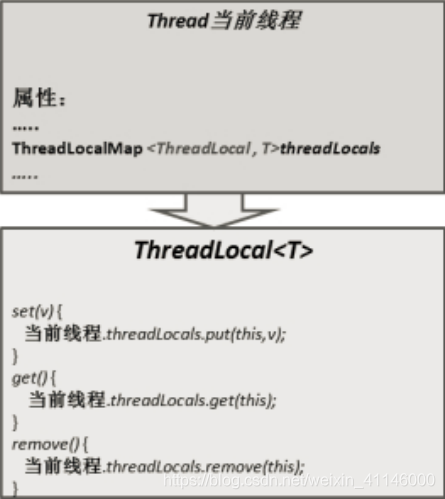

# java_读书02java核心面试知识整理
JAVA核心面试知识整理.pdf

## 4.1.2 使用ExecutorService、Callable、Future实现有返回结果的线程
可返回值的任务必须实现Callable接口

无返回值的任务必须实现Runnable接口

执行Callable任务后，可以获取一个Future的对象，在该对象上调用get就可以获取到Callable任务返回的Object

注意：get方法是**阻塞**的，即：线程无返回结果，get方法会一直等待


## 4.1.3 4种线程池


Java 里面线程池的顶级接口是 Executor,但是严格意义上讲 Executor 并不是一个线程池,而只是一个执行线程的工具。真正的线程池接口是 ExecutorService。

newCachedThreadPool创建一个可缓存线程池，如果线程池长度超过处理需要，可灵活回收空闲线程，若无可回收，则新建线程。

```
它比较适合处理执行时间比较小的任务；
corePoolSize为0，maximumPoolSize为无限大，意味着线程数量可以无限大；
keepAliveTime为60S，意味着线程空闲时间超过60S就会被杀死；
采用SynchronousQueue装等待的任务，这个阻塞队列没有存储空间，这意味着只要有请求到来，就必须要找到一条工作线程处理他，如果当前没有空闲的线程，那么就会再创建一条新的线程。
```
newFixedThreadPool 创建一个定长线程池，可控制线程最大并发数，超出的线程会在队列中等待。

```
它是一种固定大小的线程池；corePoolSize和maximunPoolSize都为用户设定的线程数量nThreads；
keepAliveTime为0，意味着一旦有多余的空闲线程，就会被立即停止掉；但这里keepAliveTime无效；
阻塞队列采用了LinkedBlockingQueue，它是一个无界队列；由于阻塞队列是一个无界队列，因此永远不可能拒绝任务；
由于采用了无界队列，实际线程数量将永远维持在nThreads，因此maximumPoolSize和keepAliveTime将无效。
```
newScheduledThreadPool 创建一个定长线程池，支持定时及周期性任务执行。

newSingleThreadExecutor 创建一个单线程化的线程池，它只会用唯一的工作线程来执行任务，保证所有任务按照指定顺序(FIFO, LIFO, 优先级)执行。

```
它只会创建一条工作线程处理任务；
采用的阻塞队列为LinkedBlockingQueue；
```
java newCachedThreadPool 线程池使用在什么情况下?：https://www.zhihu.com/question/23212914


handler（饱和策略，或者又称拒绝策略）

当队列和线程池都满了，即线程池饱和了，必须采取一种策略处理提交的新任务。

AbortPolicy： 无法处理新任务时，直接抛出异常，这是默认策略。

CallerRunsPolicy：用调用者所在的线程来执行任务。

DiscardOldestPolicy：丢弃阻塞队列中最靠前的一个任务，并执行当前任务。

DiscardPolicy： 直接丢弃任务。


总结

| 线程池 | 特点 | 建议使用场景 |
| --- | --- | --- |
| newCachedThreadPool | 1、线程数无上限  2、空闲线程存活60s  3、阻塞队列 | 1、任务执行时间短  2、任务要求响应时间短 |
| newFixedThreadPool | 1、线程数固定  2、无界队列 | 1、任务比较平缓  2、控制最大的线程数 |
| newScheduledThreadPool | 核心线程数量固定、非核心线程数量无限制（闲置时马上回收） | 执行定时 / 周期性 任务 |
| newSingleThreadExecutor | 只有一个核心线程（保证所有任务按照指定顺序在一个线程中执行，不需要处理线程同步的问题） | 不适合并发但可能引起IO阻塞性及影响UI线程响应的操作，如数据库操作，文件操作等 |

使用线程池容易出现的问题

| 现象 | 原因 |
| --- | --- |
| 整个系统影响缓慢，大部分504 | 1、为设置最大的线程数，任务积压过多，线程数用尽 |
| oom | 1、队列无界或者size设置过大 |
| 使用线程池对效率并没有明显的提升 | 1、线程池的参数设置过小，线程数过小或者队列过小，或者是服务器的cpu核数太低 |

**线程池的监控**

为什么要对线程池进行监控

```
线程池中线程数和队列的类型及长度对线程会造成很大的影响，而且会争夺系统稀有资源，线程数。设置不当，或是没有最大的利用系统资源，提高系统的整体运行效率，或是导致整个系统的故障。典型的场景是线程数被占满，其他的请求无响应。或是任务积压过多，直接oom  
方便的排查线程中的故障以及优化线程池的使用  
```

监控的原理

```
另起一个定时单线程数的线程池newSingleThreadScheduledExecutor  
调用scheduleAtFixedRate(Runnable command,long initialDelay,long period,TimeUnit unit)定时执行监控任务;  
定时任务内 通过ThreadPoolExecutor对象获取监控的对象信息，比如t线程池需要执行的任务数、线程池在运行过程中已完成的任务数、曾经创建过的最大线程数、线程池里的线程数量、线程池里活跃的线程数量、当前排队线程数  
根据预设的日志或报警策略，进行规则控制  
```
需要注意的事项

```
线程数要合理设置，一般建议值是核数的2倍。
线程池队列的类型和长度要根据业特性合理设置
不同的业务需要线程池隔离，避免相互影响
未每个线程池增加特有的命名规范以及关键的日志，方便出问题排查和优化
```

线程池的使用：https://www.ppkanshu.com/index.php/post/2483.html


## 4.1.5. 终止线程 4 种方式
4.1.5.1. **正常运行结束**

程序运行结束，线程自动结束。


4.1.5.2. **使用退出标志退出线程**

一般 run()方法执行完，线程就会正常结束，然而，常常有些线程是伺服线程。它们需要长时间的运行，只有在外部某些条件满足的情况下，才能关闭这些线程。使用一个变量来控制循环，例如： 最直接的方法就是设一个boolean 类型的标志，并通过设置这个标志为true 或 false 来控制while 循环是否退出，代码示例：

```
public class ThreadSafe extends Thread {
 public volatile boolean exit = false;
       public void run() {
             while (!exit){
             //do something
              }
           }
        }

```
定义了一个退出标志 exit，当 exit 为 true 时，while 循环退出，exit 的默认值为false.在定义 exit 时，使用了一个 Java 关键字 volatile，这个关键字的目的是使 exit 同步，也就是说在同一时刻只能由一个线程来修改 exit 的值。


4.1.5.3. **Interrupt 方法结束线程**

使用 interrupt()方法来中断线程有两种情况：

**线程处于阻塞状态**：如使用了 sleep,同步锁的 wait,socket 中的 receiver,accept 等方法时， 会使线程处于阻塞状态。当调用线程的 interrupt()方法时，会抛出 InterruptException 异常。阻塞中的那个方法抛出这个异常，通过代码捕获该异常，然后 break 跳出循环状态，从而让我们有机会结束这个线程的执行。通常很多人认为只要调用 interrupt 方法线程就会结束，实际上是错的， 一定要先捕获InterruptedException 异常之后通过break 来跳出循环，才能正常结束 run 方法。
**线程未处于阻塞状态**：使用 isInterrupted()判断线程的中断标志来退出循环。当使用interrupt()方法时，中断标志就会置 true，和使用自定义的标志来控制循环是一样的道理。
```
public class ThreadSafe extends Thread {
    public void run() {
        while (!isInterrupted()) { //非阻塞过程中通过判断中断标志来退出try{
            Thread.sleep(5 * 1000);//阻塞过程捕获中断异常来退出
        }catch(InterruptedException e){
            e.printStackTrace();
            break;//捕获到异常之后，执行 break 跳出循环
        }
    }
}
```

4.1.5.4. **stop 方法终止线程（线程不安全）**

程序中可以直接使用thread.stop()来强行终止线程，但是stop 方法是很危险的，就象突然关闭计算机电源，而不是按正常程序关机一样，可能会产生不可预料的结果，不安全主要是：thread.stop()调用之后，创建子线程的线程就会**抛出 ThreadDeatherror 的错误，并且会释放子线程所持有的所有锁**。一般任何进行加锁的代码块，都是为了保护数据的一致性，如果在调用thread.stop()后导致了该线程所持有的所有锁的**突然释放(不可控制)**，那么被保护数据就有可能呈现**不一致性**，其他线程在使用这些被破坏的数据时，有可能导致一些很奇怪的应用程序错误。因此，并不推荐使用stop 方法来终止线程。


## 4.1.8 JAVA 后台线程
1. 定义：守护线程--也称“服务线程”，他是后台线程，它有一个特性，即为用户线程 提供 公共服务，在没有用户线程可服务时会自动离开。

2. 优先级：守护线程的**优先级比较低**，用于为系统中的其它对象和线程提供服务。

3. 设置：通过 **setDaemon(true)来设置线程为“守护线程”**；将一个用户线程设置为守护线程的方式是在 线程对象创建 之前 用线程对象的 setDaemon 方法。

4. 在 **Daemon 线程中产生的新线程也是 Daemon**的。

5. **线程则是 JVM 级别**的，以 Tomcat 为例，如果你在 Web 应用中启动一个线程，这个线程的生命周期并不会和 Web 应用程序保持同步。也就是说，即使你停止了 Web 应用，这个线程依旧是活跃的。

6. example: **垃圾回收线程就是一个经典的守护线程**，当我们的程序中不再有任何运行的Thread, 程序就不会再产生垃圾，垃圾回收器也就无事可做，所以当垃圾回收线程是**JVM 上仅剩的线程时，垃圾回收线程会自动离开**。它始终在低级别的状态中运行，用于实时监控和管理系统中的可回收资源。

7. 生命周期：守护进程(Daemon)是运行在后台的一种特殊进程。它独立于控制终端并且周 期性地执行某种任务或等待处理某些发生的事件。也就是说守护线程不依赖于终端，但是**依赖于系统，与系统“同生共死”**。当 JVM 中**所有的线程都是守护线程的时候，JVM 就可以退出**了；如果还有一个或以上的非守护线程则 JVM 不会退出。


## 4.1.10.线程基本方法
1.线程等待（wait） 调用该方法的线程进入 WAITING 状态，只有等待另外线程的通知或被中断才会返回，需要注意的是调用 wait()方法后，会释放对象的锁。因此，wait 方法一般用在同步方法或同步代码块中。

2.线程睡眠（sleep） sleep 导致当前线程休眠，与 wait 方法不同的是 sleep 不会释放当前占有的锁,**sleep(long)会导致线程进入 TIMED-WATING 状态**，而 wait()方法会导致当前线程进入WATING 状态

3.线程让步（yield） yield 会使当前线程让出 CPU 执行时间片，与其他线程**一起重新竞争 CPU 时间片**。一般情况下， 优先级高的线程有更大的可能性成功竞争得到 CPU 时间片，但这又不是绝对的，有的操作系统对线程优先级并不敏感。

4.线程中断（interrupt） 中断一个线程，其本意是给这个线程一个**通知信号**，会影响这个线程内部的一个**中断标识位**。这个线程本身并**不会因此而改变状态(如阻塞，终止等)。**

1.调用 interrupt()方法并不会中断一个正在运行的线程。也就是说处于 Running 状态的线程**并不会因为被中断而被终止，仅仅改变了内部维护的中断标识位**而已。

2.若调用 sleep()而使线程处于 TIMED-WATING 状态，这时调用 interrupt()方法，会**抛出InterruptedException**,从而使线程提前结束 TIMED-WATING 状态。

3.许多声明抛出InterruptedException 的方法(如Thread.sleep(long mills 方法))，抛出异常前，都会清除中断标识位，所以抛出异常后，调用 isInterrupted()方法将会返回 false。

4.**中断状态是线程固有的一个标识位，可以通过此标识位安全的终止线程**。比如,你想终止一个线程thread 的时候，可以调用thread.interrupt()方法，在线程的 run 方法内部可以根据thread.isInterrupted()的值来优雅的终止线程。


5.Join 等待其他线程终止 join() 方法，等待其他线程终止，在当前线程中调用一个线程的 join() 方法，则当前线程转为阻塞状态，回到另一个线程结束，当前线程再由阻塞状态变为就绪状态，等待 cpu 的宠幸。

6.为什么要用 join()方法？ 很多情况下，主线程生成并启动了子线程，需要用到子线程返回的结果，也就是需要主线程需要在子线程结束后再结束，这时候就要用到 join() 方法。

7.Object 类中的 notify() 方法，**唤醒在此对象监视器上等待的单个线程**，如果所有线程都在此对象上等待，则会选择唤醒其中一个线程，选择是任意的，并在对实现做出决定时发生，线程通过调用其中一个 wait() 方法，在对象的监视器上等待，直到当前的线程放弃此对象上的锁定，才能继续执行被唤醒的线程，被唤醒的线程将以常规方式与在该对象上主动同步的其他所有线程进行竞争。类似的方法还有 notifyAll() ，唤醒再次监视器上等待的所有线程。


## 4.1.11 二. 线程上下文切换

巧妙地利用了时间片轮转的方式, CPU 给每个任务都服务一定的时间，然后把当前任务的状态保存下来，在加载下一任务的状态后，继续服务下一任务，任务的状态保存及再加载, 这段过程就叫做上下文切换。时间片轮转的方式使多个任务在同一颗 CPU 上执行变成了可能。

1. 进程

（有时候也称做任务）是指一个程序运行的实例。在 Linux 系统中，线程就是能并行运行并且与他们的父进程（创建他们的进程）共享同一地址空间（一段内存区域）和其他资源的轻量级的进程。

2. 上下文

是指某一时间点**CPU 寄存器和程序计数器**的内容。

3. 寄存器

是 **CPU 内部的数量较少但是速度很快的内存**（与之对应的是 CPU 外部相对较慢的 RAM 主内存）。寄存器通过对常用值（通常是运算的中间值）的快速访问来提高计算机程序运行的速度。

4. 程序计数器

是一个专用的寄存器，用于表明指令序列中 CPU 正在执行的位置，存的值为正在执行的**指令的位置**或者下一个将要被执行的指令的位置，具体依赖于特定的系统。

5. PCB-“切换桢”

上下文切换可以认为是内核（操作系统的核心）在 CPU 上对于进程（包括线程）进行切换，**上下文切换过程中的信息是保存在进程控制块**（PCB, process control block）中的。PCB 还经常被称作“切换桢”（switchframe）。信息会一直保存到 CPU 的内存中，直到他们被再次使用。

6. 上下文切换的活动：

（1）. 挂起一个进程，将这个进程在 CPU 中的状态（上下文）存储于内存中的某处。

（2）. 在内存中检索下一个进程的上下文并将其在 CPU 的寄存器中恢复。

（3）. 跳转到程序计数器所指向的位置（即跳转到进程被中断时的代码行），以恢复该进程在程序中。

7. 引起线程上下文切换的原因

（1）. 当前执行任务的**时间片用完**之后，系统 CPU 正常调度下一个任务；

（2）. 当前执行任务碰到 **IO 阻塞**，调度器将此任务挂起，继续下一任务；

（3）. 多个任务**抢占锁资源**，当前任务没有抢到锁资源，被调度器挂起，继续下一任务；

（4）. 用户**代码挂起**当前任务，让出 CPU 时间；

（5）. **硬件中断**；

## 4.1.18 ThreadLocal 作用（线程本地存储）
ThreadLocal，很多地方叫做**线程本地变量**，也有些地方叫做**线程本地存储**，ThreadLocal 的作用是提供**线程内的局部变量**， 这种变量在线程的生命周期内起作用 ，**减少同一个线程内多个函数 或者组件之间一些 公共变量的传递的复杂度** 。

ThreadLocalMap （线程的一个属性）

1. 每个线程中都有一个自己的 ThreadLocalMap 类对象，可以将线程自己的对象保持到其中，各管各的，线程可以正确的访问到自己的对象。

2. 将一个共用的 ThreadLocal 静态实例作为 key，将不同对象的引用保存到不同线程的ThreadLocalMap 中，然后在线程执行的各处通过这个静态 ThreadLocal 实例的 get()方法取得自己线程保存的那个对象，避免了将这个对象作为参数传递的麻烦。

3. ThreadLocalMap 其实就是线程里面的一个属性，它在 Thread 类中定义ThreadLocal.ThreadLocalMap threadLocals = null;



使用场景:最常见的 ThreadLocal 使用场景为 用来解决 **数据库连接、Session 管理**等。

## ConcurrentHashMap 并发（todo)
java-并发-ConcurrentHashMap高并发机制-jdk1.8：https://blog.csdn.net/jianghuxiaojin/article/details/52006118


## 5.1.4 JAVA 内部类
Java 类中不仅可以定义变量和方法,还可以定义类,这样定义在类内部的类就被称为内部类。根据定义的方式不同,内部类分为**静态内部类,成员内部类,局部内部类,匿名内部类**四种。
一、静态内部类 （定义在类内部的静态类，就是静态内部类。） 
```
eg :     
public class Out { 
       private static int a; 
       private int b; 
       public static class Inner { 
                        public void print() { 
                               System.out.println(a); 
                        } 
          } 
} 
```
1. 静态内部类可以访问外部类所有的静态变量和方法，即使是private的也一样。

2. 静态内部类和一般类一致，可以定义静态变量、方法，构造方法等。

3. 其它类使用静态内部类需要使用“外部类.静态内部类”方式，如下所示：Out.Inner inner = new Out.Inner();inner.print();

4. Java集合类HashMap内部就有一个静态内部类Entry。Entry是HashMap存放元素的抽象， HashMap 内部维护 Entry 数组用了存放元素，但是 Entry 对使用者是透明的。像这种和外部 类关系密切的，且不依赖外部类实例的，都可以使用静态内部类。


二、成员内部类 （定义在类内部的非静态类，就是成员内部类。成员内部类不能定义静态方法和变量（final 修饰的 除外）。这是因为成员内部类是非静态的，类初始化的时候先初始化静态成员，如果允许成员内 部类定义静态变量，那么成员内部类的静态变量初始化顺序是有歧义的。）

```
eg:
public class Out {    
   private static int a;    
   private int b;    
   public class Inner {        
      public void print() {            
          System.out.println(a);            
          System.out.println(b);        
      }    
   }
} 
```

三、局部内部类（定义在方法中的类）

定义在方法中的类，就是局部类。如果一个类只在某个方法中使用，则可以考虑使用局部类。

```
eg:
public class Out { 
    private static int a; 
    private int b; 
    public void test(final int c) { 
        final int d = 1; 
        class Inner { 
            public void print() { 
                       System.out.println(c); 
                } 
        } 
    } 
} 
```
四、匿名内部类（要继承一个父类或者实现一个接口、直接使用 new 来生成一个对象的引用）

 匿名内部类我们必须要继承一个父类或者实现一个接口，当然也仅能只继承一个父类或者实现一 个接口。同时它也是没有class关键字，这是因为匿名内部类是直接使用new来生成一个对象的引用。

 ```
public abstract class Bird { 
    private String name; 
     public String getName() { 
        return name; 
    } 
     public void setName(String name) { 
        this.name = name; 
    } 
     public abstract int fly(); 
    } 
    public class Test { 
     public void test(Bird bird){ 
        System.out.println(bird.getName() + "能够飞 " + bird.fly() + "米"); 
    } 
     public static void main(String[] args) { 
        Test test = new Test(); 
        test.test(new Bird() { 
             public int fly() { 
                return 10000; 
            } 
             public String getName() { 
                return "大雁"; 
            } 
        }); 
    } 
} 
```

## 5.1.5. JAVA 泛型
泛型提供了编译时类型安全检测机制,该机制允许程序员在**编译时检测到非法的类型**。**泛型的本质是参数化类型**,也就是说所操作的数据类型被指定为一个参数。比如我们要写一个排序方法,能够对整型数组、字符串数组甚至其他任何类型的数组进行排序,我们就可以使用 Java 泛型。  

泛型有三种使用方式，分别为：泛型类、泛型接口、泛型方法  
一、泛型方法  
你可以写一个泛型方法，该方法在调用时可以接收不同类型的参数。根据传递给泛型方法的参数 类型，编译器适当地处理每一个方法调用。  
```
1. <? extends T>表示该通配符所代表的类型是T类型的子类。

2. <? super T>表示该通配符所代表的类型是T类型的父类。


// 泛型方法 printArray

public static < E > void printArray( E[] inputArray )

{

     for ( E element : inputArray ){

        System.out.printf( "%s ", element );

     }

}

```
二、泛型类<T>   
泛型类的声明和非泛型类的声明类似，除了在类名后面添加了类型参数声明部分。和泛型方法一 样，泛型类的类型参数声明部分也包含一个或多个类型参数，参数间用逗号隔开。一个泛型参数， 也被称为一个类型变量，是用于指定一个泛型类型名称的标识符。因为他们接受一个或多个参数， 这些类被称为参数化的类或参数化的类型。   

```
public class Box<T> {

  private T t;

  public void add(T t) {

    this.t = t;

  }

  public T get() {

    return t;

  }

}

```

三、泛型接口  
泛型接口与泛型类的定义及使用基本相同。泛型接口常被用在各种类的生产器中  
```
public interface Generator<T> {

    public T next();

}

```
四、类型通配符  
类型通配符一般是使用？代替具体的类型实参，注意了，此处’？’是类型实参，而不是类型形参 。  
再直白点的意思就是，此处的？和Number、String、Integer一样都是一种实际的类型，可以把？看成所有类型的父类。是一种真实的类型。  
可以解决当具体类型不确定的时候，这个通配符就是 ?  ；当操作类型时，不需要使用类型的具体功能时，只使用Object类中的功能。那么可以用 ? 通配符来表未知类型。  
五、泛型擦除  
Java 中的泛型基本上都是在编译器这个层次来实现的。在生成的 Java 字节代码中是不包含泛 型中的类型信息的。  
使用泛型的时候加上的类型参数，会被编译器在编译的时候去掉。这个 过程就称为类型擦除。  
如在代码中定义的 List<Object>和 List<String>等类型，在编译之后 都会变成List。JVM看到的只是List，而由泛型附加的类型信息对JVM来说是不可见的。 类型擦除的基本过程也比较简单，首先是找到用来替换类型参数的具体类。这个具体类一般 是 Object。如果指定了类型参数的上界的话，则使用这个上界。把代码中的类型参数都替换 成具体的类。   
例：  
```
public static void main(String[] args) {

    List<String> ls = new ArrayList<String>();

    List<Integer> li = new ArrayList<Integer>();

    System.out.println(ls.getClass() == li.getClass());

}

//结果：true

```

## 5.1.6. JAVA 序列化(创建可复用的 Java 对象)
1、如果一个类想被序列化，需要实现Serializable接口。否则将抛出NotSerializableException异常，这是因为，在序列化操作过程中会对类型进行检查，要求被序列化的类必须属于Enum、Array和Serializable类型其中的任何一种。  
2、通过ObjectOutputStream和ObjectInputStream对对象进行序列化及反序列化  
3、虚拟机是否允许反序列化，不仅取决于类路径和功能代码是否一致，一个非常重要的一点是两个类的序列化 ID 是否一致（就是 private static final long serialVersionUID）  
序列化 ID 在 Eclipse 下提供了两种生成策略，一个是固定的 1L，一个是随机生成一个不重复的 long 类型数据（实际上是使用 JDK 工具生成），在这里有一个建议，如果没有特殊需求，就是用默认的 1L 就可以，这样可以确保代码一致时反序列化成功。那么随机生成的序列化 ID 有什么作用呢，有些时候，通过改变序列化 ID 可以用来限制某些用户的使用。  
4、序列化并不保存静态变量。  
5、要想将父类对象也序列化，就需要让父类也实现Serializable 接口。  
6、Transient 关键字的作用是控制变量的序列化，在变量声明前加上该关键字，可以阻止该变量被序列化到文件中，在被反序列化后，transient 变量的值被设为初始值，如 int 型的是 0，对象型的是 null。  
7、服务器端给客户端发送序列化对象数据，对象中有一些数据是敏感的，比如密码字符串等，希望对该密码字段在序列化时，进行加密，而客户端如果拥有解密的密钥，只有在客户端进行反序列化时，才可以对密码进行读取，这样可以一定程度保证序列化对象的数据安全。  
8、在类中增加writeObject 和 readObject 方法可以实现自定义序列化策略  

## 参考  
Executors创建的4种线程池的使用：https://my.oschina.net/sdlvzg/blog/2222136  
Java面试复习总结19——序列化和反序列化:https://blog.csdn.net/qq_38905818/article/details/103493119#t8  
Java线程池(围绕ThreadPoolExecutor讲解工作流程、常见参数、调优、监控）:https://blog.csdn.net/u014454538/article/details/96910729  