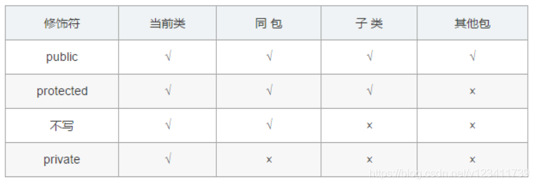
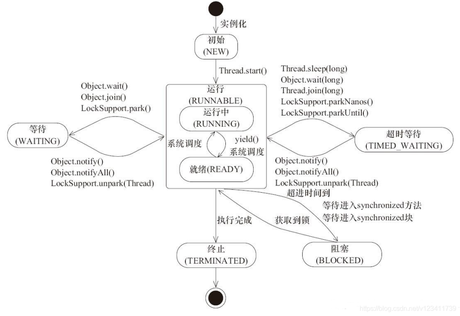
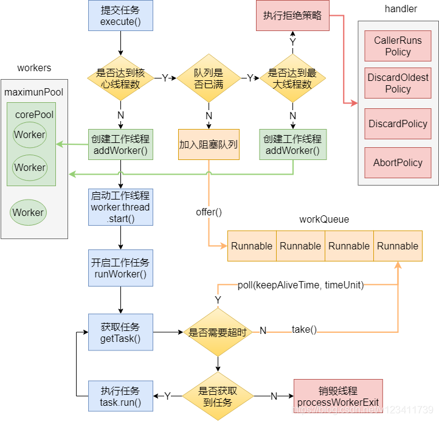
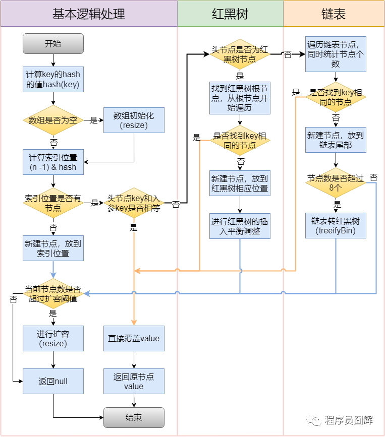
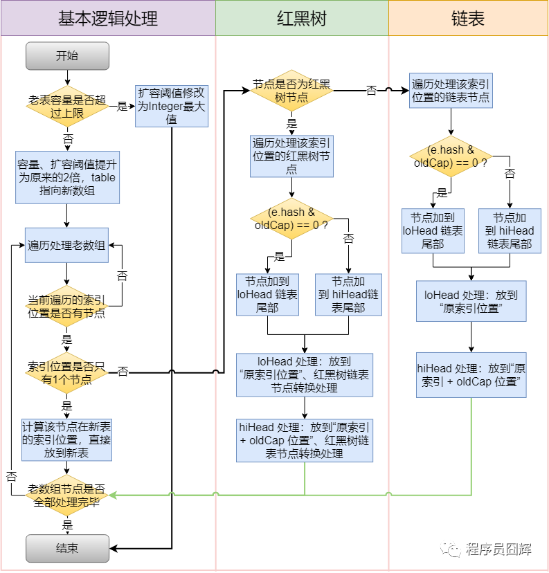

# java_读书03Java基础高频面试题(2021年最新版)
原文:Java 基础高频面试题（2021年最新版）:https://blog.csdn.net/v123411739/article/details/115364158/

## 2、访问修饰符public，private，protected，以及不写时的区别？



## 3、下面两个代码块能正常编译和执行吗？
```
// 代码块1
short s1 = 1; s1 = s1 + 1;
// 代码块2
short s1 = 1; s1 += 1;
```
代码块1编译报错，错误原因是：不兼容的类型: 从int转换到short可能会有损失”。

代码块2正常编译和执行。s1 += 1 相当于 s1 = (short)(s1 + 1)


## 7、String 是 Java 基本数据类型吗？
答：不是。Java 中的基本数据类型只有8个：byte、short、int、long、float、double、char、boolean；除了基本类型（primitive type），剩下的都是引用类型（reference type）。

基本数据类型：数据直接存储在栈上

引用数据类型区别：数据存储在堆上，栈上只存储引用地址

个人补充：传参不同，都是传取值，但一个是复制实际值，另一个复制地址


## 10、String s = new String("xyz") 创建了几个字符串对象？
一个或两个。如果字符串常量池已经有“xyz”，则是一个；否则，两个。

当字符创常量池没有 “xyz”，此时会创建如下两个对象：

一个是字符串字面量 "xyz" 所对应的、驻留（intern）在一个全局共享的字符串常量池中的实例，此时该实例也是在堆中，字符串常量池只放引用。

另一个是通过 new String() 创建并初始化的，内容与"xyz"相同的实例，也是在堆中。


## 15、深拷贝和浅拷贝区别是什么？
数据分为基本数据类型和引用数据类型。**基本数据类型**：数据直接存储在栈中；**引用数据类型**：存储在栈中的是对象的引用地址，真实的对象数据存放在堆内存里。

浅拷贝：对于基础数据类型：直接复制数据值；对于引用数据类型：只是复制了对象的引用地址，新旧对象指向同一个内存地址，修改其中一个对象的值，另一个对象的值随之改变。

深拷贝：对于基础数据类型：直接复制数据值；对于引用数据类型：开辟新的内存空间，在新的内存空间里复制一个一模一样的对象，新老对象不共享内存，修改其中一个对象的值，不会影响另一个对象。

**深拷贝相比于浅拷贝速度较慢并且花销较大。**

## 23、为什么不能根据返回类型来区分重载？
方法的返回值只是作**为方法运行之后的一个“状态”**，但是并不是所有调用都关注返回值，所以不能将返回值作为重载的唯一区分条件。

## 28、try、catch、finally 考察，请指出下面程序的运行结果。

## 31、JDK1.8之后有哪些新特性？
接口默认方法，Lambda 表达式和函数式接口，Stream API，方法引用，日期时间API，Optional 类

## 51、线程的 sleep() 方法和 yield() 方法有什么区别？
线程执行 sleep() 方法后进入超时等待（TIMED_WAITING）状态，而执行 yield() 方法后进入就绪（READY）状态。

sleep() 方法给其他线程运行机会时不考虑线程的优先级，因此会给低优先级的线程运行的机会；yield() 方法只会给相同优先级或更高优先级的线程以运行的机会。


## 54、Thread 调用 start() 方法和调用 run() 方法的区别
意思run没有另起线程，而start才是真正意义的新开线程

run()：**普通的方法调用，在主线程中执行**，不会新建一个线程来执行。它只会在当前线程中，串行执行run()方法中的代码。

start()：**新启动一个线程**，这时此线程处于就绪（可运行）状态，并没有运行，一旦得到 CPU 时间片，就开始执行 run() 方法。(start属于native方法)。

## 55、线程的状态流转



一个线程可以处于以下状态之一：

NEW：新建但是尚未启动的线程处于此状态，没有调用 start() 方法。

RUNNABLE：包含就绪（READY）和运行中（RUNNING）两种状态。线程调用 start() 方法会会进入就绪（READY）状态，等待获取 CPU 时间片。如果成功获取到 CPU 时间片，则会进入运行中（RUNNING）状态。

BLOCKED：线程在进入同步方法/同步块（synchronized）时被阻塞，等待同步锁的线程处于此状态。

WAITING：无限期等待另一个线程执行特定操作的线程处于此状态，需要被显示的唤醒，否则会一直等待下去。例如对于 Object.wait()，需要等待另一个线程执行 Object.notify() 或 Object.notifyAll()；对于 Thread.join()，则需要等待指定的线程终止。

TIMED_WAITING：在指定的时间内等待另一个线程执行某项操作的线程处于此状态。跟 WAITING 类似，区别在于该状态有超时时间参数，在超时时间到了后会自动唤醒，避免了无期限的等待。

TERMINATED：执行完毕已经退出的线程处于此状态。

线程在给定的时间点只能处于一种状态。这些状态是虚拟机状态，不反映任何操作系统线程状态。


## 56、synchronized 和 Lock 的区别
1）Lock 是一个接口；synchronized 是 Java 中的关键字，synchronized 是内置的语言实现；

2）Lock 在发生异常时，如果没有主动通过 unLock() 去释放锁，很可能会造成死锁现象，因此使用 Lock 时需要在 finally 块中释放锁；synchronized 不需要手动获取锁和释放锁，在发生异常时，会自动释放锁，因此不会导致死锁现象发生；

3）Lock 的使用更加灵活，可以有响应中断、有超时时间等；而 synchronized 却不行，使用 synchronized 时，等待的线程会一直等待下去，直到获取到锁；

4）在性能上，随着近些年 synchronized 的不断优化，Lock 和 synchronized 在性能上已经没有很明显的差距了，所以性能不应该成为我们选择两者的主要原因。官方推荐尽量使用 synchronized，除非 synchronized 无法满足需求时，则可以使用 Lock。

## 61、线程池的核心属性有哪些？
threadFactory（线程工厂）：用于创建工作线程的工厂。

corePoolSize（核心线程数）：当线程池运行的线程少于 corePoolSize 时，将创建一个新线程来处理请求，即使其他工作线程处于空闲状态。

workQueue（队列）：用于保留任务并移交给工作线程的阻塞队列。

maximumPoolSize（最大线程数）：线程池允许开启的最大线程数。

handler（拒绝策略）：往线程池添加任务时，将在下面两种情况触发拒绝策略：1）线程池运行状态不是 RUNNING；2）线程池已经达到最大线程数，并且阻塞队列已满时。

keepAliveTime（保持存活时间）：如果线程池当前线程数超过 corePoolSize，则多余的线程空闲时间超过 keepAliveTime 时会被终止。
 
## 62、说下线程池的运作流程。



## 63、线程池有哪些拒绝策略？
AbortPolicy：中止策略。默认的拒绝策略，直接抛出 RejectedExecutionException。调用者可以捕获这个异常，然后根据需求编写自己的处理代码。

DiscardPolicy：抛弃策略。什么都不做，直接抛弃被拒绝的任务。

DiscardOldestPolicy：抛弃最老策略。抛弃阻塞队列中最老的任务，相当于就是队列中下一个将要被执行的任务，然后重新提交被拒绝的任务。如果阻塞队列是一个优先队列，那么“抛弃最旧的”策略将导致抛弃优先级最高的任务，因此最好不要将该策略和优先级队列放在一起使用。

CallerRunsPolicy：调用者运行策略。在调用者线程中执行该任务。该策略实现了一种调节机制，该策略既不会抛弃任务，也不会抛出异常，而是将任务回退到调用者（调用线程池执行任务的主线程），由于执行任务需要一定时间，因此主线程至少在一段时间内不能提交任务，从而使得线程池有时间来处理完正在执行的任务。

## 77、HashMap 的插入流程是怎么样的？



## 78、HashMap 的扩容（resize）流程是怎么样的？



## 95、GC Root有哪些?
在Java语言中，可作为GC Roots的对象包括下面几种：

虚拟机栈（栈帧中的本地变量表）中引用的对象。

方法区中类静态属性引用的对象。

方法区中常量引用的对象。

本地方法栈中JNI（即一般说的Native方法）引用的对象。


